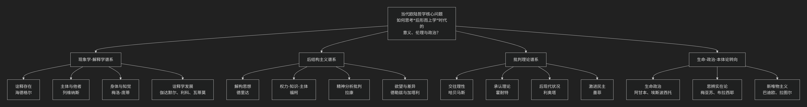

当代欧陆哲学的一个分类
-------------------

对当代欧陆哲学进行分类是一项极具挑战但又至关重要的任务。传统的按“主义”或“学派”线性划分的方式，已难以捕捉其错综复杂的“思想生态”。当代欧陆哲学更像一个 **“问题网络”或“思想星座”** ，各路径相互交叉、批判与融合。

为了更直观地把握其脉络，下图呈现了一个以“核心问题”为牵引的当代欧陆哲学思想图谱：

以下，我们将以这张图谱为线索，详细解析这四大相互交织的谱系。

### 谱系一：[现象学](/chats/outlaw/analyse/foreign/schools/modern/phenom/index)-[解释学](/chats/outlaw/analyse/foreign/schools/modern/hermen/index)谱系（追问“存在”与“理解”）

此谱系是欧陆哲学的“隐性主干”，从未真正离开。它关注**人的存在、意识、理解和体验**如何构成世界。

*   **核心问题**：在形而上学崩塌后，意义和真理如何从我们的**在世存在**和**理解活动**中涌现？
*   **关键人物与转向**：
    *   **海德格尔**： 将现象学从“意识”转向“存在”，奠定了整个谱系的基调。
    *   **列维纳斯**： 将现象学的焦点从“自我”转向 **“他者”** ，将伦理学确立为第一哲学。
    *   **梅洛-庞蒂**： 从“意识”转向 **“身体”** ，强调知觉和身体是我们与世界交往的原初方式。
    *   **伽达默尔、利科、瓦蒂莫**： 发展了解释学，探讨理解的历史性、叙事性与创造性。

### 谱系二：[后结构主义](/chats/outlaw/analyse/foreign/schools/today/posts/index)谱系（解构“主体”与“理性”）

这是20世纪下半叶最引人注目的力量，对现代性的核心概念（主体、理性、真理、意义）进行激进批判。

*   **核心问题**：如果“主体”不是意义的主宰，而是被语言、无意识、权力关系所建构的，那么思想该如何进行？
*   **关键人物与主题**：
    *   **德里达**： **解构** 文字、语言和哲学概念的形而上学基础，揭示其内在的矛盾与延异。
    *   **福柯**： 分析 **权力**、**知识** 与 **主体** 的共生关系，揭示现代社会如何通过话语和制度塑造人。
    *   **德勒兹与加塔利**： 创造 **“根茎”**、**“欲望机器”** 等概念，反对僵化的树状结构，倡导差异、生成和流变的思想。
    *   **拉康**： 用结构语言学重读弗洛伊德，提出 **“无意识像语言一样结构”** ，颠覆了传统的自主主体观念。

### 谱系三：[批判理论](/chats/outlaw/analyse/foreign/schools/modern/critical/index)谱系（诊断社会与寻求解放）

从[法兰克福学派](/chats/outlaw/analyse/foreign/schools/modern/marx/frankfurt/index)发展而来，紧密结合社会现实，旨在批判社会不公并寻求解放路径。

*   **核心问题**：在复杂的现代社会中，如何诊断病理、批判意识形态，并找到理性与解放的可能性？
*   **关键人物与演进**：
    *   **哈贝马斯**： 从工具理性批判转向 **交往行为理论**，试图在语言交往中为理性和规范找到新的基础。
    *   **霍耐特**： 发展 **“为承认而斗争”** 的理论，将社会冲突的根源归于主体间对承认的需求。
    *   **利奥塔**： 宣告 **“宏大叙事的终结”**，走向对差异和悖谬的后现代辩护。
    *   **墨菲**： 倡导 **“激进民主”**，认为政治的本质不是达成共识，而是在承认对抗不可消除的前提下，建构“我们”与“他们”的对立。

### 谱系四：生命-政治-本体论的“转向”浪潮（21世纪的新前沿）

这是近期最活跃的领域，共同特点是试图超越“语言转向”的局限，直接思考生命、物质和实在本身。

*   **核心问题**：如何直接思考非人力量（生命、技术、物质、实在）及其与政治、伦理的关系？
*   **关键动向**：
    *   [生命政治](/chats/outlaw/analyse/foreign/branch/politic/biopolitics/index)： 福柯思想的延续，探讨权力如何管理、优化和控制“生命”本身。
        *   **阿甘本**： “赤裸生命”、“例外状态”。
        *   **埃斯波西托**： “免疫范式”、“生命政治”的肯定性视角。
    *   [思辨实在论/新唯物主义](/chats/outlaw/analyse/foreign/schools/today/new)： 反对哲学只关注人类如何“ access ”世界，主张探索独立于思想的“实在本身”。
        *   **梅亚苏**： 批判“关联主义”，提出“偶然性必然性”。
        *   **布拉西耶**： 思考“无思”的实在，提出“世界非实存”的激进命题。
        *   **巴迪欧**： 用数学本体论思考“存在”与“事件”。
        *   **拉图尔**： “行动者网络理论”，消解自然/社会、人/物的二元对立。

### 总结：一个动态的思想星座

| 思想谱系 | 核心关切 | 关键词 |
| :--- | :--- | :--- |
| **现象学-解释学** | 存在、理解、他者、身体、生活世界 | 在世存在、诠释、他者性、具身化 |
| **后结构主义** | 权力、差异、解构、欲望、无意识 | 解构、权力/知识、生成、延异 |
| **批判理论** | 社会理性、解放、承认、民主、正义 | 交往理性、承认斗争、激进民主 |
| **新前沿转向** | 生命、物质、实在、非人、技术 | 生命政治、思辨实在论、新唯物主义 |

**重要提示**：
1.  **交叉性**：这些分类是流动的。例如，阿甘本的思想深深植根于海德格尔和福柯；巴迪欧的数学本体论也是对德勒兹的回应。
2.  **问题导向**：最好的方式不是记住流派，而是**追踪他们共同处理的核心问题**，例如：主体性的命运、他者的伦理要求、权力与自由的关系、在虚无中如何奠基规范等。

因此，当代欧陆哲学是一幅由**批判、重建、转向**共同绘制的、充满张力的思想地图。它不再提供统一的答案，而是持续地、富有创造力地提出关于我们自身和世界的最根本问题。