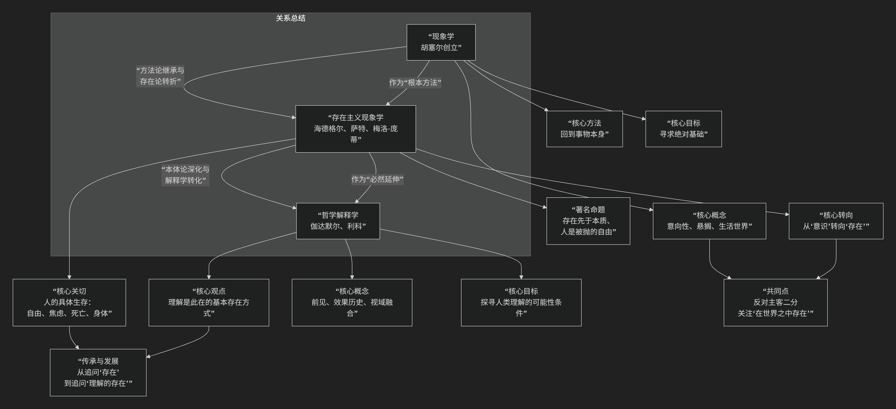

## 现象学、存在主义和解释学

---

现象学、存在主义和解释学是20世纪欧陆哲学中紧密相连、环环相扣的三大思潮。它们的关系不是简单的并列或对立，而是一部生动的思想“家族史”，可以概括为：**现象学是父亲（提供了核心方法），存在主义是长子（将方法应用于人的具体生存），解释学则是继承了前两者遗产的集大成者（将理解推广到人类存在的根本维度）。**

为了更直观地把握这三者之间复杂而富有生成性的关系，下图清晰地勾勒了它们的演进脉络与核心关联：

以下，我们将沿此谱系，深入解析它们之间的思想对话与承继关系。

---

### 一、现象学：父亲与“方法工具箱”

* **创始人**：埃德蒙德·胡塞尔
* **核心贡献**：提供了一套全新的哲学方法。
  * **口号**：**“回到事物本身！”**——即直接面对并描述在意识中显现的现象。
  * **方法**：**悬搁**（中止关于世界存在的自然信念）、**还原**（聚焦纯粹意识）、**意向性分析**（分析意识总是指向某物的结构）。
  * **目标**：为所有知识（包括科学知识）找到一个绝对可靠、无预设的**阿基米德点**（先验自我或生活世界）。
* **角色定位**：现象学是**方法论的基础**。它提供了哲学家如何“看”、如何“描述”世界的基本工具。可以把它想象成哲学家的“显微镜”或“解剖刀”。

### 二、存在主义：长子的“存在论转向”

存在主义者（尤其是海德格尔、萨特、梅洛-庞蒂）接受了现象学的方法，但彻底扭转了它的方向和应用焦点。

* **核心转变：从“意识”到“存在”**
  * **胡塞尔关心**：纯粹的**意识**如何构成世界和意义。
  * **海德格尔关心**：**人**这种特殊的存在者（他称之为“此在”）的**存在**方式是什么？哲学的核心问题应是“存在之谜”，而非“意识之谜”。
* **对现象学的继承与改造**：
  * **继承**：认同要回到“事情本身”。但这个“事情本身”不再是胡塞尔的“纯粹意识”，而是**人的具体生存体验**，如焦虑、被抛、向死而生、操心等。
  * **批判与改造**：他们认为胡塞尔的“先验自我”仍然是一个抽象、无世界的点。他们强调，人永远是 **“在世之在”**，意识总是 **“具身的”**（有血有肉的身体）、**“情境化的”**（处于特定的历史、社会环境中）。无法脱离具体生存来谈意识。
* **著名命题**：
  * **海德格尔**：**“此在的本质在于它的生存。”** 人没有固定不变的本质，他的本质是在其存在过程中不断生成和实现的。
  * **萨特**：**“存在先于本质。”** 人首先存在、遭遇自己、在世界上涌现，然后才定义自己。这意味着**人是自由的**，人注定要自由，并为自己的一切选择负全责。
* **关系总结**：存在主义是**运用现象学的方法，去描述和分析人的具体生存困境**的哲学。它将现象学从认识论（知识论）的层面，拉回到了**存在论（本体论）** 的层面。

### 三、解释学：继承家业的“集大成者”

解释学最初是关于理解和解释文本（尤其是《圣经》和古典文献）的技艺学。在20世纪，通过海德格尔和伽达默尔，它完成了一次“哲学转向”，成为一门关于人类理解之本质的哲学。

* **与现象学、存在主义的血脉联系**：
  * **海德格尔的奠基**：海德格尔在《存在与时间》中提出，**“理解”不是认识方法，而是“此在”的基本存在方式。** 人活着，就意味着在不断理解和解释自己与世界。这为哲学解释学奠定了基础。
  * **伽达默尔的集大成**：伽达默尔在其巨著《真理与方法》中，系统发展了海德格尔的思想。
* **核心观点**：
  1. **理解的历史性**：任何理解都无法脱离理解者自身的**历史情境**。我们总是带着由传统和先入之见构成的 **“视域”** 去理解事物。理解不是克服偏见，而是**正确地评价偏见**。
  2. **效果历史意识**：真正的理解是理解者自身的视域与文本（或历史、艺术品）的视域发生 **“视域融合”** 的过程。我们始终处于历史的影响效果之中。
  3. **对话模式**：理解就像一场对话，我们向文本提问，文本也向我们提问，从而生成新的意义。
* **对现象学和存在主义的深化与综合**：
  * 解释学接受了存在主义的“人在世界中”的基本立场。
  * 它同时指出，现象学所追求的“无预设的起点”是不可能的。我们总是已经被抛入一个**充满传统和语言的解释世界**中。**理解是此在的生存论结构**。
  * 因此，解释学可以看作是**对“理解”活动本身进行的现象学描述**，而理解的对象，正是**存在于此世中的人**的历史性生存。

---

### 核心关系总结

| 流派               | 与现象学的关系                       | 核心关切                                                         | 关键转折                                 |
| :----------------- | :----------------------------------- | :--------------------------------------------------------------- | :--------------------------------------- |
| **现象学**   | **方法论开创者**               | **意识如何构成对象？知识的绝对基础何在？**                 | 从抽象思辨转向直接经验                   |
| **存在主义** | **方法的应用与“存在论转向”** | **人如何具体地生存？自由、选择、焦虑、死亡的意义是什么？** | 从“意识”转向“存在”                   |
| **解释学**   | **对“理解”活动的现象学描述** | **理解如何可能？历史、传统、语言如何塑造我们？**           | 从“存在”转向“理解”（作为存在的方式） |

### 一个简单的比喻

* **现象学** 好比是 **“物理学的研究方法”**（如观察、实验）。它提供了一套如何研究世界的基本范式。
* **存在主义** 好比是 **“凝聚态物理”**。它用物理学的方法，去专门研究一种特定的、复杂的物质形态（比如“人”这种存在者）的特殊性质（自由、焦虑等）。
* **解释学** 好比是 **“科学哲学”**。它反过来研究“物理学研究”这个活动本身是如何可能的？观察者如何受到其理论背景、历史语境的影响？它关注的是“科学理解”本身的本质和条件。

总而言之，这三者构成了一个连续的、深化的思想运动：**现象学提供了“看”的方法，存在主义用这个方法去“看”人的生存，解释学则反思“看”这个行为本身的历史性和条件性。** 它们共同塑造了20世纪哲学关注生活世界、人的存在和历史理解的基本面貌。

## 结构主义和存在主义 (Qwen)

结构主义（Structuralism）与存在主义（Existentialism）确实是20世纪欧洲哲学中两种具有鲜明对立倾向的思想流派，尽管它们在某些具体思想家那里可能存在交叉或对话（如早期萨特与列维-斯特劳斯的争论），但总体而言，二者在本体论、方法论和人观上呈现出根本性差异。

---

### 一、存在主义（Existentialism）的核心特点

存在主义兴起于19世纪末至20世纪中叶，代表人物包括克尔凯郭尔、海德格尔、萨特、加缪、梅洛-庞蒂等。其核心主张可归纳为以下几点：

1. **存在先于本质**（萨特语）：人的存在是第一位的，人不是被预先定义好的“本质”所决定，而是通过自由选择、行动和责任创造自身的本质。
2. **强调个体性与主体性**：存在主义关注具体、活生生的“我”，强调人的焦虑、荒诞、自由、责任、死亡等生存体验。
3. **拒斥系统化与普遍结构**：存在主义反对将人简化为某种抽象结构或规律的产物，强调个体经验的不可还原性。
4. **自由与责任**：人的自由是一种根本处境，但伴随而来的是沉重的责任——人必须为自己的选择负责，无法推诿给外部结构或命运。

---

### 二、结构主义（Structuralism）的核心特点

结构主义兴盛于20世纪50–70年代，源自语言学（索绪尔），扩展至人类学（列维-斯特劳斯）、精神分析（拉康）、文学理论（巴特）等领域。其基本立场包括：

1. **结构先于个体**：意义不是由个体主观赋予的，而是由深层的、普遍的符号或文化结构所决定。个体只是结构中的“位置”或“功能”。
2. **拒斥主体中心主义**：结构主义质疑“自主的、理性的人”这一启蒙观念，认为所谓“主体”其实是语言、文化或无意识结构的产物。
3. **强调系统性与共时性**（synchrony）：结构主义偏好分析某一系统内部的逻辑关系（如亲属关系、神话结构），而非历时性的历史演变。
4. **科学化倾向**：结构主义试图以类似自然科学的方式揭示“隐藏的规则”，赋予人文研究以客观性与普遍性。

---

### 三、根本对立点

| 维度 | 存在主义 | 结构主义 |
|------|-----------|-----------|
| 本体论 | 个体存在优先 | 结构/系统优先 |
| 主体观 | 自由、能动、负责的主体 | 被结构决定的“去中心化”主体 |
| 方法论 | 现象学描述、内省、文学表达 | 形式分析、符号学、系统建模 |
| 对“意义”的理解 | 由个体在生存中创造 | 由结构关系预先编码 |
| 政治/伦理取向 | 强调个体选择、反抗、介入 | 强调揭示潜藏规则、中立分析 |

---

### 四、后续发展与调和

尽管二者对立，但后来的思想流派（如后结构主义、后现代主义）试图超越这种二元对立。例如：

- **福柯**早期受结构主义影响，后期转向关注权力与主体性的历史建构；
- **德勒兹**批判结构主义的静态性，但吸收其非人本主义视角；
- **拉康**将结构主义语言学引入精神分析，却保留了对主体分裂性的存在论关注。

因此，虽然结构主义与存在主义在鼎盛期呈现鲜明对立，但它们共同构成了20世纪思想对“人之本质”的深刻反思的两极。

如你有兴趣，也可进一步探讨二者在具体领域（如文学、人类学或政治哲学）中的交锋。

## 结构主义和存在主义 (DS)

两种思潮，在方法论、价值观和历史观上形成了鲜明对照，常被视为对立的思想范式。以下是它们核心特点的对比分析：

---

### **一、结构主义：探寻隐藏的秩序**
1. **核心取向**  
   认为现象背后存在**普遍、客观的结构系统**，这些结构决定了个体行为、文化表达和社会关系的逻辑。

2. **关键特点**  
   - **去主体性**：否定“自我”是意义的源头，主张主体是被语言、文化、无意识等先验结构塑造的产物。  
   - **共时分析**：关注系统内部要素的**关系网络**，而非历史演变（如索绪尔的语言学、列维-斯特劳斯的亲属关系研究）。  
   - **反人本主义**：反对将“人”视为中心，认为“人”只是结构的承载者（福柯甚至断言“人将被抹去”）。  
   - **科学化追求**：试图以客观、精确的方法（如符号学、音位学模型）揭示人类活动的深层规则。

3. **代表人物**  
   - 语言学：索绪尔  
   - 人类学：列维-斯特劳斯  
   - 精神分析：拉康  
   - 思想史：福柯（早期）  
   - 文学理论：罗兰·巴特

---

### **二、存在主义：拥抱个体的自由**
1. **核心取向**  
   强调**个人存在**的优先性，主张人通过自由选择创造自身本质，并须对选择负责。

2. **关键特点**  
   - **存在先于本质**：人没有预设的本质，而是在行动、选择中塑造自己（萨特的核心命题）。  
   - **绝对自由与责任**：自由是人的宿命，但自由伴随对自我和世界的责任，由此产生“焦虑”。  
   - **强调体验与主观性**：关注个体在具体境遇中的情感（如荒谬、孤独、绝望）和超越性。  
   - **反抗决定论**：反对用科学或理性完全定义人，主张人永远可能通过行动突破既定框架。

3. **代表人物**  
   - 哲学：克尔凯郭尔（先驱）、海德格尔、萨特、波伏娃  
   - 文学：加缪（虽自认非存在主义者，但其“荒谬哲学”与之共鸣）、陀思妥耶夫斯基（思想先驱）

---

### **三、对立性对比**
| **维度**       | **结构主义**                | **存在主义**                |
|----------------|----------------------------|----------------------------|
| **核心关注**   | 系统、结构、关系            | 个体、自由、存在体验        |
| **人的地位**   | 结构的产物/载体             | 创造意义的自由主体          |
| **方法论**     | 客观、科学、分析            | 主观、现象学、文学化表达    |
| **时间取向**   | 共时性（静态结构）          | 历时性（生命历程与选择）    |
| **自由观**     | 自由是结构的幻觉            | 自由是存在的根本            |
| **典型领域**   | 语言学、人类学、符号学      | 哲学、戏剧、小说、政治行动  |

---

### **四、重要对话与后续发展**
1. **互相批判**  
   - 存在主义者批评结构主义**消解了人的主体性与道德责任**，沦为冷漠的形式主义。  
   - 结构主义者批评存在主义是**资产阶级个人主义的浪漫幻象**，忽视了决定个体的社会无意识。

2. **可能的调和**  
   - 梅洛-庞蒂的现象学尝试结合**身体经验的结构性**与主体能动性。  
   - 后期福柯关注“自我技术”，在结构中探索自由的可能。  
   - 萨特晚年也尝试将存在主义与马克思主义结合，吸纳社会结构分析。

3. **共同遗产**  
   两者都深刻批判启蒙理性主义，并共同塑造了后现代思想：结构主义为解构主义铺路，存在主义为批判理论和身份政治提供资源。

---

### **五、思想简喻**
- **结构主义**：将社会视为一部**语法书**，个人只是按既定规则造句的“说话者”。  
- **存在主义**：认为每个人都是**没有剧本的演员**，必须在舞台上即兴创造自己的角色，并为演出负责。

---

### **总结**
结构主义与存在主义的对立，本质上是 **“系统决定论”与“个体自由论”** 的冲突。前者揭示我们如何被看不见的规则塑造，后者呐喊人如何在限制中活出真实性。二者的张力至今仍回荡在社会科学、哲学与日常生活的思考中——我们既是“结构之子”，也是“选择之母”。