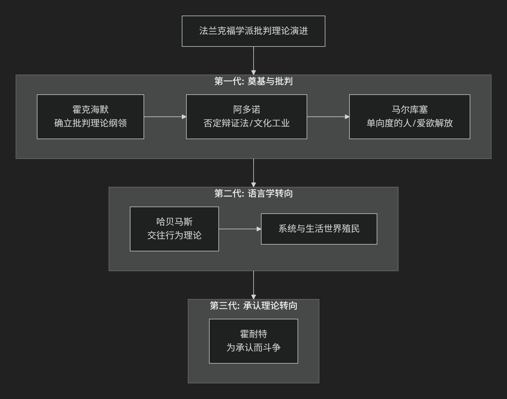

Frankfurt
=========

基于法兰克福学派（Frankfurt School）理论视角。

-----

法兰克福学派是20世纪最具影响力的批判性社会理论流派之一，它开创了被称为 **“批判理论”** 的独特思想传统。其核心思想可以概括为：**对现代资本主义社会进行跨学科的、彻底的批判，揭示其如何通过经济、文化、心理等各种隐蔽手段，实现对人的深层奴役和异化，即使在社会物质丰裕和政治看似自由的条件下也不例外。其目标是唤醒一种能够超越现有社会结构的、真正的解放意识。**

该学派的思想发展脉络与核心贡献，可以通过以下图表清晰地呈现其演进过程：

一、批判理论的总体纲领：对传统理论的超越

学派创始人 :doc:`马克斯·霍克海默 </chats/outlaw/analyse/foreign/branch/social/horkheim/index>` 在1937年的《传统理论与批判理论》一文中，确立了其基本立场。

*   **传统理论**：指实证主义的科学观，将知识视为对世界的 **中立、客观的描述**，旨在 **预测和控制** 世界。它接受现存的社会框架，并为之服务。

*   **批判理论**：则具有 **反思性和规范性**。它不满足于描述世界，而是要 **揭示社会的内在矛盾、批判其不公正的权力结构，并致力于推动社会向更加自由、公正和理性的方向变革**。其核心是 **批判的、解放的旨趣**。

二、核心批判维度

在上述总体纲领下，学派成员从不同维度对现代性展开了深刻批判。

1. 启蒙辩证法与工具理性批判

*   **代表人物**：:doc:`霍克海默 </chats/outlaw/analyse/foreign/branch/social/horkheim/index>`、:doc:`西奥多·阿多诺 </chats/outlaw/analyse/foreign/branch/social/adorno/index>`

*   **核心著作**：《启蒙辩证法》

*   **核心命题**： **启蒙精神在战胜神话、解放人类的同时，走向了自我毁灭。** 它强调的“理性”逐渐退化为一种 **工具理性** ——只关心手段的有效性，而不问目的的正当性。这种理性将世界（包括人）视为可计算、可操控的客体，最终导致新的神话：**技术官僚统治和新的极权主义**。

2. 文化工业论

*   **代表人物**：:doc:`霍克海默 </chats/outlaw/analyse/foreign/branch/social/horkheim/index>`、:doc:`阿多诺 </chats/outlaw/analyse/foreign/branch/social/adorno/index>`

*   **核心命题**：在发达资本主义社会，大众文化不再是自主的艺术表达，而是成为 **按照工业模式生产、传播和消费的商品**。其功能是 **麻痹大众的批判意识，为社会制造“同意”**。

*   **运作机制**：文化工业通过提供标准化的、易于消遣的娱乐产品，让人们 **逃避现实的压力，同时潜移默化地接受现有的社会秩序和价值观**。它塑造了 **被动、顺从的消费者**，扼杀了否定性和反抗精神。

3. 单向度的人

*   **代表人物**：:doc:`赫伯特·马尔库塞 </chats/outlaw/analyse/foreign/master/modern/marcuse/index>`

*   **核心著作**：《单向度的人》

*   **核心命题**：发达工业社会是一个 **利用技术理性成功压制了社会否定力量（批判和超越维度）的极权主义社会**。
 
*   **单向度化**：社会通过高生产和高消费，将原本对立的阶级（如工人阶级）整合进体系之中。人们的需要被塑造为“虚假需要”（如消费特定品牌），真正的需要（如自由、创造、否定）被压抑。人们失去了 **批判和想象一个完全不同替代方案的能力**，思想和行为都变得只有“单向度”——即认同和维护现状。

4. 权威人格与法西斯主义心理分析

*   **背景**：为解释纳粹主义为何在文明高度发达的德国兴起。

*   **研究**：通过实证研究，他们将法西斯主义的群众心理基础归结为 **“权威人格”**——一种由僵化家庭结构塑造的、兼具对权威的屈从和对弱者的攻击的性格结构。这揭示了 **社会心理是如何被经济体系所塑造并服务于该体系的**。

三、第二代与第三代的范式转换

1. :doc:`于尔根·哈贝马斯 </chats/outlaw/analyse/foreign/master/modern/habermas/index>` 的交往行为理论

*   **核心转折**：哈贝马斯将批判理论从“意识哲学”范式转向 **“语言哲学”范式**。

*   **核心命题**：**工具理性并非理性的全部。** 他提出 **“交往理性”** ，即人们在自由、平等的对话中，通过“更好的论据的力量”达成共识的理性。这种理性内在于语言交往的结构中。

*   **诊断**：现代社会的核心问题是 **系统（以金钱和权力为媒介的经济和官僚体系）对“生活世界”（以交往行为为基础的日常文化领域）的殖民化**。批判的任务是 **捍卫生活世界，发展交往理性**，以抵抗系统的侵蚀。

2. :doc:`阿克塞尔·霍耐特 </chats/outlaw/analyse/foreign/branch/social/honneth/index>` 的承认理论

*   **核心转折**：将批判理论的基础从“交往”转向 **“承认”**。

*   **核心命题**： **社会冲突的深层动力是为“承认”而斗争。** 主体需要从他人那里获得爱、法律平等和社会尊重等不同形式的承认，才能实现自我同一性。

*   **诊断**：社会不公的本质是 **承认的拒绝或扭曲**。批判理论的任务是分析这些“承认关系”中的病理，并为建立公正的承认秩序而奋斗。

---

核心要义与代表人物总结

.. list-table:: 
   :header-rows: 1
   :widths: 25 45 30
   :align: center

   * - **理论维度**
     - **核心命题**
     - **代表人物与著作**
   * - **总体方法论**
     - **批判理论超越传统理论**，旨在社会解放而非仅仅描述社会。
     - :doc:`霍克海默 </chats/outlaw/analyse/foreign/branch/social/horkheim/index>` （《传统理论与批判理论》）
   * - **理性批判**
     - **启蒙走向自我毁灭，工具理性导致新统治**。
     - :doc:`霍克海默 </chats/outlaw/analyse/foreign/branch/social/horkheim/index>`、:doc:`阿多诺 </chats/outlaw/analyse/foreign/branch/social/adorno/index>` （《启蒙辩证法》）
   * - **文化批判**
     - **文化工业麻痹大众，制造顺从的消费者**。
     - :doc:`阿多诺 </chats/outlaw/analyse/foreign/branch/social/adorno/index>`、:doc:`霍克海默 </chats/outlaw/analyse/foreign/branch/social/horkheim/index>` （《文化工业：作为大众欺骗的启蒙》）
   * - **社会批判**
     - **发达工业社会造就"单向度的人"，消灭否定性**。
     - :doc:`马尔库塞 </chats/outlaw/analyse/foreign/master/modern/marcuse/index>` （《单向度的人》）
   * - **心理批判**
     - **权威人格是法西斯主义的群众心理基础**。
     - :doc:`弗洛姆 </chats/outlaw/analyse/foreign/branch/psycho/fromm/index>` 、:doc:`阿多诺 </chats/outlaw/analyse/foreign/branch/social/adorno/index>` 等 （《权威人格研究》）
   * - **范式重建（第二代）**
     - **以"交往理性"对抗"系统对生活世界的殖民"**。
     - :doc:`哈贝马斯 </chats/outlaw/analyse/foreign/master/modern/habermas/index>` （《交往行为理论》）
   * - **范式发展（第三代）**
     - **社会斗争的本质是"为承认而斗争"**。
     - :doc:`霍耐特 </chats/outlaw/analyse/foreign/branch/social/honneth/index>` （《为承认而斗争》）

思想特质与影响

*   **跨学科性**：融合哲学、社会学、经济学、心理学、文学批评等进行整体分析。
*   **辩证性**：深刻揭示现代性的 **两面性** ——其进步与倒退、解放与奴役并存于一体。
*   **现实关怀**：始终紧扣20世纪最重大的历史事件（法西斯主义、斯大林主义、消费资本主义、福利国家等）。
*   **深远影响**：为 **文化研究、媒体研究、政治哲学、社会运动** 等提供了核心的分析工具和批判视角。

总而言之，法兰克福学派的核心思想在于，它是一套 **“关于奴役的清醒剂”和“关于解放的想象力”** 。它教导我们，**真正的批判在于质疑那些被视为理所当然的、最舒适和最“正常”的东西**。它提醒我们，自由不仅需要物质基础，更需要一种**不妥协的批判精神和一种对另一种可能世界的坚定想象**。

-------------------

 .. toctree::
    :maxdepth: 3

    grok
    gemini
    copilot
    chatgpt
    ds
    qw

---------------------------

[:doc:`批判理论 </chats/outlaw/analyse/foreign/schools/modern/critical/index>`]
[:doc:`批判理论与法兰克福学派 </chats/outlaw/analyse/foreign/schools/modern/critical/frankfurt>`]
