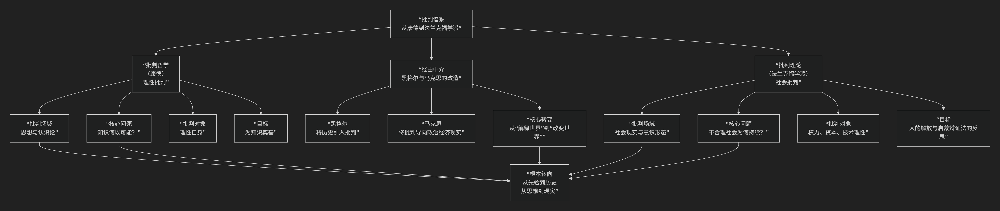

Critical Theory
====================

基于批判理论（Critical Theory）的核心思想

---------------------------------

批判理论和批判哲学既有深刻的历史关联，又有根本性的立场分歧。下面我将首先厘清它们的关系，然后系统介绍批判理论的核心思想。

一、从“理性批判”到“社会批判”

简单来说，**批判哲学是批判理论的重要思想源头和方法论启迪者，但批判理论扭转了批判哲学的基本方向，完成了一场从“认识论”到“社会理论”的范式转换。**

它们的关系可以概括为：

*   **批判哲学（康德）**：核心是 **理性的自我批判**。它追问“知识如何可能？”，旨在为理性划界，防止其僭越。其批判场域在 **思想内部**，目标是建立普遍有效的知识基础。

*   **批判理论**：核心是 **社会的批判**。它追问“不合理的社会现实为何持续存在？”，旨在揭示社会中的权力、压迫和意识形态。其批判场域是 **社会现实本身**，目标是推动社会解放。

**关系比喻**：批判哲学如同一位严谨的“工具质检员”，检查我们认识世界的“工具”（理性）是否可靠。而批判理论则像一位“病理学家”，使用（经过改造的）工具去诊断社会机体本身的“疾病”（不公正、奴役、异化）。

为了更直观地把握这一者复杂的历史承继与根本转向，下图清晰地勾勒了其演变脉络与核心差异：

二、批判理论的核心思想

批判理论是20世纪20年代起源于德国法兰克福大学“社会研究所”（通称法兰克福学派）的一种社会哲学思潮。其核心思想可以概括为：**一种旨在** 不仅理解社会，更要批判和改变社会，以将人从奴役和压迫中解放出来 **的跨学科社会研究。它拒绝将思想与社会现实割裂，力图揭示隐藏在表面“合理性”之下的权力关系、意识形态操控和系统性非理性，其根本旨趣是“解放的旨趣”。**

以下，我们将深入解析其核心要义。

（一）、思想渊源与立场：对传统理论的“批判”

“批判理论”一词最初由霍克海默在1937年的经典论文《传统理论与批判理论》中提出，旨在与占主导地位的“传统理论”（以实证主义为代表）划清界限。

.. list-table:: 
   :header-rows: 1
   :widths: 25 35 40
   :align: center

   * - **对比维度**
     - **传统理论（如实证主义）**
     - **批判理论**
   * - **目标**
     - **客观描述、解释、预测** 社会现象，提高生产效率和控制社会。
     - **批判、揭露、改造** 社会，追求人的解放。
   * - **方法论**
     - 模仿自然科学，追求价值中立、客观性，将社会事实化约为可量化的数据。
     - **反思性** 的，认为研究无法脱离社会价值和利益，理论家是社会进程的参与者。
   * - **社会角色**
     - 充当 **技术顾问**，服务于现有社会的管理和修补。
     - 充当 **批判者**，站在被压迫者一边，旨在唤醒大众的批判意识。
   * - **知识观**
     - 知识像镜子一样 **反映** 现实。
     - 知识是一种 **介入现实** 的力量，与人类的解放旨趣相连。

（二）、核心批判维度

批判理论不是一个统一的学说，而是围绕几个核心主题展开的批判星丛。

1.  **对启蒙理性与工具理性的批判**

    *   **核心论点**：启蒙运动倡导的“理性”并未带来预期的自由和幸福，反而 **蜕化为一种“工具理性”**。这种理性只关心“手段”的有效性（如何最高效地达成既定目标），却放弃对“目的”本身（何为良善生活？）进行价值判断。

    *   **后果**：工具理性渗透到社会各领域，使人沦为可被计算、管理和操控的客体。霍克海默和阿多诺在《启蒙辩证法》中深刻指出，这种对自然的工具化控制，最终导致了对人自身的控制。**“理性”成了新的神话。**

2.  **对资本主义、文化工业与异化的批判**

    *   **政治经济学批判**：继承马克思，分析资本主义如何通过商品拜物教、剩余价值剥削制造不平等和奴役。

    *   **文化工业**：这是批判理论的标志性概念。大众文化（电影、广播、流行音乐）不再是真正的艺术，而是被资本逻辑收编的 **意识形态工具**。它通过标准化、模式化的文化产品，麻痹大众的批判意识，制造虚假需求，让人们安于现状。

    *   **异化**：人在劳动、消费乃至休闲中，都与自己的创造性本质相疏离，成为社会机器上一个被动的、可替换的零件。

3.  **对意识形态的批判**

    *   意识形态并非一套“错误观念”，而是一种 **隐含在社会实践和日常生活中的、维护统治关系的“虚假意识”**。它通过教育、媒体、语言等渠道，将特定的、偶然的社会安排（如阶级差异、性别歧视） **自然化、永恒化**，让人们不自觉地接受现存秩序是唯一可能和合理的。

（三）、核心特征与方法

1.  **跨学科性**：融合哲学、社会学、经济学、心理学（如弗洛伊德、弗洛姆）、文学理论等，多角度诊断现代性病症。
2.  **辩证思维**：反对非此即彼的形而上学，强调分析社会现象中的内在矛盾（如自由市场的理念与垄断的现实）。
3.  **反思性**：批判理论必须将自身置于批判之下，反思自己的社会立场和局限性。
4.  **规范性基础**：其批判并非凭空指责，而是基于一种（有时是隐含的）规范性理想，如 **自由、正义、和解、非压制性的文明**。

三、核心要义总结

.. list-table:: 
   :header-rows: 1
   :widths: 25 45 30
   :align: center

   * - **理论维度**
     - **核心命题**
     - **关键概念与贡献**
   * - **理论立场**
     - **理论不是价值中立的描述，而是致力于社会解放的批判性介入。**
     - **批判 vs 传统理论、解放的旨趣、反思性**
   * - **现代性批判**
     - **启蒙理性已蜕变为工具理性，成为新的统治形式。**
     - **启蒙辩证法、工具理性、文化工业**
   * - **社会病理诊断**
     - **资本主义通过经济、文化制造了全面的异化和虚假意识。**
     - **异化、商品拜物教、意识形态、虚假需求**
   * - **方法论**
     - **采用跨学科的、辩证的方法，揭示社会表面的合理性之下的权力结构。**
     - **跨学科研究、辩证思维、意识形态批判**

四、总结

总而言之，批判理论的核心思想在于，它是一场 **“现代社会病理学的宏大调查”** 。它教导我们，**那些被视为天经地义的“常态”——经济的增长、科技的进步、文化的繁荣——可能正系统地生产着的不自由和不公正。真正的批判，在于戳穿这种“合理性”的幻象，唤醒人们对另一种可能生活的想象。**

它的全部工作是对 **现代文明** 的一次全面而深刻的体检。尽管其观点常被视为悲观或激进，但它所提供的批判性视角，对于我们理解消费社会、媒体霸权、技术统治等当代问题，依然是不可或缺的思想资源。在这个意义上，批判理论不仅是一种学术传统，更是一种永不妥协的批判精神和解放承诺。

------------

 .. toctree::
    :maxdepth: 3

    grok
    copilot
    chatgpt
    deepseek
    gemini
    qwen

---------------------------

[:doc:`西方马克思主义 </chats/outlaw/analyse/foreign/schools/modern/marx/index>`]
[:doc:`后现代马克思主义 </chats/outlaw/analyse/foreign/schools/today/marx/index>`]
[:doc:`法兰克福学派 </chats/outlaw/analyse/foreign/schools/modern/critical/frankfurt/index>`]
[:doc:`批判理论与法兰克福学派 </chats/outlaw/analyse/foreign/schools/modern/critical/frankfurt>`]
[:doc:`批判理论与马克思主义 </chats/outlaw/analyse/foreign/schools/modern/critical/marx>`]

