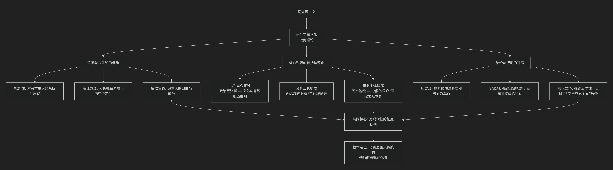

# 批判理论与马克思主义

法兰克福学派（批判理论）与马克思主义的关系极为深刻和复杂，可以概括为：**批判理论是对马克思主义的继承、反思、修正与激进化，使其适应20世纪的新历史条件（法西斯主义、消费社会、文化工业等）。**

我们可以从 **“三重关系”** 来理解这种联系：**继承、转折与超越**。

为了更直观地理解两者间的传承与发展关系，下图概括了这一演进脉络：

以下，我们将沿此逻辑脉络，深入解析其核心要义。

---

### **一、继承：批判理论的马克思主义根基**

法兰克福学派自诞生起就以“马克思主义”为标签，其核心成员（霍克海默、阿多诺、马尔库塞等）继承了马克思主义的**基本问题意识和方法论内核**。

1. **对资本主义的彻底批判立场**：他们完全接受马克思对资本主义的批判，认为它是一个建立在剥削、物化和矛盾之上的非理性体系。他们的工作始终是“批判的”，旨在揭示社会表象下的压迫结构。
2. **辩证法的运用**：他们坚持使用辩证思维，分析社会的内在矛盾、现象与本质的差异，并寻找内在的否定力量。阿多诺的“否定辩证法”正是这种方法的极致发展。
3. **解放的旨趣**：理论的最终目的是人的解放，摆脱一切形式的奴役和异化。这直接源于马克思主义的共产主义理想。

### **二、转折：对经典马克思主义的深刻修正**

面对20世纪的历史现实（俄国革命后的斯大林主义、西欧无产阶级革命失败、法西斯主义崛起、美国发达的消费社会），他们认为经典马克思主义的许多核心预设已经**不足或过时**，必须进行重大修正。

| 修正维度             | **经典马克思主义**                                   | **法兰克福学派的转折**                                                                                                                               |
| :------------------- | :--------------------------------------------------------- | :--------------------------------------------------------------------------------------------------------------------------------------------------------- |
| **经济决定论** | 经济基础决定上层建筑。                                     | **拒绝简化论**。强调**上层建筑（文化、意识形态、心理学）的相对自主性**，甚至认为在晚期资本主义社会，文化工业和技术理性已成为主导的统治力量。   |
| **革命主体**   | **工业无产阶级**是历史的否定力量和革命主体。         | **悲观地认为无产阶级已被“整合”**。他们被消费主义收编，失去了革命意识。革命主体“缺失”，批判只能由少数知识分子承担。                               |
| **历史进步观** | 历史是生产力发展的线性进步过程，最终通过革命到达共产主义。 | **强烈怀疑历史进步论**。目睹了奥斯维辛，他们认为“启蒙”可能走向自我毁灭的“野蛮”，进步与倒退交织。本雅明认为历史是“灾难的堆积”。                 |
| **科学的权威** | 马克思主义是“科学社会主义”，揭示客观历史规律。           | 区分**“传统理论”**（实证的、肯定的）与**“批判理论”**（反思的、否定的）。他们坚持后者，反对将马克思主义教条化为“科学”，强调其批判和乌托邦维度。 |
| **统治的形式** | 统治主要是**经济剥削和阶级压迫**。                   | 统治更多是**意识形态控制、技术理性与文化的“微妙暴力”**。马尔库塞提出“舒适的奴役”，阿多诺分析“文化工业”如何麻痹大众。                           |

### **三、超越：新工具与新领域**

为了完成上述修正，他们创造性地**融合了其他思想资源**，极大地扩展了批判的边界：

1. **弗洛伊德精神分析**：用于分析**权威人格**（法西斯主义的心理基础）、社会如何**压抑本能**并将其导向顺从，以及解放可能需要的“非压抑性文明”。
2. **韦伯的理性化理论**：用于发展出 **“工具理性批判”** 。他们认为，资本主义的危机不仅是经济的，更是理性的：原本用于解放人类的理性，蜕变为计算、控制和支配的工具理性，渗透到社会每一个角落。
3. **美学与文化批判**：这是他们最富创造性的领域。他们将文化产品（音乐、电影、广告）置于资本主义商品生产和意识形态再生产的核心进行分析，提出了影响深远的 **“文化工业”** 理论。同时，他们也在先锋派艺术中寻找否定和反抗的工具。

### **四、核心分歧与内部演变**

尽管同属一个学派，其内部对马克思主义的态度也有差异：

* **霍克海默、阿多诺**（尤其是战后）：最为悲观，认为启蒙辩证法的“否定”几乎看不到出路，革命希望渺茫，理论本身成为最后的抵抗堡垒。
* **马尔库塞**：相对乐观，在1960年代的学生运动中看到了新的革命主体（边缘群体、知识分子、青年），并试图将马克思主义与弗洛伊德主义结合，提出“爱欲与文明”的解放图景。
* **哈贝马斯**（第二代）：试图“重建”历史唯物主义。他承认马克思的贡献，但认为其局限于“劳动”范式，需要用 **“交往行为理论”** 来补充。他批判工具理性，但试图在“交往理性”中寻找现代社会新的规范基础，标志着学派向更具建设性的理论转型。

### **总结**

总而言之，法兰克福学派与马克思主义的关系是 **“批判的继承者”** 关系。

* 他们**放弃了**马克思主义中许多**具体的历史预言和革命策略**（经济决定论、无产阶级使命、暴力革命）。
* 他们**坚守并激进化了**马克思主义的**批判精神和解放承诺**，将其应用于马克思未曾预料的新的统治形式（大众文化、技术理性、消费社会、行政控制）。
* 他们**不再是“正统的”马克思主义者**，但无疑是**20世纪最重要、最具创造性的马克思主义传统发展者之一**。他们的工作标志着马克思主义从一门关于“政治经济学”的革命理论，转向了一种更广泛、更精密的关于**现代性文明批判**的社会哲学。

因此，可以说**批判理论是马克思主义在20世纪面临深刻危机时，一次痛苦而必要的自我革新和智力深化**。
