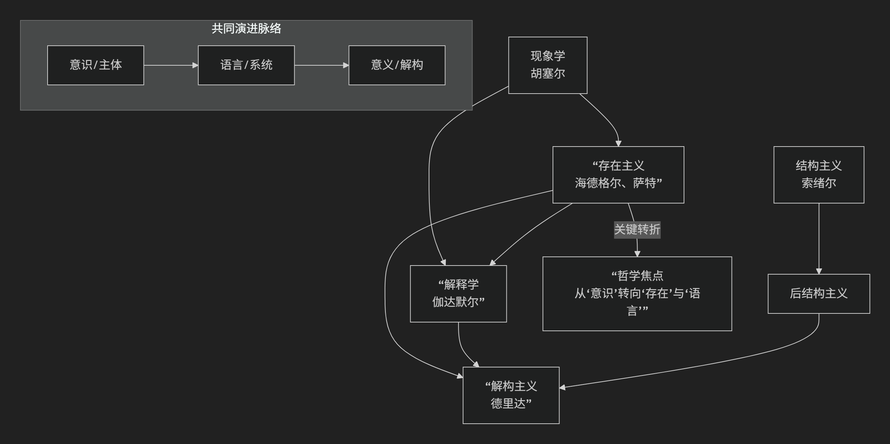
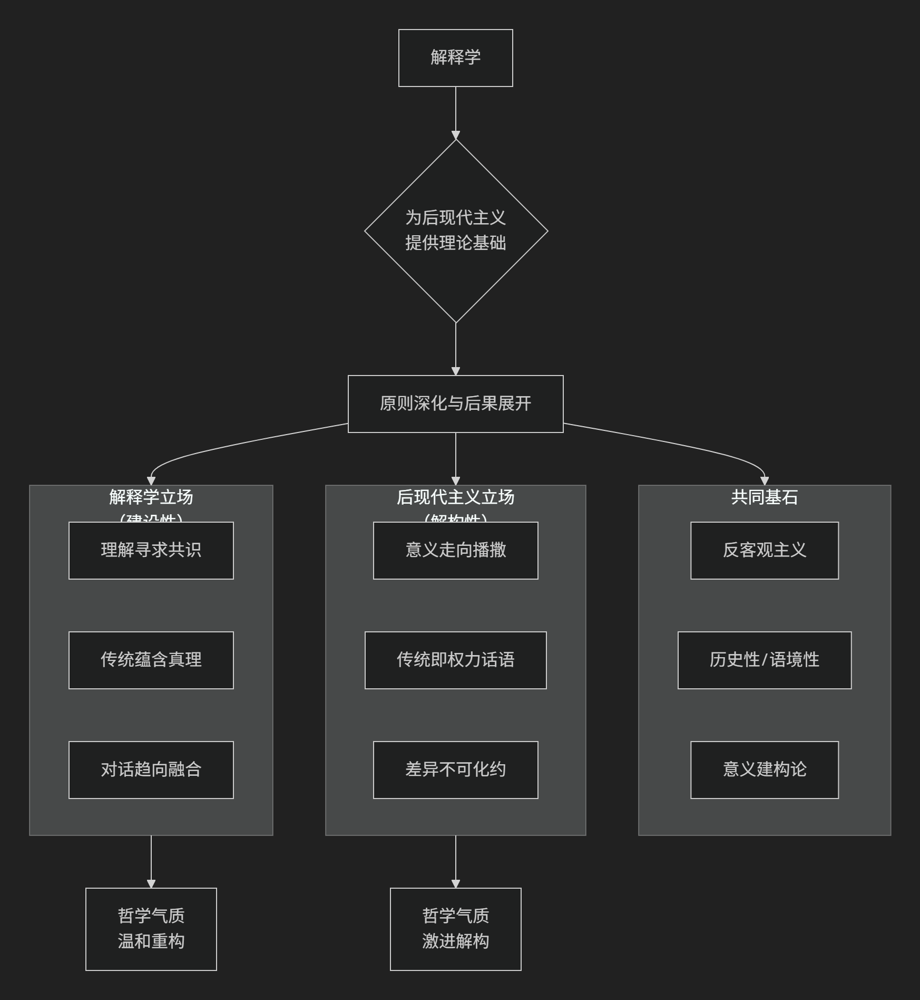

# Deepseek

----------

## 解释学与其它学派

现代欧陆哲学各学派不是孤立发展的，而是存在着深刻的**承继、批判与转折**关系。它们共同描绘了20世纪欧陆哲学从探究“意识”到探究“语言”再到解构“意义”的演变轨迹。

为了更直观地理解它们错综复杂的关系，下图梳理了各学派的发展脉络与核心思想关联：

### 核心关系总览

简单来说，这条思想链可以这样概括：

*   **现象学**是**母体和起点**，试图为哲学找到坚实基点。
*   **存在主义**是现象学的一次**人类学转折**，将其应用于人的具体生存。
*   **解释学**是现象学和存在主义的**融合与发展**，将“理解”视为人的基本存在方式。
*   **结构主义**是作为**反题**出现的，它反对前三种思想对“主体”和“意识”的强调，转而关注客观的“结构”和“系统”。
*   **后结构主义/解构主义**则又是对**结构主义**的批判和超越，它吸收了前几家所长，最终将焦点指向语言和意义的无限延异游戏。

下面我们详细展开它们之间的具体关系。

### 一、现象学：共同的起点与方法论母体

**创始人**：埃德蒙德·胡塞尔
**口号**：“回到事物本身！”

现象学可被视为其他学派的**共同源头和方法论摇篮**。

*   **核心目标**：悬置（搁置）关于世界存在的传统信念（“自然态度”），直接**描述呈现在我们意识中的现象**，从而为知识找到一个绝对可靠的基础。
*   **关键方法**：**意向性**（意识总是关于某物的意识）和**本质直观**。
*   **与其他学派的关系**：
    *   **对存在主义**：胡塞尔的学生**海德格尔**将老师的现象学方法从对“纯粹意识”的分析，彻底转向了对“人的存在”（此在）的追问。他问的不是“意识是什么？”，而是“**存在**的意义是什么？”。这就完成了从现象学到存在主义的转折。
    *   **对解释学**：海德格尔进一步认为，人对“存在”意义的探究，本身就是一种**理解和解释**活动。因此，他将现象学发展为**解释学的现象学**，为后来的伽达默尔开辟了道路。
    *   **对结构主义**：结构主义在某种意义上是对胡塞尔追求“主体性”和“意义”的**反叛**。

### 二、存在主义：现象学的人类学应用与深化

**核心人物**：海德格尔、萨特、梅洛-庞蒂
**核心关切**：人的存在、自由、选择、焦虑、死亡。

存在主义可看作是将现象学方法**彻底地应用于具体的人类生存境况**。

*   **从现象学到存在主义**：胡塞尔关心的是普遍的意识结构，而海德格尔和萨特则认为，哲学的起点必须是**独特的人类存在**——“此在”。他们用现象学方法描述了人被“抛入”世界、面对虚无、不得不自由选择等生存体验。
*   **与解释学的关系**：海德格尔的哲学本身就是存在论的解释学。他认为理解不是认识方法，而是**此在的存在方式**。伽达默尔则继承并发展了这一点，将其系统化为哲学解释学。
*   **与结构主义的对立**：存在主义高扬**人的主体性、自由和能动性**。而结构主义则宣称**“主体已死”**，认为不是人在说话，而是结构在通过人说话。两者在“人”的地位问题上直接对立。

### 三、结构主义：作为反题的革命

**核心人物**：索绪尔（语言学）、列维-斯特劳斯（人类学）、拉康（精神分析）
**核心观点**：**“语言/文化/心灵的结构决定了个体的思想和行为。”**

结构主义是作为现象学和存在主义的**一个强大反题**而出现的。

*   **反主体/反人道主义**：结构主义认为，现象学和存在主义对“主体”、“意识”、“自由”的强调是一种幻觉。真正的决定力量是**隐藏在表象之下的深层、无意识的结构系统**（如语言结构、亲属结构、神话结构）。
*   **反历史**：结构主义关注**共时性** 结构（系统在特定时刻的静态关系），而非**历时性** 演变（历史发展），这与强调历史性的解释学形成对比。
*   **关系**：它用“结构决定论”取代了“主体中心论”，彻底改变了人文社会科学的研究范式。

### 四、解释学：在现象学、存在主义与结构主义之间

**核心人物**：伽达默尔
**核心观点**：**“理解是此在的基本存在方式。”**

解释学巧妙地**吸收和融合**了现象学、存在主义，并回应了结构主义的挑战。

*   **继承现象学与存在主义**：从海德格尔那里继承了“理解”的本体论地位和前结构（前见）。
*   **回应结构主义**：伽达默尔承认结构主义揭示的“语言中心性”，但他认为语言不是封闭的结构，而是**进行中的、活生生的对话**，理解是“视域融合”的事件。他保留了**历史性和主体间性**，这与结构主义的反历史倾向不同。

### 五、后结构主义/解构主义：对结构主义的内部爆破

**核心人物**：德里达、福柯、巴特
**核心观点**：**解构结构的稳定性和确定性，揭示意义的无限延异。**

后结构主义是从结构主义内部生发出来的**批判者和颠覆者**。

*   **与结构主义的关系**：它接受结构主义关于“语言重要性”的基本前提，但反对其“结构是稳定、封闭、有中心”的观点。
*   **德里达的解构**：认为结构总有一个无法被结构化的“中心”，而这个中心本身是脆弱的。意义不是在二元对立中确定的，而是在无尽的“延异”中被不断推迟和差异化的。
*   **与其他学派的关系**：德里达的解构思想深受胡塞尔现象学（对符号的分析）和海德格尔存在论（对“存在”的追问）的影响，但其结论却动摇了它们的基础。

### 总结：一张动态的思想地图

| 学派 | 核心关切 | 与它派的关系 |
| :--- | :--- | :--- |
| **现象学** | **意识与现象** | **母体**：为存在主义和解释学提供了方法论。 |
| **存在主义** | **人的生存与自由** | **应用与转折**：将现象学应用于人的具体存在，与结构主义直接对立。 |
| **解释学** | **理解与意义** | **综合与发展**：融合现象学/存在主义，并回应结构主义的语言观。 |
| **结构主义** | **系统与结构** | **反题**：反对前三种学派对“主体”的强调，关注客观结构。 |
| **后结构主义** | **差异与解构** | **批判与超越**：从内部解构结构主义，并颠覆传统的意义和真理观。 |

总而言之，这些学派的关系是一部**充满张力的思想戏剧**：从现象学的**奠基**，到存在主义的**转向**，再到结构主义的**反叛**，最后到解构主义对一切的**颠覆**。它们共同推动哲学告别了追求绝对确定性的梦想，进入了一个关注**语言、历史、差异和解释**的更为复杂、也更为丰富的时代。

-------------------------------

## 解释学与后现代主义

解释学与后现代主义的关系极其密切，可以说，**解释学为后现代主义提供了核心的理论工具和哲学基础，而后现代主义则将解释学的原则推向了极端，并将其后果彻底地展现出来。**

它们之间的关系不是简单的从属，而是一种**深化、激进化和后果展开**的关系。

为了更直观地理解两者错综复杂的关系，下图梳理了其核心关联与根本分歧：

### 一、共同基石：从客观主义走向意义建构论

解释学和后现代主义都猛烈批判了传统哲学中的**客观主义**和**基础主义**迷梦。

*   **共同敌人**：那种认为存在一个**独立于观察者、可以被绝对客观地把握的“真理”** 的观念。它们都认为，理解不是主体被动地“反映”客观世界的过程。
*   **共同核心**：**意义是生成的、建构的，而非被发现的。**
    *   **解释学的贡献**：伽达默尔提出，理解是 **“视域融合”** 的历史事件。我们总是带着由历史和文化形成的“前见”去理解，意义是在读者与文本、现在与过去的对话中产生的。
    *   **后现代主义的推进**：全盘接受这一观点，并进一步认为，既然意义是建构的，那么就不存在唯一的、确定的、权威的解释。意义是**多元的、不稳定的、语境化的**。

正如图表所示，两者共同致力于解构传统的客观主义意义观，但在此共同基石上，却发展出了不同的哲学气质与路径。

### 二、解释学：温和的建构主义与对传统的信任

以伽达默尔为代表的哲学解释学，虽然激进，但依然保持着某种建设性和保守性。

*   **目标**：**达成理解与共识**。尽管理解是历史的、有前提的，但伽达默尔相信通过真诚的对话，不同的视域可以融合，从而达成一种更丰富的、共享的理解。
*   **对传统的态度**：**基本信任**。伽达默尔认为，我们隶属于传统，传统不是应被克服的偏见，而是理解得以可能的条件。传统中蕴含着需要我们倾听的真理。
*   **关键词**：**对话、效果历史、视域融合**。其基调是希望通过承认历史性来更好地进行沟通。

### 三、后现代主义：激进的解构主义与对传统的怀疑

后现代主义将解释学的洞见推向极致，得出更激进的结论。

*   **目标**：**揭示差异与不确定性**。后现代主义者（如德里达、利奥塔）认为，解释学所追求的“共识”或“融合”可能是一种幻觉，它掩盖了无法化约的**差异、冲突和权力意志**。
*   **对传统的态度**：**深刻怀疑**。后现代主义将传统视为一种压迫性的 **“宏大叙事”** （利奥塔），是权力话语的体现，其目的是压制异质性的声音。他们的任务不是倾听传统，而是**解构**传统。
*   **关键词**：**解构、差异、播撒、权力/知识**。其基调是批判、怀疑和释放被主流叙事所压抑的意义可能性。

### 四、关键交锋：以德里达 vs. 伽达默尔为例

两位哲学巨匠的著名论战完美体现了这种关系。

*   **伽达默尔**：他强调 **“善良意志”** ，即对话双方都愿意理解对方，最终达成一致。理解是可能的。
*   **德里达**：他对此深表怀疑。他认为语言本身具有 **“延异”** 特性，意义总是被延迟、扩散和差异化的。真正的、完全的“理解”是不可能的，误解才是常态。对话中永远存在无法被“融合”的剩余物。

这场辩论就是 **“对话的哲学”** 与 **“差异的哲学”** 的交锋。解释学相信对话能通向真理；后现代主义则认为对话本身就是一个充满裂隙和权力游戏的领域。

### 关系总结表

| 特征维度 | **解释学（以伽达默尔为例）** | **后现代主义（以德里达、利奥塔为例）** | **关系性质** |
| :--- | :--- | :--- | :--- |
| **核心诉求** | 通过对话达成 **“理解”与“共识”** | 通过解构揭示 **“差异”与“冲突”** | **目标分歧** |
| **对意义的看法** | 意义在 **“视域融合”** 中生成，趋向稳定 | 意义在 **“延异播撒”** 中滑动，永不固定 | **原则的激进化** |
| **对传统的态度** | **信任**，传统是理解的基石 | **怀疑**，传统是需解构的“宏大叙事” | **态度的对立** |
| **哲学气质** | 建设性的、温和的、辩证的 | 批判性的、激进的、颠覆的 | **气质的差异** |
| **共同点** | 反对客观主义，认为意义是历史性和语境化的建构 | 反对客观主义，认为意义是历史性和语境化的建构 | **共同的出发点** |

### 结论

总而言之，解释学与后现代主义是**同一条思想战线上的盟友与对手**。

*   **解释学**是**后现代主义的先驱和理论基础**。它摧毁了客观主义的堡垒，为“意义建构论”打开了大门。
*   **后现代主义**是**解释学逻辑的激进继承者和后果清算者**。它走进解释学打开的大门，并将屋内的所有家具（共识、真理、传统、主体）都拆解一遍，告诉我们这个房子根本没有稳固的根基。

可以做一个比喻：
*   **解释学**像一位**严谨的考古学家**。他承认我们无法完全客观地还原历史现场（反对客观主义），但相信通过仔细的挖掘和与历史文本的对话，我们可以无限逼近历史的真实意义，并从中获得教益。
*   **后现代主义**像一位**叛逆的艺术家**。他同意考古学家的前提，但他进入遗址后，目的不是复原，而是用遗址的碎片进行全新的、颠覆性的创作，以展示历史叙述本身是如何被权力建构的，并庆祝意义的无限可能。

因此，**没有解释学，后现代主义就缺乏哲学深度；而没有后现代主义，解释学的革命性后果就可能被淡化。** 两者共同构成了20世纪哲学对“理解”和“意义”问题进行的最为深刻的探索。

