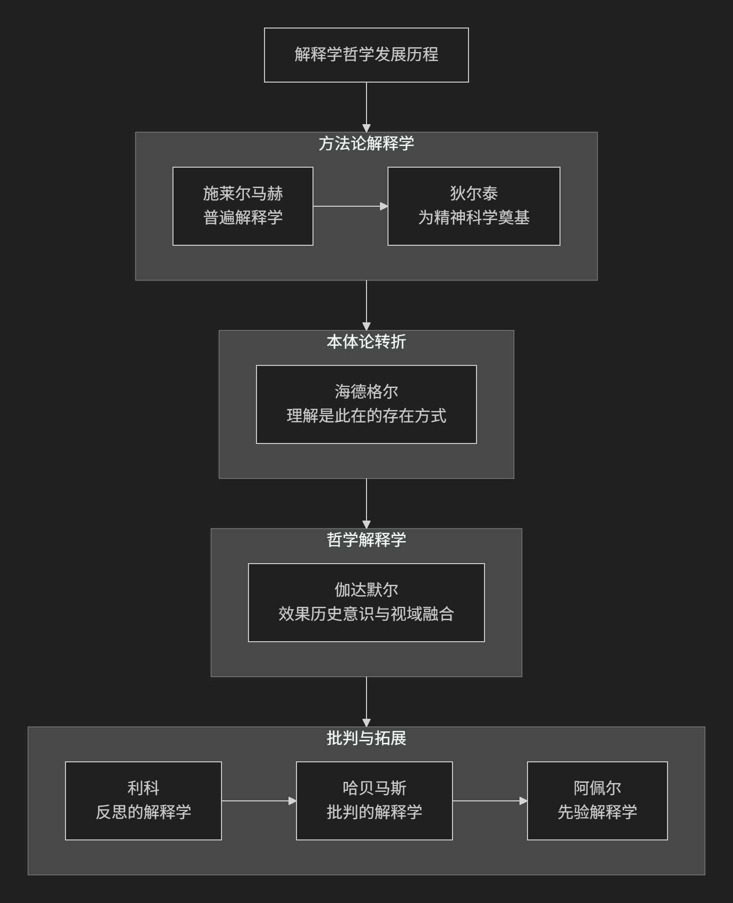

Hermeneutics
==============

基于解释学（Hermeneutics）理论视角。

-----

解释学是一门关于 **理解、解释和意义** 的哲学学科。其核心思想经历了从 **方法论** （如何正确解释文本）到 **认识论** （理解如何成为可能），再到 **本体论** （理解是人的基本存在方式）的根本性转变。

其核心思想可以概括为：**“理解”不是主体认识客体的方法，而是人存在于世的基本方式。理解具有历史性、语言性和实践性，总是发生在特定的“前见”和“视域”中，并通过“解释学循环”实现“视域融合”。**

以下流程图清晰地展示了解释学发展的主要阶段、核心转折及代表人物：

解释学核心思想的演变

一、方法论解释学：追寻客观意义

早期解释学旨在为文本解释（尤其是《圣经》和古典文献）建立一套普遍规则，以消除误解，获得客观意义。

*   **核心关切**：**如何正确理解文本的作者原意？**

*   **代表人物与思想**：

    *  :doc:`弗里德里希·施莱尔马赫 </chats/outlaw/analyse/foreign/master/recent/smacher/index>`  ：

        *   **普遍解释学**：解释学不应只是特定领域的技巧，而应是适用于一切文本理解的普遍方法论。

        *   **核心命题**：**“比作者理解他自己更好地理解作者。”** 理解的关键在于通过语法解释（语言规则）和心理解释（重构作者创作过程）的循环，把握作者自己都可能未意识到的深层意图。

    *  :doc:`威廉·狄尔泰 </chats/outlaw/analyse/foreign/master/recent/dilthey/index>` ：

        *   **为“精神科学”奠基**：深受自然科学方法论挑战，狄尔泰试图为人文科学（历史、艺术、哲学）找到独特的方法论基础。

        *   **核心命题**：**“我们说明自然，但我们理解生命。”** 自然需要因果“说明”，而人的生命表达（文本、行动、艺术）则需要“理解”。

        *   **方法**：通过“移情”和“重新体验”，理解者进入他人的生命体验，从而获得客观知识。

二、本体论转折：理解是存在的方式

这一转折由海德格尔发起，将解释学从方法论提升为哲学的核心。

*   **核心关切**：**“理解”如何先于主客二分，构成人之为人的根本？**

*   **代表人物与思想**：

    *  :doc:`马丁·海德格尔 </chats/outlaw/analyse/foreign/master/modern/heidegger/index>` ：

        *   **理解是此在的存在方式**：人（此在）不是先存在然后去理解，人本质上就是一种 **理解着的存在**。理解是我们与世界打交道的基本方式，它先于任何理论反思。

        *   **前结构**：任何理解都必然基于我们已有的“前有”、“前见”和“前概念”。我们总是带着“先入之见”去理解，而非从零开始。

三、哲学解释学：历史与对话中的理解

伽达默尔在海德格尔基础上，系统构建了现代哲学解释学。

*   **核心关切**：**在历史中，理解如何实际发生？**

*   **代表人物与思想**：

    *  :doc:`汉斯-格奥尔格·伽达默尔 </chats/outlaw/analyse/foreign/master/modern/gadamer/index>` ：

        *   **效果历史意识**：我们始终处于历史的影响之下，真正的理解是意识到这种影响，而非试图摆脱它。理解是历史本身的运动的一部分。

        *   **视域融合**：理解不是主体侵入客体，而是 **理解者的当下视域与文本的历史视域相互融合**，形成一个全新的、更广阔的视域。

        *   **对话模式**：理解如同对话，我们向文本提问，文本也向我们提问，在问答中真理得以显现。

四、批判与反思：解释学的多元发展

伽达默尔之后，解释学向多个方向拓展，与其他思想传统碰撞。

*   **核心关切**：**理解是否隐含权力与意识形态？如何保证解释的正当性？**

*   **代表人物与思想**：

    *  :doc:`保罗·利科 </chats/outlaw/analyse/foreign/master/nowaday/ricoeur/index>` ：

        *   **反思的解释学**：试图调和解释学的各种冲突。他主张通过 **“长程迂回”** ——即对符号、神话、文本等客观产物的细致分析——来更好地理解自我。他强调 **叙事身份**，我们通过讲述故事来理解自身。

    *  :doc:`于尔根·哈贝马斯 </chats/outlaw/analyse/foreign/master/modern/habermas/index>` ：

        *   **批判的解释学**：认为伽达默尔忽略了语言和传统中可能蕴含的 **权力扭曲和意识形态**。他主张解释学必须与 **意识形态批判** 结合，通过理想的交往情境，消除系统性扭曲，达成真正的共识。

    *  :doc:`卡尔-奥托·阿佩尔 </chats/outlaw/analyse/foreign/master/nowaday/apel/index>` ：

        *   **先验解释学**：将解释学与康德先验哲学结合，认为 **达成理解的先验条件** 是解释学的根基，所有解释共同体都必须预设一种理想沟通的可能性。

---

核心要义总结

.. list-table:: 
   :header-rows: 1
   :widths: 25 45 30
   :align: center

   * - **发展阶段**
     - **核心命题**
     - **关键概念**
   * - **方法论解释学**
     - **理解是追寻作者原意或客观精神的方法**，旨在消除误解。
     - **作者意图、心理重构、移情、生命表达**
   * - **本体论转折**
     - **理解是此在在世存在的基本方式**，先于主客二分。
     - **此在、前结构、在世存在**
   * - **哲学解释学**
     - **理解是效果历史事件中的视域融合**，以对话模式进行。
     - **效果历史、视域融合、问答逻辑、实践智慧**
   * - **批判与反思**
     - **理解需批判意识形态扭曲**，并通过叙事与反思建构自我。
     - **意识形态批判、叙事身份、反思性、交往理性**

总结

总而言之，解释学的核心思想从 **“如何正确解读文本”** 这一具体问题出发，最终发展为对 **“人如何理解自身和世界”** 这一根本哲学问题的深刻探索。它揭示了我们作为历史性的、语言性的存在，其理解活动永远是 **开放的、创造性的、处于无尽对话之中** 的。这一思想彻底改变了我们对知识、真理和理性的传统看法，使其成为20世纪以来最具影响力的哲学思潮之一。

-------------------

 .. toctree::
    :maxdepth: 3

    grok
    gemini
    chatgpt
    ds
    qw

---------------------------

[:doc:`学派比较 </chats/outlaw/analyse/foreign/schools/modern/hermen/compare>`]
