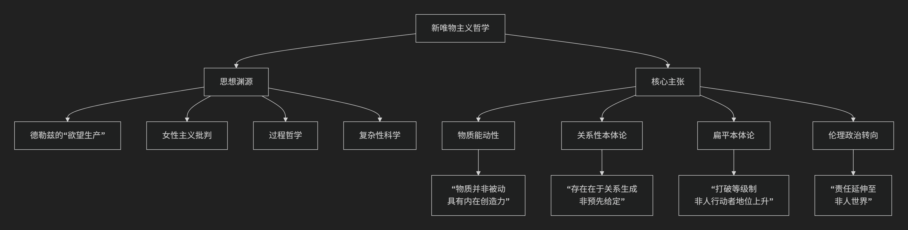

New Materialism
================

基于新唯物主义（New Materialism）​​哲学的核心思想

-----------------------------------------------

新唯物主义是21世纪初兴起的一场极具影响力的哲学思潮，它并非一个统一的理论学派，而是一个共享着相似问题意识和理论取向的思想集合。其核心思想可以概括为：**对传统哲学中“消极被动”的物质观发起一场根本性革命，主张物质（包括身体、自然、技术物等）具有内在的活力、能动性和创造力，并在此基础上重新思考政治、伦理和生态关系。**

新唯物主义的思想渊源与核心主张，可以通过以下图表清晰地呈现：

以下我们来详细解析这一哲学的核心要义。

一、对传统物质观的颠覆：从“被动惰性”到“内在能动”

这是新唯物主义最根本的突破。

*   **传统观点（尤其是机械唯物主义）**：将物质视为 **消极、惰性、被动的**。它本身没有目的、生命或创造力，其运动和形式变化完全依赖于外部力量的施加（如神的推动、人类意识的塑造）。物质是等待被形式赋予意义的“原材料”。

*   **新唯物主义的革命性观点**：物质是 **能动的、自我组织的、具有创造力的**。它内部蕴含着生成、变化和涌现新形态的潜力。自然、身体、技术物乃至社会结构，都不是僵死的，而是充满内在活力的过程。

**著名例子**：:doc:`简·贝内特 </chats/outlaw/analyse/foreign/schools/nowaday/material/bennett/index>` 在《活跃的物质》中描述了一个“垃圾堆”：她看到一只手套、一个塑料瓶、一团霉菌等。她认为，这个垃圾堆 assemblage 作为一个整体，展现了一种非人的、分布式的“能动性”，它影响着环境、视觉景观和过往行人的情绪。

二、核心原则

基于上述颠覆，新唯物主义发展出几个核心原则。

1.  **关系性本体论**

    *   **核心思想**：**不存在独立的实体，一切存在都在动态的关系网络中生成。** 事物的“本质”不是预先给定的，而是在它与其他事物（包括人类和非人）的互动中 **持续生成和变化的**。

    *   **比喻**：一个“病毒”的本质，并非固定不变，而是在它与宿主细胞、免疫系统、社会环境、全球旅行网络的互动中不断被重新定义。

2.  **扁平本体论**

    *   **核心思想**：**拒绝以人类为中心的等级制本体论**。在新唯物主义看来，人类并不天然地高于动物、植物、微生物或技术物。所有存在者（人类与非人）在本体论上是“扁平”的，都是能动的行动者，共同参与世界的构成。

    *   **思想来源**：深受 :doc:`布鲁诺·拉图尔 </chats/outlaw/analyse/foreign/schools/nowaday/material/latour/index>` “行动者网络理论”的影响。

3.  **对二元论的彻底拒绝**

    *   新唯物主义旨在消解西方思想中一系列根深蒂固的二元对立：**自然/文化、心灵/身体、人类/非人、男性/女性**。它认为这些对立是建构的，而非自然的，并导致了压迫性的思维方式（如对自然的剥削、对身体的贬低）。

三、思想渊源与代表人物

新唯物主义的思想并非凭空产生，而是植根于一系列哲学与科学传统。

*   **巴鲁赫·斯宾诺莎**： 他的“实体”论和“内在性”原则，为思考一种非超越的、存在于万物之中的力量提供了资源。

*   **吉尔·德勒兹/费利克斯·加塔利**： 无疑是新唯物主义最重要的先驱。他们的“欲望生产”、“根茎”、“装配体”等概念，为思考物质的流动、生成和创造力提供了核心词汇。

*   **过程哲学（阿尔弗雷德·诺斯·怀特海）**： 将世界理解为事件和过程的集合，而非静态实体的观点，深刻影响了新唯物主义。

*   **女性主义理论**： 特别是对“自然”被女性化并进而被剥削的批判，以及对“身体”物质性的重新评估，是新唯物主义的重要理论来源。

**主要代表人物**：

*   :doc:`简·贝内特 </chats/outlaw/analyse/foreign/schools/nowaday/material/bennett/index>` ： 提出“物的能动性”，探讨非人力量在政治生活中的作用。

*   :doc:`凯伦·芭拉德 </chats/outlaw/analyse/foreign/schools/nowaday/material/barad/index>` ： 结合量子物理学和过程哲学，阐述物质的内在活力和“能动实在论”。

*   :doc:`罗西·布雷多蒂 </chats/outlaw/analyse/foreign/schools/nowaday/material/braidotti/index>` ： 以“后人类”理论闻名，强调物质、技术和生命的连续性。

*   :doc:`曼努尔·德兰达 </chats/outlaw/analyse/foreign/schools/nowaday/material/delanda/index>` ： 运用德勒兹哲学和复杂科学，对历史和社会进行新唯物主义的重读。

四、伦理与政治意涵

新唯物主义不仅是理论革新，更具有强烈的实践关怀。

*   **生态伦理**： 如果自然不是被动的资源仓库，而是有活力的行动者，那么我们对环境的态度就应从“统治”转向“回应”和“共生”。这为应对气候变化和生态危机提供了新的伦理基础。

*   **技术伦理**： 承认技术物（如算法、社交平台）的能动性，意味着我们要反思它们如何积极地塑造我们的欲望、行为和社会关系，而不仅仅将它们视为中性工具。

*   **身体政治**： 重新肯定身体的物质性和其内在智慧，挑战将身体视为意识被动容器的观念，对性别政治和医学伦理有深远影响。

-----------------

总而言之，新唯物主义的核心思想在于，它是一场 **“哲学的生态学转向”** 。它邀请我们放弃人类是宇宙唯一主体的傲慢，转而将世界看作一个 **由无数有活力的行动者（人类与非人）共同构成的、动态的、创造性的网络**。它的最大贡献在于，为我们在这个生态危机和技术融合的时代，提供了一种 **更谦卑、更互联、更具责任感的方式** 来思考我们与万物共存的关系。

------------

 .. toctree::
    :maxdepth: 3

    grok
    copilot
    deepseek
    gemini

-----------

代表人物

[:doc:`Karen Barad </chats/outlaw/analyse/foreign/schools/nowaday/material/barad/index>`]
[:doc:`Jane Bennett </chats/outlaw/analyse/foreign/schools/nowaday/material/bennett/index>`]
[:doc:`Rosi Braidotti </chats/outlaw/analyse/foreign/schools/nowaday/material/braidotti/index>`]
[:doc:`Manuel DeLanda </chats/outlaw/analyse/foreign/schools/nowaday/material/delanda/index>`]
[:doc:`Bruno Latour </chats/outlaw/analyse/foreign/schools/nowaday/material/latour/index>`]

-----------

【:doc:`新唯物主义vs古典唯物主义 </chats/outlaw/analyse/foreign/schools/nowaday/material/compare>`】

