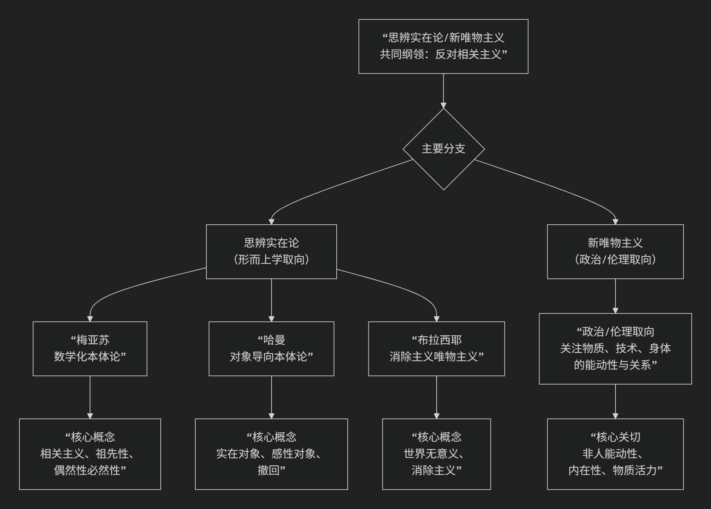

## 思辨实在论/新唯物主义

思辨实在论/新唯物主义是21世纪初兴起的一场极具冲击力的哲学运动，它标志着欧陆哲学的一个重要转向。其核心思想可以概括为：**对以康德哲学为基础的“相关主义”发起猛烈攻击，主张哲学必须能够直接思考“独立于人类思维和感知之外的实在本身”，并积极探索非人领域（如物体、物质、环境、技术）的自主性和能动性。**

这场运动与其说是一个统一学派，不如说是一个**共享问题意识的思潮集合**。其核心要义与内部差异可以通过以下图谱一目了然：

### 一、共同敌人：“相关主义”

要理解这场运动，首先要理解其攻击的靶心——“相关主义”。

*   **相关主义**：这是思辨实在论者昆汀·梅亚苏提出的概念，指一种自康德以来的哲学主流观点。康德认为，我们无法认识“**物自体**”（独立于我们之外的实在），我们只能认识被我们的**先天认知形式**（时间、空间、范畴）所建构的“现象”。因此，思维与存在、世界与人类总是**相关联**的。
*   **思辨实在论的指控**：相关主义导致了一种**人类中心主义**的禁锢。哲学变得只关心人类如何“ access ”世界，而完全放弃了思考世界本身的可能性。它本质上是一种**哲学上的怯懦**，是一种拒绝思考绝对实在的“弱哲学”。

### 二、主要分支与代表人物

如图表所示，该运动主要分为两大取向：以形而上学为核心的**思辨实在论**和更具实践关怀的**新唯物主义**。

#### **思辨实在论（更偏向形而上学本体论）**

1.  **昆汀·梅亚苏 - 数学化本体论**
    *   **核心著作**：《有限性之后》
    *   **核心命题**：**我们必须能够思考“祖先性”**——即在人类甚至生命出现之前就已存在的实在（如宇宙大爆炸、化石）。相关主义无法思考这一点，因为它要求任何存在都必须与人类思维相关，这是荒谬的。
    *   **关键概念**：**“偶然性必然性”**。他认为，自然律本身是**偶然的**（它们可以不是现在这样），但它们的存在是**必然的**（总要有某种自然律）。这为思考一个没有必然性的、充满可能性的绝对实在开辟了道路。
    *   **方法**：通过数学（尤其是集合论）来思考独立于人类的绝对实在。

2.  **格拉汉姆·哈曼 - 对象导向本体论**
    *   **核心命题**：**实在由“对象”构成，所有对象（无论是电子、茶杯、国家还是思想）都是平等的，且永远无法被完全耗尽。**
    *   **关键概念**：
        *   **对象的“撤回”**：任何一个实在对象，其真实本质总是隐藏在它与其它对象的关系之后，永远无法被完全触及或理解。
        *   **关系不对称**：对象之间的相互作用（如火燃烧棉花）不是直接的，而是通过各自的“感性属性”进行的，这是一种扭曲的翻译，而非真实的接触。
    *   **影响**：OOO在艺术、建筑、文学批评等领域产生了巨大影响，因为它赋予了一切非人对象以尊严和神秘性。

3.  **雷·布拉西耶 - 消除主义唯物主义**
    *   **核心命题**：**“虚无主义是真理。”** 世界本质上是无意义、无目的的。人类意识是自然过程的偶然产物，并终将消亡。
    *   **态度**：他主张一种冷酷的、科学化的唯物主义，接受宇宙的冷漠和人类最终的消亡。哲学的任务不是寻找意义或安慰，而是**追随理性的冷酷之光**，即使它导向的是虚无。他的思想深受神经科学和宇宙学的影响。

#### **新唯物主义（更偏向政治、伦理和科学实践）**

这一分支更关注物质世界本身的活力、创造性和能动性，以及其对政治、伦理和生态的启示。

*   **核心特征**：
    *   **拒绝被动物质观**：反对将物质视为僵死的、被动的、等待人类形式赋予其意义的传统观点。
    *   **强调内在能动性**：认为物质、技术、环境、身体等非人力量具有自身的**能动性**和**创造力**，它们积极地参与世界的构成和变化。
    *   **关系性本体论**：强调存在是**关系性的、过程性的**，是在动态的互动中生成的。
*   **代表性思想家**：
    *   **简·贝内特**： 《活跃的物质》中提出“物的能动性”，探讨垃圾、食物、电力等如何影响人类集合体的行动。
    *   **凯伦·巴拉德**： 结合量子物理和过程哲学，探讨物质的内在活力和生成性。
    *   **曼努尔·德兰达**： 运用德勒兹的哲学和复杂科学，重新解读历史和社会，强调物质流变的力量。

### 核心要义总结

| 理论维度 | 核心命题 | 关键概念与贡献 |
| :--- | :--- | :--- |
| **共同纲领** | **反对“相关主义”**，主张哲学能够且必须思考独立于人类的**绝对实在**。 | **相关主义批判、物自体、思辨转向** |
| **本体论革新** | **赋予“非人领域”（物体、物质、环境）以本体论核心地位**，探索其自主性与能动性。 | **对象导向、物质能动性、扁平本体论** |
| **方法论多元** | 运用**数学、科学、艺术**等多种方式，直接思辨实在本身。 | **数学化本体论、思辨哲学、跨学科方法** |
| **现实关怀** | 为**生态危机、技术伦理、后人类主义**等当代问题提供新的哲学基础。 | **新唯物主义、生态哲学、技术哲学** |

### 影响与意义

思辨实在论/新唯物主义的重要性在于：

*   **哲学上的解放**：它打破了康德以来哲学的人类学禁锢，为哲学思考打开了广阔的非人领域，恢复了哲学的野心和思辨勇气。
*   **应对当代挑战**：它为理解**气候变化**（盖亚理论）、**人工智能**（非人智能）、**技术物**（算法、网络）等提供了全新的框架，使我们能够更公正地对待与我们共存并塑造我们的非人力量。
*   **争议**：批评者认为其有些观点过于思辨而缺乏实证基础，或可能陷入一种新的神秘主义。

总而言之，这场运动是一场**哲学的“宇宙学转向”**。它邀请我们放下人类的自恋，谦卑而勇敢地思考一个**不以我们为中心、甚至没有我们的世界**，并在这个基础上，重新思考我们与万物共存的责任与伦理。它是对哲学想象力的一次极大激发。

