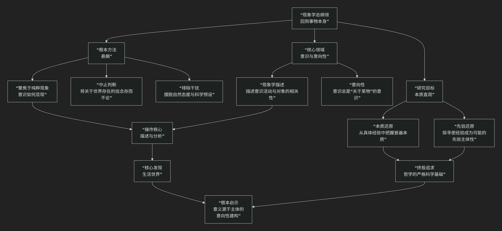

Phenomenology
=============

基于现象学（Phenomenology）哲学的核心思想

---------------------------------

现象学是20世纪欧洲哲学最重要的流派之一，由德国哲学家埃德蒙德·胡塞尔创立。它与其说是一套固定的学说，不如说是一种 **哲学方法** 和 **研究取向**。其核心思想可以概括为：**一种“回到事物本身”的彻底尝试，即悬置所有未经检验的先入之见和理论预设，直接描述并分析在意识中直接“显现”出来的现象，以此探寻意识和经验的本质结构，并为所有知识奠定一个绝对可靠的基础。**

现象学的革命性在于它彻底转变了哲学提问的方式。其核心方法与探索路径可以通过下图清晰地展现：

以下，我们将沿此探索路径，深入解析现象学的核心要义。

一、核心口号：“回到事物本身！”

这是现象学的旗帜性口号，但它并非指回到物理事物，而是指：

*   **回到“现象”**：即回到在我们的 **意识中直接呈现、直接被给予的东西**。它强调哲学研究的起点必须是直接的经验，而非任何关于这些经验的理论解释或科学推论。
*   **反对“解释”先行**：传统哲学和科学往往不自觉地带着各种理论预设（如“世界由原子构成”、“心灵是大脑的机能”）去解释经验，而现象学要求我们首先 **如实地描述** 经验本身。

二、根本方法：“悬搁”与“还原”

为了实现“回到事物本身”，胡塞尔设计了一套精密的方法论。

*   **悬搁**：又称“中止判断”或“加括号”。这是最关键的一步。它要求我们 **将关于外部世界“是否存在”的自然信念以及一切科学理论预设暂时“存而不论”**。我们不去问眼前这张桌子是否独立存在，只关注它“向我显现”的样子（如它的颜色、形状、质感）。

*   **还原**：通过悬搁，我们从“自然态度”（朴素地相信世界独立存在）转向“现象学态度”，从而：

    1.  **现象学还原**：将研究领域限定在 **纯粹意识现象** 之内。

    2.  **本质还原**：在多样的具体经验中，通过自由想象变更，去发现使某物成为某物的 **不变的本质结构** （例如，通过想象各种红色的物体，把握“红”本身的本质）。

    3.  **先验还原**：这是更彻底的一步，回溯到进行所有意识活动的 **先验主体性** （即纯粹的“我思”本身），探寻意识如何为世界赋予意义和秩序。

三、核心发现：意识的“意向性”

这是现象学的基石性概念，由胡塞尔的老师布伦塔诺提出，并被胡塞尔发扬光大。

*   **核心命题**：**意识总是“关于某物的意识”**。意识不是封闭的、像盒子一样的内容，它生来就是指向性的、开放的。我们不可能只是“在思考”，而总是在“思考 **某事**”；不可能只是“在感知”，而总是在“感知 **某物**”。

*   **重要意义**：意向性理论打破了传统的主客二元对立。它表明，意识和世界（主体和客体）是 **内在关联、不可分割** 的。现象学研究的单位不是孤立的客体，也不是封闭的主体，而是 **“意识活动-意识对象”** 这个完整的相关性结构。

四、重要发展：“生活世界”与“存在论转向”

现象学在后续哲学家那里得到了极具创造性的发展。

*   :doc:`胡塞尔 </chats/outlaw/analyse/foreign/master/modern/husserl/index>` 的“生活世界”：晚期胡塞尔提出，被现代科学所遗忘的、我们日常直接经验的、前科学的 **“生活世界”** 才是所有意义的最终源泉。科学世界只是对这个丰富的生活世界的高度抽象化和数学化的结果。

*   :doc:`马丁·海德格尔 </chats/outlaw/analyse/foreign/master/modern/heidegger/index>` 的“存在论转向”：马丁·海德格尔将现象学方法用于研究“存在”本身。他认为，现象学要“让那自身显现者，以自身显现的方式，被从它自身看到”。他分析了“此在”（人的存在）在世界中的生存结构，如“在世之存”、“操心”、“向死而生”，开创了存在主义现象学。

*   :doc:`梅洛-庞蒂 </chats/outlaw/analyse/foreign/master/modern/ponty/index>` 的“身体现象学”：他提出 **“身体主体”** 的概念，认为我们是通过活生生的、有知觉的身体与世界打交道。身体不是客体，而是我们感知世界的 **媒介和视角**，是世界意义的纽结。

五、核心要义总结

.. list-table:: 
   :header-rows: 1
   :widths: 25 45 30
   :align: center

   * - **理论维度**
     - **核心命题**
     - **关键概念与贡献**
   * - **哲学目标**
     - **"回到事物本身"，为哲学奠定绝对明晰的基础。**
     - **回到事物本身、严格科学**
   * - **方法论**
     - **通过"悬搁"与"还原"，直面纯粹的意识现象。**
     - **悬搁、还原（现象学、本质、先验）、描述**
   * - **本体论**
     - **意识具有"意向性"，主客体在意识活动中统一。**
     - **意向性、意识活动-意识对象、相关性**
   * - **后续发展**
     - **从先验意识转向"生活世界"、"存在"和"身体主体"。**
     - **生活世界、此在、身体主体**

六、思想特质与影响

*   **描述性而非解释性**：现象学首要任务是精细地描述经验的结构，而非因果解释。

*   **反自然主义**：反对用自然科学（如心理学、物理学）的方法和结论来取代哲学对直接经验的探究。

*   **深远影响**：现象学直接孕育了 **存在主义** （ :doc:`萨特 </chats/outlaw/analyse/foreign/master/modern/sartre/index>` 、:doc:`加缪 </chats/outlaw/analyse/foreign/master/modern/camus/index>`），深刻影响了 **解释学** （:doc:`伽达默尔 </chats/outlaw/analyse/foreign/master/modern/gadamer/index>`）、**后结构主义**，以及心理学（格式塔心理学）、文学理论、建筑学、认知科学等多个领域。

七、总结

总而言之，现象学的核心思想在于，它是一位 **“经验的考古学家”和“意义的守护者”** 。它教导我们，**在匆忙地用各种宏大理论去解释世界之前，我们首先需要怀着谦卑与专注，回到我们最直接、最鲜活的经验现场，去仔细察看事物是如何向我们显现其自身的。**

它的全部工作是对 **人类经验** 的一次极其彻底和严肃的审视。它提醒我们，那个被科学理论抽象化之前的生活世界，那个我们终日生活于其中、爱恨交织、充满意义的世界，才是哲学思考的真正起点和归宿。在这个意义上，现象学不仅是一场哲学运动，更是一种唤醒我们重新“看”世界的方式。

------------

 .. toctree::
    :maxdepth: 3

    grok
    copilot
    chatgpt
    deepseek
    gemini
    qwen

----------

西方哲学常识

-----------

[:doc:`现象学、存在主义和解释学 </chats/outlaw/analyse/foreign/schools/modern/phens>`]
[:doc:`现象学与物理学唯象模型 </chats/outlaw/analyse/foreign/schools/modern/phenom/physics>`]
