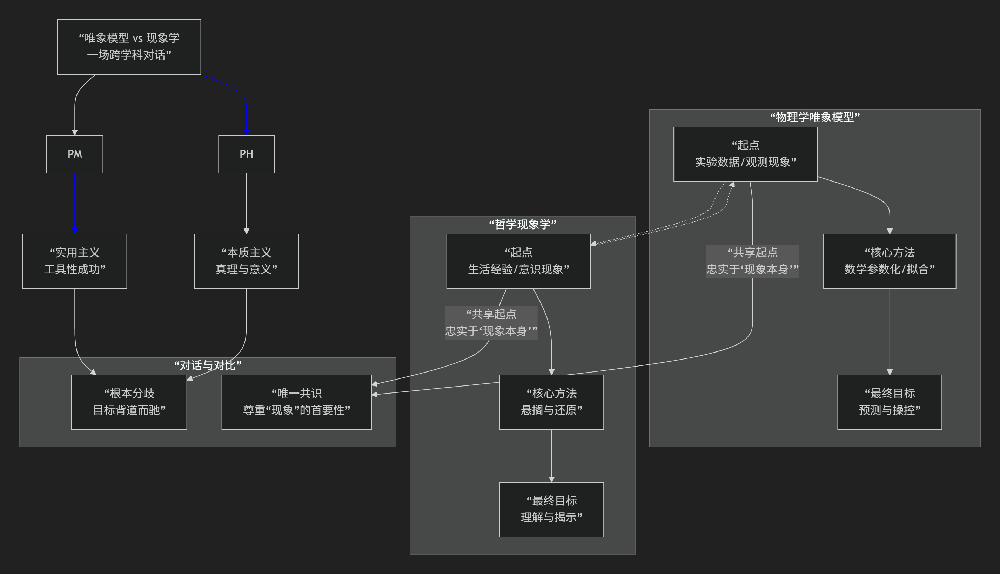

现象学与物理学唯象模型
----------------------

物理学中的**唯象模型** 与哲学中的**现象学** 虽然中文译名共享“现象”二字，但它们的核心目标、方法和含义有本质区别。然而，在更深的层面上，它们之间又存在着某种有趣的对比和对话关系。

我们可以这样概括它们的核心关系：**二者在目标上基本是“背道而驰”的，但在承认直接经验的优先性上，却又“殊途同归”。**

为了更清晰地把握这两者之间复杂而有趣的关系，下图从它们的核心方法论与终极目标出发，进行了一场跨越物理学与哲学的“思想实验式”对话：

---

### 一、核心区别：“工具”与“根基”的背道而驰

上图的左右两条路径清晰地表明，尽管起点相似，但唯象模型与现象学的目标几乎是相反的。

| 维度                         | 物理学中的唯象模型                                                                                                                                                 | 哲学中的现象学                                                                                                                                               |
| :--------------------------- | :----------------------------------------------------------------------------------------------------------------------------------------------------------------- | :----------------------------------------------------------------------------------------------------------------------------------------------------------- |
| **核心目标**           | **实用性与预测性**。构建数学模型来**描述、拟合、预测**观测到的现象， 而不必（或暂时无法）触及其背后的**终极物理机制**。                     | **理解与意义**。**回到事物本身**，通过直接描述意识经验中的现象， 揭示其**本质结构**和**意义来源**，为所有知识奠定坚实基础。     |
| **对待“现象”的态度** | 现象是**需要被概括和超越的起点**。模型是工具， 一旦有更基础的理论（如从唯象标准模型到弦理论）， 唯象模型就可能被取代或修正。                       | 现象是**研究的最终领域**。“现象”本身就是“事物本身”的显现。 哲学的任务是如实地描述它，而不是超越它。                                           |
| **方法**               | **数学参数化**。 引入自由参数（如标准模型中的粒子质量、混合角）， 通过实验数据来拟合这些参数。方法是**建模和计算**。                         | **悬搁与还原**。将关于世界存在的自然信念（以及科学理论）“加上括号”存而不论， 直接**描述**在意识中呈现的东西。方法是**描述和分析**。 |
| **与“本质”的关系**   | **不关心本质**（在其模型框架内）。 一个成功的唯象模型可以在不知道“为什么”电子有特定质量的情况下， 精确预测其行为。它的成功在于相关性而非本质性。 | **直接追求本质**。现象学的目标就是通过“自由想象变更”等方法， 在多样的现象中把握那个不变的**本质**（例如，“红”的本质是什么）。           |

**简单比喻：**

* **唯象模型** 像一个极其精准的 **“黑箱”操作手册**。你不知道箱子里面的齿轮和电路（深层机制）是如何工作的，但你可以通过手册（模型）按按钮（输入参数），准确预测灯会亮什么颜色、音乐会播什么（输出结果）。手册的目标是 **“有用”**。
* **现象学** 则像一位 **“视觉科学家”** ，他关心的是“看见”这个活动本身：颜色是如何在视觉中构成的？视觉意向性是什么？他并不急于去按按钮，而是要彻底弄清“看”的**本质和结构**。他的目标是 **“理解”**。

---

### 二、有趣的对比与联系：“殊途”与“同归”

尽管目标迥异，但二者在起点和一些深层思想上存在有趣的对比点。

1. **共同的起点：对直接经验的尊重**

   * 两者都始于对“既定理论”的某种不信任，回归到“被给予的东西”。
   * **唯象模型** 是因为现有理论（如牛顿力学）无法解释新现象（如黑体辐射），所以必须**回到实验数据本身**来构建新模型。
   * **现象学** 是因为反对哲学史上的各种独断论和自然主义，要求**回到直接直观的经验本身**。
   * 在这个意义上，它们都带有 **“反对空谈，回到实事”** 的革命色彩。
2. **对“自然态度”的超越**

   * 现象学要“悬搁”的，正是我们日常生活中那种认为世界理所当然存在的 **“自然态度”**。这种自然态度其实也包含了我们不加批判地接受科学理论描绘的世界图景。
   * **唯象模型**在某种意义上也在进行一种“悬搁”：它**悬置了对“最终原因”的追问**，满足于当前层次上的数学描述。它不关心“夸克背后是什么”，只关心夸克的模型能多准地预测实验。
3. **层级结构**

   * 物理理论有时被看作一个层级：**唯象模型** 处于底层，与实验直接接口；**基本原理**（如量子场论）处于中层；**终极理论**（如假想中的万物理论）处于顶层。
   * 这在一定程度上类似于现象学中从**具体经验**（个别的红）到**本质结构**（红的本质）的探索过程。但方向依然是相反的：物理学从上往下是“推导”，从下往上是“拟合”；现象学则是从下往上是“本质直观”。

---

### 总结

总而言之，**物理学唯象模型** 和 **哲学现象学** 的关系是：

* **主要方面是“背道而驰”**：它们的**核心目标和基本方法存在根本性的不同**。一个是工程式的、工具性的，旨在预测和控制现象；另一个是奠基性的、反思性的，旨在理解现象本身的含义和结构。将它们混为一谈是一个常见的误解。
* **次要方面是“殊途同归”**：它们都**体现了对直接经验和观察数据的首要性的尊重**，都源于对某种“宏大理论”的不满，并都试图建立一种更严谨的研究路径。

因此，一个现象学哲学家可能会欣赏物理学家构建唯象模型时那种“忠于现象”的务实起点，但会批评其最终将丰富的经验世界化约为枯燥的数学符号，从而**遗忘了生活世界**。而一个物理学家则会认为现象学的描述对于解决具体的物理问题**缺乏工具价值**，尽管它作为一种普遍的哲学态度可能具有启发性。

理解这种区别和联系，有助于我们更深刻地把握科学实践和哲学反思的不同性质与界限。
