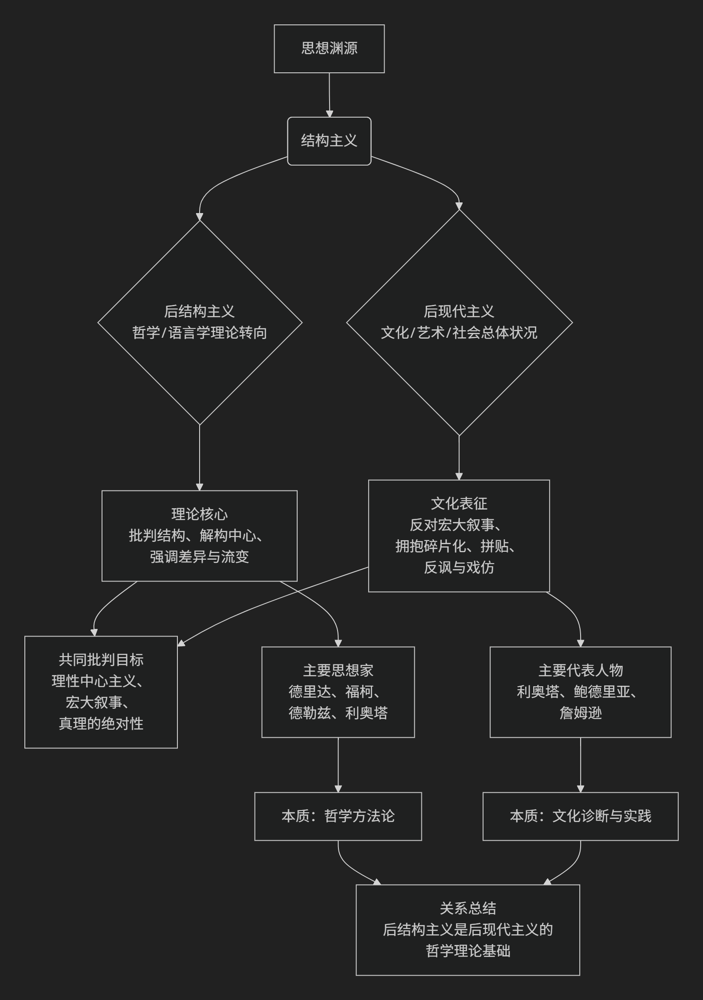

## 后现代/结构主义

后现代主义与后结构主义的关系极其密切，如同**树干与树枝、气候与天气**的关系。它们共享许多核心关切和批判对象，但侧重点和范围不同。

简单来说：

* **后结构主义** 主要是一场**哲学和语言学的理论思潮**，它从内部批判和超越了结构主义。
* **后现代主义** 则是一种更广泛的**文化、艺术和思想上的“情绪”或“状况”**，它描述了整个西方社会在现代化之后的状态。后结构主义为后现代主义提供了**关键的理论武器**。

为了更直观地理解两者错综复杂的关系，下图梳理了它们的思想渊源、核心交集与关键区别：

### 一、共同点：它们联手批判什么？

后现代主义和后结构主义都兴起于20世纪60年代的法国，它们共同攻击的是西方思想传统中的“现代性”基石：

1. **理性中心主义**：相信理性是至高无上、普遍适用的。
2. **宏大叙事**：那些声称能解释一切历史和社会现象的总体性理论，如启蒙叙事、马克思主义、弗洛伊德主义等。
3. **真理的符合论**：认为语言可以准确地表征或对应一个客观的外部现实。
4. **稳定的主体**：认为存在一个统一的、理性的、先于语言存在的“自我”或“人类本质”。
5. **结构与中心**：认为任何系统（语言、社会、心理）都有一个稳定的深层结构和一个固定的中心。

### 二、侧重点的不同：理论引擎 vs. 文化表现

尽管目标一致，但它们的侧重点有本质区别。

#### **后结构主义：哲学的“方法论革命”**

* **核心任务**：从**内部解构结构主义**。结构主义（如索绪尔语言学、列维-斯特劳斯人类学）认为现象背后有稳定的“深层结构”。后结构主义则质疑这种结构的稳定性和客观性。
* **关键思想**：
  * **德里达的“解构”**：揭示任何文本内部都存在无法消除的矛盾和意义延迟（延异），不存在固定的、单一的意义中心。
  * **福柯的“权力/知识”**：真理和知识不是中立的，而是由权力关系建构和生产的。“人”是现代知识型建构的产物，并非永恒的主体。
  * **德勒兹的“根茎”与“差异”**：反对树状的、有根有中心的等级结构，推崇无中心、可任意连接的“根茎”模型。强调“差异”先于“同一”。
* **本质**：后结构主义是一套**精密的哲学分析工具**，主要活跃在学术界。

#### **后现代主义：文化的“时代精神”**

* **核心任务**：描述和回应二战以后西方社会出现的**文化转向**。它是对高度发达的消费主义、媒体饱和的“晚期资本主义”社会的反应。
* **关键特征**：
  * **宏大叙事的消解**：利奥塔直言后现代就是“对宏大叙事的不信任”。
  * **碎片化与拼贴**：艺术和文化作品不再追求整体统一，而是混合不同风格、时代和元素（如波普艺术、抄袭、戏仿）。
  * **深度模式的消失**：作品不再追求隐藏的深层意义，而是停留在表面和游戏性上（如安迪·沃霍尔的《坎贝尔汤罐》）。
  * **模拟与超真实**：鲍德里亚认为，在后现代社会中，符号不再指涉现实，而是进行自我指涉，创造出比真实更真实的“超真实”（如迪士尼乐园、现实电视）。
* **本质**：后现代主义是一种**文化气质、一种社会状况**，体现在建筑、艺术、文学、电影等各个领域。

### 三、关系总结：错综复杂的交织

1. **理论供给关系**：**后结构主义是后现代主义的哲学理论基础**。没有德里达、福柯等人提供的“解构中心”、“批判主体”、“反真理”的理论工具，后现代主义的文化批判就会缺乏深度。利奥塔的后现代定义直接运用了语言哲学的分析。
2. **人物交叉关系**：一些关键人物身兼两职。

   * **利奥塔**：他的《后现代状况》是后现代主义的宣言，但其分析方法深受后结构主义语言理论的影响。
   * **鲍德里亚**：他是后现代文化理论的大师，但其思想明显继承了后结构对符号和现实的批判。
   * **福柯和德里达**：他们通常被视为后结构主义者，但他们的思想被广泛地援引为后现代批判的典范。
3. **范围与领域的不同**：

   * 你可以是一个**后结构主义者**但不一定完全拥抱**后现代主义**。例如，你可能赞同解构文本的方法，但可能对消费文化的戏仿和碎片化持保留态度。
   * 但一个典型的**后现代主义者**（尤其在文化实践上）几乎必然地分享了**后结构主义**的基本世界观。

### 一个简单的比喻

* **后结构主义** 像是 **“哲学界的特种部队”** ，它们深入语言和知识的内部，用精密的工具（解构、系谱学）进行爆破和颠覆。
* **后现代主义** 则是 **“文化战场的全面气象”** ，它描述了整个社会在经历了这种哲学颠覆后所呈现出的“碎片化”、“拼贴化”、“无深度”的文化景观。

总而言之，**后结构主义提供了批判的武器，而后现代主义则是被这种武器轰炸后的文化战场图景**。两者共同勾勒了20世纪下半叶以来，我们对知识、真理、自我和社会的理解所发生的根本性转变。

