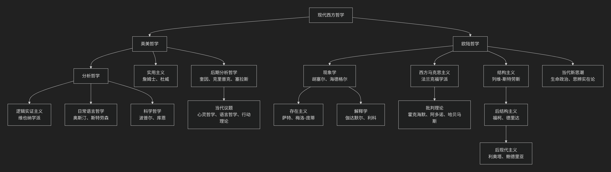

现代西方哲学概况
----------------

------

现代西方哲学在20世纪后主要分为**欧陆哲学**和**英美哲学**两大传统。它们不仅在主题和方法上差异显著，甚至在对“哲学是什么”的理解上也大相径庭。

以下图表直观展示了两大传统的主要流派与演进脉络：

---

### 一、核心分歧概览

| 特征维度 | **英美哲学** | **欧陆哲学** |
| :--- | :--- | :--- |
| **方法论** | **分析、逻辑、论证清晰** | **诠释、历史、综合思辨** |
| **风格** | **科学化、专业化、问题导向** | **文学化、跨学科、宏大叙事** |
| **核心关切** | **语言、逻辑、知识、真理、心智** | **存在、历史、权力、社会、文化** |
| **理想模型** | **科学家** | **公共知识分子** |
| **代表性人物** | 罗素、维特根斯坦、奎因 | 海德格尔、萨特、福柯、哈贝马斯 |

---

### 二、英美哲学主要流派及特点

英美哲学以**分析哲学**为主流，强调概念的清晰性、论证的严密性，常借鉴逻辑学和自然科学的方法。

#### 1. 分析哲学
*   **特点**：认为许多哲学问题源于语言的混淆和逻辑的混乱。哲学的任务是**通过逻辑分析来澄清概念和命题**。
*   **代表人物**：
    *   **早期**：**伯特兰·罗素**、**G.E.摩尔**。
    *   **巅峰**：**路德维希·维特根斯坦**（前后期思想差异巨大，分别影响了不同方向）。
    *   **逻辑实证主义**（维也纳学派）：坚持**“可证实性原则”**，认为无法被经验证实的命题是无意义的形而上学。**（卡尔纳普）**
    *   **日常语言哲学**：反对逻辑实证主义，认为哲学问题源于对日常语言的误用，应通过分析语言的实际用法来消解问题。**（J.L. 奥斯汀、吉尔伯特·赖尔）**

#### 2. 科学哲学
*   **特点**：专门反思科学的本质、方法、进步和概念基础。
*   **代表人物**：
    *   **卡尔·波普尔**：提出 **“证伪主义”** ，区分科学与非科学。
    *   **托马斯·库恩**：提出 **“范式”** 理论，认为科学进步是通过“科学革命”非连续地实现的。
    *   **伊姆雷·拉卡托斯**：提出 **“科学研究纲领方法论”**。

#### 3. 心灵哲学与语言哲学
*   **特点**：当代英美哲学的核心领域。心灵哲学关注**意识、身心问题**；语言哲学关注**意义、指称、真理**。
*   **代表人物**：
    *   **W.V.O. 奎因**：批判分析/综合的区分，提出翻译的不确定性。
    *   **索尔·克里普克**：提出 **“命名与必然性”** ，复活了本质主义。
    *   **约翰·塞尔**：研究言语行为、意向性。
    *   **丹尼尔·丹尼特**：从自然主义角度研究意识。

---

### 三、欧陆哲学主要流派及特点

欧陆哲学更关注历史、社会、人类存在和权力结构，风格更具诠释性和历史感，常与文学批评、政治理论、精神分析等交叉。

#### 1. 现象学与存在主义
*   **特点**：**现象学**主张“回到事物本身”，描述意识经验的结构。**存在主义**则关注人的自由、选择、焦虑和存在的意义。
*   **代表人物**：
    *   **埃德蒙德·胡塞尔**（现象学奠基人）。
    *   **马丁·海德格尔**（将现象学转向“存在”问题）。
    *   **让-保罗·萨特**（“存在先于本质”）。
    *   **莫里斯·梅洛-庞蒂**（强调身体知觉）。

#### 2. 解释学
*   **特点**：研究理解和解释的理论，认为理解是人的基本存在方式。
*   **代表人物**：
    *   **汉斯-格奥尔格·伽达默尔**：提出 **“视域融合”** 和 **“效果历史”** 原则。
    *   **保罗·利科**：融合现象学、解释学和精神分析。

#### 3. 西方马克思主义与批判理论
*   **特点**：结合马克思主义与其它思潮，批判现代社会、文化和意识形态。
*   **代表人物**：
    *   **法兰克福学派**（第一代）：**西奥多·阿多诺**、**马克斯·霍克海默**（启蒙辩证法、文化工业）。
    *   **法兰克福学派**（第二代）：**于尔根·哈贝马斯**（交往行为理论）。
    *   **法兰克福学派**（第三代）：**阿克塞尔·霍耐特**（为承认而斗争）。

#### 4. 结构主义与后结构主义（后现代主义）
*   **特点**：**结构主义**认为现象背后有深层结构。**后结构主义/后现代主义**则批判结构主义的确定性，强调差异、权力和不确定性。
*   **代表人物**：
    *   **结构主义**：**克洛德·列维-斯特劳斯**（人类学）。
    *   **后结构主义**：**米歇尔·福柯**（权力/知识）、**雅克·德里达**（解构）、**吉尔·德勒兹**（欲望、根茎）。
    *   **后现代主义**：**让-弗朗索瓦·利奥塔**（对宏大叙事的不信任）。

#### 5. 当代新思潮
*   **生命政治**：**乔吉奥·阿甘本**、**罗伯托·埃斯波西托**（分析权力如何管理“生命”本身）。
*   **思辨实在论**：**昆汀·梅亚苏**（挑战“相关主义”，试图思考独立于人类的绝对实在）。

---

### 总结：两种不同的哲学“气质”

*   **英美哲学**更像 **“哲学的手术刀”** ：追求精确、清晰，致力于解决具体的、界定明确的问题。它倾向于将大问题分解为小问题，逐个击破。
*   **欧陆哲学**更像 **“哲学的透视镜”** ：追求深度、广度，致力于揭示人类存在和社会的整体结构与意义。它倾向于将具体问题联系到更宏大的历史、社会背景中。

需要强调的是，这种划分是粗略的，并且**当代哲学正在出现越来越多的交叉和融合**。例如，约翰·麦克道威尔的著作就试图弥合分析哲学和欧陆哲学之间的鸿沟。但理解这一基本分野，无疑是进入现代哲学殿堂的最佳路线图。