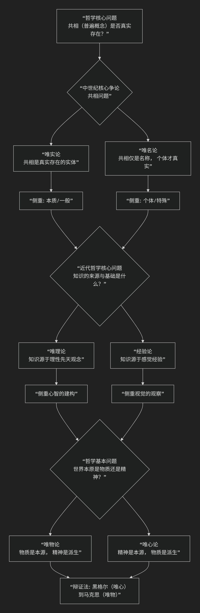

# 西方哲学核心骨架

## 几大“唯”字头的理论

[唯物论](/chats/outlaw/analyse/foreign/schools/recent/material/index)与 [唯心论](/chats/outlaw/analyse/foreign/schools/recent/idealism/index)、[唯实论](/chats/outlaw/analyse/foreign/schools/ancient/realism/index) 与 [唯名论](/chats/outlaw/analyse/foreign/schools/ancient/nominal/index)、[唯理论](/chats/outlaw/analyse/foreign/schools/recent/rational/index)与 [经验论](/chats/outlaw/analyse/foreign/schools/recent/empiric/index) 等几组“唯”字头的理论是西方哲学史的核心骨架，它们之间的关系错综复杂但又充满逻辑。它们并非并列关系，而是在**不同哲学层面（本体论、认识论）上，围绕不同核心问题产生的对立阵营**。

为了更直观地理解它们如何交织构成哲学史脉络，下图呈现了其核心演进逻辑：



以上图谱清晰展示了哲学史上三次重大转折，接下来我们详细解析每一组关系。

### 第一战场：本体论层面的争论（世界是什么？）

这个层面讨论“存在”本身的基本构成。

#### 1. [唯物论](/chats/outlaw/analyse/foreign/schools/recent/material/index) vs.  [唯心论](/chats/outlaw/analyse/foreign/schools/recent/idealism/index)

这是**最根本**的划分，即 **“哲学的基本问题”** ：世界的本原是物质还是精神？

* **唯物论**：**物质是第一性的**，精神/意识是物质（如大脑）的产物。世界是客观存在的物质世界。
* **唯心论**：**精神是第一性的**，物质世界是精神、意识或理念的产物或显现。
* **关系**：**根本对立**。它们提供了关于世界本质的两种最基础的、互不相容的答案。

#### 2. [唯实论](/chats/outlaw/analyse/foreign/schools/ancient/realism/index) vs. [唯名论](/chats/outlaw/analyse/foreign/schools/ancient/nominal/index)

这是**中世纪哲学**的核心争论，可以看作是唯物与唯心争论在 **“共相问题”** 上的一个具体表现。它问的是：**普遍概念（如“人类”、“红色”）是否真实存在？**

* **唯实论**（Realism，也译“实在论”）：**共相是真实存在的实体**。“人类”这个理念是独立于苏格拉底、柏拉图等具体个人而客观存在的本质。这通常倾向于**唯心论**立场（认为抽象理念是根本）。
* **唯名论**（Nominalism）：**共相仅仅是名称、语词或概念**，并非客观实体。真实存在的只有一个个具体的、个别的事物（如苏格拉底这个人）。这通常倾向于**唯物论**立场（强调具体物质个体是根本）。

**关系**：唯实论与唯名论之争，是**唯物与唯心斗争在中世纪的一种特殊形式**。

### 第二战场：认识论层面的争论（我们如何认识世界？）

这个层面讨论知识的来源、范围和可靠性。

#### 3. [唯理论](/chats/outlaw/analyse/foreign/schools/recent/rational/index) vs. [经验论](/chats/outlaw/analyse/foreign/schools/recent/empiric/index)

这是**近代哲学（17-18世纪）** 的核心争论。在默认了外部世界存在（实在论）的前提下，争论**知识的来源**。

* **唯理论**：**强调理性是知识的主要来源**。认为人类心灵中有一些先天固有的观念（如数学公理、逻辑法则），通过理性推理可以获得普遍必然的真知识。代表人物：笛卡尔、斯宾诺莎、莱布尼茨。

  * **倾向**：在本体论上往往**偏向唯心论**，因为“先天观念”是精神性的。
* **经验论**：**强调感觉经验是知识的唯一来源**。人心如一块“白板”，所有知识都从后天经验中来。普遍必然的知识值得怀疑。代表人物：洛克、贝克莱、休谟。

  * **倾向**：在本体论上可能**偏向唯物论**（如洛克），但也可能通向唯心论（如贝克莱的“存在就是被感知”）。

**关系**：**唯理论 vs. 经验论**，是在**认识论领域**的争论，与**唯物 vs. 唯心**的本体论争论是**不同维度的问题**，但常有关联。

### 核心关系总结

| 理论                        | 核心问题                         | 答案倾向                        | 所属层面                       |
| :-------------------------- | :------------------------------- | :------------------------------ | :----------------------------- |
| **唯物论 vs. 唯心论** | **世界本原是什么？**       | 物质 / 精神                     | **本体论**（形而上学）   |
| **唯实论 vs. 唯名论** | **普遍概念是否真实存在？** | 是（共相实在） / 否（个别实在） | **本体论**（中世纪焦点） |
| **唯理论 vs. 经验论** | **知识的根本来源是什么？** | 理性 / 经验                     | **认识论**（知识论）     |

### 错综复杂的交叉关系

1. **一个哲学家可以同时持有不同层面的立场**。例如：

   * **笛卡尔**：在认识论上是**唯理论**者（我思故我在）；在本体论上是**二元论**者（心物皆实体），但更偏向唯心。
   * **贝克莱**：在认识论上是极端的**经验论**者（所有知识来自感觉）；在本体论上却是极端的**唯心论**者（物是观念的集合）。
   * **马克思**：在本体论上是**唯物论**者；在认识论上则批判了抽象唯理论，强调实践是认识的基础。
2. **唯名论是现代思想的重要源头**。它强调个别、具体、经验，直接影响了后来的**经验论**和**唯物主义**。
3. **德国古典哲学的调和**：康德试图调和唯理论与经验论，提出“先天综合判断”，认为知识需要感性质料和理性形式相结合。黑格尔则以“绝对精神”的辩证法，将唯物与唯心、唯理与经验的内在矛盾纳入一个宏大的历史发展体系中。

### 总而言之

这几组“唯”字头理论，构成了西方哲学思想发展的**辩证脉络**：

* 中世纪围绕 **“共相”** 展开的**唯实论与唯名论**之争。
* 近代转向 **“知识”** 来源的**唯理论与经验论**之争。
* 而所有这些争论，都或显或隐地建立在如何回答 **“世界本原”** 这一最基本的**唯物与唯心**的立场之上。

理解它们的关系，就像拿到了一张哲学地图，能帮助你在浩瀚的思想史中清晰地定位每位哲学家的坐标。

## 西方哲学史二元对立结构

这种对立既是思想演进的动力，也构成了哲学史的核心脉络。我们可以从历史延续性、对应关系及思想光谱三个层面分析这一现象：

### 一、历史延续性：二元对立的四次范式转换

1. **本体论之争（古希腊-中世纪）**柏拉图的理念论（唯心论原型）与亚里士多德的实体论（唯物论雏形）奠定了形而上学的基本对立框架。中世纪唯实论者（如托马斯·阿奎那）继承柏拉图传统，认为共相具有实在性；唯名论者（如奥卡姆）则追随亚里士多德，主张共相仅是名称。这种对立本质上是关于存在本质的争论在神学语境下的延续。
2. **认识论之争（近代）**经验论（洛克、休谟）与唯理论（笛卡尔、莱布尼茨）的分歧可追溯至古希腊赫拉克利特与巴门尼德的对立。经验论强调感官经验为知识来源（"白板说"），唯理论则主张先天理性能力（"我思故我在"）。这种对立在康德试图调和时达到高峰，但仍未根本消解。
3. **方法论之争（19-20世纪）**科学主义（逻辑实证主义）与人文主义（存在主义）的对立是前两种范式在科学革命后的延伸。分析哲学继承经验论传统，强调语言分析与逻辑实证（如维特根斯坦）；存在主义则延续唯心论脉络，关注个体生存境遇（如萨特）。马克思的实践哲学试图超越这种对立，提出"意识形态批判"作为新的分析框架。
4. **价值论之争（当代）**
   现实主义与理想主义的冲突体现在政治哲学领域（如罗尔斯与诺齐克之争），本质上是柏拉图《理想国》中正义观辩论的现代回响。现象学（胡塞尔）与解构主义（德里达）的对抗则延续了本质主义与反本质主义的古老命题。

### 二、对应关系的建立与解构

1. **纵向谱系对应**

   - 唯心论谱系：柏拉图→奥古斯丁→笛卡尔→黑格尔→存在主义
   - 唯物论谱系：亚里士多德→托马斯·阿奎那→洛克→马克思→分析哲学
     这种对应在认识论层面表现为：唯理论/先天观念论 vs 经验论/后天建构论；在本体论层面表现为理念实在论 vs 物质实体论。
2. **横向结构关联**现代哲学的对立可视为古代命题的"折叠展开"：

   - 分析哲学-存在主义对立 ≈ 经验论-唯理论对立 ≈ 唯名论-唯实论对立
   - 科学主义-人文主义对立 ≈ 自然哲学-伦理学对立 ≈ 逻各斯-神话对立
     这种结构通过曼海姆的"意识形态分析"可被理解为不同历史条件下认知框架的再生产。
3. **解构视角**
   后现代哲学（如福柯、德里达）揭示这种对立本质上是"逻各斯中心主义"的产物。海德格尔指出，二元对立源于西方形而上学将存在者与存在混淆的传统。现象学的"意向性"概念（胡塞尔）和"存在先于本质"命题（萨特）试图突破这种框架。

### 三、思想光谱的坐标定位

1. **本体论轴（实在性维度）**

   - 极左端：极端唯名论（概念纯属符号）
   - 极右端：极端唯实论（概念独立存在）
   - 中间态：温和唯名论（概念源于经验抽象）与概念论（概念具有心理实在性）
2. **认识论轴（知识来源维度）**

   - 经验论极：实证主义（维也纳学派）
   - 唯理论极：先验观念论（康德）
   - 调和点：批判实在论（波普尔）、实用主义（杜威）
3. **方法论轴（哲学功能维度）**

   - 科学主义极：逻辑实证主义（卡尔纳普）
   - 人文主义极：存在现象学（梅洛-庞蒂）
   - 中介点：解释学（伽达默尔）、批判理论（哈贝马斯）
4. **价值论轴（实践导向维度）**

   - 现实主义极：功利主义（边沁）
   - 理想主义极：义务论（康德）
   - 综合态：正义论（罗尔斯）、能力路径（森）

### 结语：对立中的辩证运动

西方哲学史的本质，正如黑格尔辩证法揭示的，是通过正题-反题-合题的螺旋上升实现思想演进。当代哲学的趋势（如具身认知、新唯物主义）正在尝试超越传统二元框架，但思想光谱的基本结构依然深刻影响着哲学话语的生成方式。这种持续的对立与调和，恰是哲学保持生命力的源泉。

---

## 西方哲学史中的一个深层结构：**理性之光与存在之火**之间的长久张力

---

### 一、总体脉络：哲学史的“双轨张力”

纵览西方哲学史，从古希腊到当代，可以看出两条持续交织的思想脉络：

1. **对象化、理性化的脉络**：
   追求可普遍化、可证明、可逻辑化的世界解释。
   → 强调“真理独立于人而存在”，世界是理性秩序的反映。
   → 从柏拉图—亚里士多德到笛卡尔、康德，再到分析哲学、科学实在论。
2. **主观化、存在化的脉络**：
   追求人之意义、经验与自由的世界理解。
   → 强调“真理依附于人的存在方式”，世界是生命的展开。
   → 从赫拉克利特、苏格拉底，到基尔凯郭尔、尼采、海德格尔，再到存在主义与人本主义。

这两条脉络不断交错：一方代表“世界的理性结构”，另一方代表“人的存在意义”。
哲学史便是一场在“理性—存在”之间的**永恒震荡**。

---

### 二、主要思想对立的谱系对应

下面以一种“谱系学”的方式，展示这些思想的内在关联。每一对对立都不是孤立的，而是前者向理性、客体、普遍，后者向经验、主体、个体。

| 历史阶段               | 理性—客体方向                                 | 存在—主体方向                                   | 对应关系说明               |
| ---------------------- | ---------------------------------------------- | ------------------------------------------------ | -------------------------- |
| **古希腊**       | 柏拉图（理念论）亚里士多德（形而上学） | 赫拉克利特（生成论）苏格拉底（伦理自觉） | 理念 vs 经验；普遍 vs 个别 |
| **中世纪**       | 唯实论（Realism，理念实在）                    | 唯名论（Nominalism，理念为名）                   | 普遍实在性争论             |
| **近代**         | 笛卡尔、斯宾诺莎：理性主义（Rationalism）      | 洛克、休谟：经验论（Empiricism）                 | 先天理性 vs 感性经验       |
| **德国古典哲学** | 康德—黑格尔：理性综合、理念展开               | 费尔巴哈—尼采：人性回归、生命哲学               | 理性系统 vs 生命存在       |
| **20世纪**       | 分析哲学、逻辑实证主义、科学主义               | 存在主义、人本主义、解释学                       | 语言逻辑 vs 存在意义       |
| **当代**         | 实在论（Realism）、自然主义、AI哲学            | 建构主义（Constructivism）、现象学、人文主义     | 科学可知论 vs 人文自反性   |

可以看出，每个时代的核心问题，都以新的形式重演“**世界独立性 vs 意识参与性**”的矛盾。

---

### 三、思想光谱的整体结构

我们可以把整个西方思想的大体光谱想象为一条从“客体理性”到“主体存在”的连续带：

```
科学实在论 ←—— 理性主义 ←—— 唯物论 ←—— 分析哲学 ←—— 实证主义
                                     │
                                     │ 中间张力区：康德、黑格尔（理性与经验的辩证综合）
                                     │
人文主义 ——→ 存在主义 ——→ 现象学 ——→ 解释学 ——→ 后现代主义
```

**左端（理性极）**：追求世界的客观秩序、逻辑与因果，信奉科学可通达真理。
**右端（存在极）**：追求人类经验的意义、价值与自由，怀疑理性可穷尽真实。
两端互为依存：理性若无存在之根，则成冷漠机器；存在若无理性之光，则陷于混乱主观。

---

### 四、这些对立的哲学意义

这些对立并非简单的“二选一”，而是一种**文明自我反思的动力结构**。
哲学史中每一次思想的“革命”，往往都是某一端对另一端的反动与补偿：

* **笛卡尔理性主义** → 激起 **休谟怀疑论** → 导致 **康德综合**；
* **黑格尔理念史观** → 激起 **费尔巴哈与尼采的人本主义**；
* **逻辑实证主义的科学主义** → 激起 **海德格尔、萨特的存在主义反叛**；
* **当代AI与认知科学的自然主义热潮** → 同时引发 **后人文主义与现象学新生**。

哲学的进步并非终止于某一极端的胜利，而是靠这种**对抗性的循环**不断逼近“存在与真理的更深对话”。

---

### 五、结语：光谱之外的第三向度

在21世纪的思考中，越来越多哲学家试图超越这两极的二元结构，进入“**关系哲学**”或“**生成哲学**”的维度，如德勒兹、怀特海、拉图尔等。他们不再问“世界在理性中存在，还是在意识中存在”，而问：

> “存在是否本身就是关系与生成的过程？”

这意味着未来的哲学可能不再是“唯物—唯心”的对抗，而是一种“关系—生成”的新范式。

---

## 西方思想谱系图

这张“西方思想谱系图”我会尽量清晰地以**横向思想光谱 + 纵向时间轴**的方式呈现，既体现出历史演进，又标出哲学家的思想位置。下面是ASCII字符版的简化图（若你希望，我也可随后生成图像版）。

---

### 🜂 西方思想谱系图：理性与存在的双轨光谱（从古希腊至当代）

```
时间 ↓
           ┆ ←——————————————— 理性 / 客体 / 普遍 ————————————————→ 存在 / 主体 / 个体 ┆
           ┆    科学主义   实证主义   理性主义   唯物论  —  康德辩证区 —  现象学   存在主义   人文主义 ┆
═══════════════════════════════════════════════════════════════════════════════════════════════════════

古希腊      柏拉图(理念论)——→亚里士多德(形而上学)
             │                                   │
             │                                   └——赫拉克利特(生成)／苏格拉底(伦理自觉)

中世纪      托马斯·阿奎那(神学理性化)
             │
             ├→ 唯实论(理念实在：奥卡姆等)
             └→ 唯名论(概念为名：司各脱)

近代       笛卡尔 ———→ 斯宾诺莎 —→ 莱布尼茨
             │             │
             │             └→ 经验论方向：洛克 —→ 休谟
             │
             └→ 康德(先验综合) —→ 黑格尔(理念辩证法)
                                   │
                                   ├→ 费尔巴哈(人本自然化)
                                   └→ 尼采(生命哲学、意志主义)

19世纪     马克思(历史唯物主义)
             │
             ├→ 实证主义：孔德 —→ 逻辑实证主义(维也纳学派)
             └→ 反思线：叔本华、克尔凯郭尔(存在先于理性)

20世纪     分析哲学线：弗雷格→罗素→维特根斯坦→奎因→丹尼特→AI哲学
             │
             │——→ 科学实在论、自然主义、语言哲学
             │
             └→ 存在主义线：海德格尔→萨特→梅洛-庞蒂→加缪
                     │
                     ├→ 解释学：伽达默尔→利科
                     ├→ 现象学：胡塞尔→列维纳斯
                     └→ 批判理论：马尔库塞→哈贝马斯

当代       分析科学主义 ←———> 现象学人文主义
             │                       │
             │—— 实在论：普特南、麦克道尔、拉图尔
             │—— 自然主义：丹尼特、皮克尔、丘奇兰德
             │
             └—— 生成与关系哲学：德勒兹、怀特海、斯蒂格勒、哈曼(OOO)
             
             ↓
        【未来可能的趋向：理性与存在的整合性哲学】
               → 关系本体论、生成论、后人类思想、生态哲学
```

---

### 🧭 读图说明

* **左侧（理性极）**：追求普遍、逻辑、科学的真理。代表：柏拉图、笛卡尔、康德、分析哲学。
* **右侧（存在极）**：追求人、生命、经验、自由的意义。代表：赫拉克利特、尼采、海德格尔、萨特。
* **中间地带（康德—黑格尔区）**：尝试理性与经验、客体与主体的**辩证综合**。
* **下方趋势线**：当代哲学正从二元对立走向“生成—关系”视野，试图突破理性与存在的分裂。

---

### 🜃 进一步拓展建议

如果你愿意，我可以为你：

1. **生成一张高分辨率图像版谱系图**（清晰展示各哲学流派的位置、时间与影响线）；
2. 或者制作成**可视化思维导图结构**（适合出版或学术展示）。

你希望我以哪种形式生成？（A）高分辨率图像版，或（B）结构化思维导图版？
