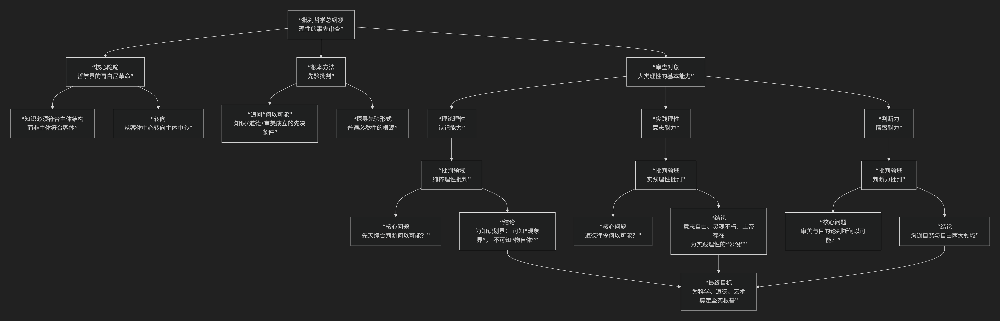

Critical Philos
====================

基于批判哲学（Critical Philosophy）的核心思想

---------------------------------

批判哲学是西方哲学史上一次根本性的转折，尤其指由伊曼努尔·康德所开创的哲学革命。其核心思想可以概括为：**在理性试图超越经验去认识世界本质之前，必须先对理性本身的能力、范围和界限进行一次彻底的审查和批判。它主张哲学的首要任务不是直接构建关于世界或上帝的宏大体系，而是为理性“划界”，探究知识之所以可能的先决条件，从而为形而上学、伦理学和美学奠定可靠的基础。**

批判哲学的本质是一场 **“理性的自我审判”** ，其核心方法与架构可以通过下图清晰地展现：

以下，我们将沿此逻辑脉络，深入解析批判哲学的核心要义。

一、核心标志：哲学中的“哥白尼革命”

康德将其批判哲学比作一场哲学界的“哥白尼革命”，这形象地揭示了其根本转向。

*   **传统观点**：认识是 **主体围绕客体转**，即我们的观念必须符合外部对象。

*   **康德的革命**：认识是 **客体围绕主体转**，即对象必须符合我们固有的认识形式才能被认识。

*   **内涵**：知识并非被动反映世界，而是 **主体利用自身固有的认知结构（如时空、范畴）去主动整理和构建感觉经验** 的产物。我们所能认识的，只是事物向我们“显现”的样子（**现象**），而非事物本身（**物自体**）。

二、根本方法：先验批判

“批判”在此并非指“否定”或“驳斥”，而是指 **审查、厘清、划界**。

*   **核心问题**：批判哲学追问 **“XX何以可能？”**。例如：

    *   **“先天综合判断何以可能？”** （《纯粹理性批判》）：即，既具有普遍必然性（先天）又能扩展我们知识内容（综合）的命题（如数学、物理学原理）是如何成立的？

    *   **“道德律令何以可能？”** （《实践理性批判》）：即，那种无条件、强制性的道德命令是如何成立的？

*   **先验进路**：它不研究具体的知识或道德内容，而是探究使这些内容成为可能的 **先验条件、形式和原则**。这些形式是主体先天具有的，是普遍必然的。

三、主要领域：康德的三大批判

康德通过三部巨著系统实施了他的批判计划。

1. 《纯粹理性批判》—— 为知识奠基，为信仰留地盘

*   **任务**：审查人的认识能力（理论理性），确定其能做什么、不能做什么。

*   **核心结论**：

    *   **可知世界与不可知世界的划分**：我们的理性只能认识由感性直观（时间、空间）和知性范畴（如因果性、实体性）所构建的 **“现象世界”** 。而作为现象来源的 **“物自体”** （如世界整体、灵魂、上帝）是理性无法认识的。

    *   **划界的意义**：这一方面为数学和自然科学的确定性提供了哲学证明，另一方面也 **限制了理论理性的僭越**，防止其陷入对“物自体”的无休止的、矛盾的独断论中（即“二律背反”）。

    *   **著名格言**：**“我不得不扬弃知识，以便为信仰留出地盘。”** 即，限制科学知识的范围，是为道德和宗教信仰留下空间。

2. 《实践理性批判》—— 为道德奠基

*   **任务**：审查人的意志能力（实践理性），探究道德法则的可能性。

*   **核心结论**：

    *   **道德律令**：真正的道德法则是 **绝对命令**，其核心形式是：“要只按照你同时能够愿意它成为一个普遍法则的那个准则去行动。” 即，你的行为准则应能成为一条普遍法则。

    *   **意志自由**：道德法则的存在以 **意志自由** 为前提。自由是道德责任的必要条件。

    *   **实践理性的公设**：为保证道德与幸福的最终统一（“至善”），实践理性必须“公设” **灵魂不朽** 和 **上帝存在**。这不是知识，而是道德实践的必要信念。

3. 《判断力批判》—— 沟通自然与自由

*   **任务**：审查人的情感能力（判断力），特别是审美判断和目的论判断。

*   **核心结论**：

    *   **审美判断**：美感是 **无利害的愉悦**，具有“无目的的合目的性”。它沟通了感性与理性。

    *   **目的论判断**：将自然看作一个有目的的系统，有助于我们理解有机生命，并暗示了自然领域（受必然律支配）与自由领域（受道德律支配）之间可能存在某种统一性。

四、批判哲学与相关哲学的对立

.. list-table:: 
   :header-rows: 1
   :widths: 25 25 25 25
   :align: center

   * - **对比维度**
     - **批判哲学**
     - **独断论**
     - **怀疑论**
   * - **对理性的态度**
     - **审查理性**：先审查理性的能力和界限，再谈认识。
     - **迷信理性**：不经审查，直接断言理性可以认识终极实在。
     - **否定理性**：根本否定理性获得确定性知识的可能性。
   * - **方法论**
     - **先验批判**：追问"何以可能"，探寻先验条件。
     - **直接建构**：直接构建关于世界本体的形而上学体系。
     - **全面怀疑**：怀疑一切知识的可靠性。
   * - **目标**
     - **为理性划界**：确定可知与不可知的界限，为真知奠基。
     - **追求绝对知识**：试图获得关于宇宙整体的终极真理。
     - **终止判断**：通过怀疑达到内心的宁静。

五、核心要义总结

.. list-table:: 
   :header-rows: 1
   :widths: 25 45 30
   :align: center

   * - **理论维度**
     - **核心命题**
     - **关键概念与贡献**
   * - **哲学使命**
     - **在构建体系前，必须先对理性能力本身进行批判性审查。**
     - **理性批判、划界、哥白尼革命**
   * - **认识论**
     - **人为自然立法；可知的是现象，不可知的是物自体。**
     - **现象与物自体、先天综合判断、先验唯心论**
   * - **伦理学**
     - **道德源于理性颁布的绝对命令，意志自由是其前提。**
     - **绝对命令、意志自由、实践理性公设**
   * - **美学与目的论**
     - **审美判断沟通自然与自由，目的论判断暗示世界的合目的性。**
     - **无利害的愉悦、判断力、合目的性**

六、历史影响与评价

*   **划时代的意义**：批判哲学终结了近代早期唯理论和经验论的争论，开启了从康德到黑格尔的德国古典哲学的辉煌时代，被誉为哲学史上的“蓄水池”（之前的哲学汇入其中，之后的哲学从中流出）。

*   **深远影响**：其主体性思想、对知识条件的探究深刻影响了现象学、分析哲学等现代哲学流派。

*   **争议与批判**：

    *   “物自体”概念被认为是一个不可知的神秘残留。

    *   其形式主义的伦理学被认为过于抽象，缺乏现实内容。

    *   后来的哲学家（如黑格尔）批评其“划界”过于僵化，割裂了现象与本质。

七、总结

总而言之，批判哲学的核心思想在于，它是一位 **“理性的法官”和“思想的测绘师”** 。它教导我们，**人类追求真理的伟大征程，第一步不是向外眺望星空，而是向内审视我们用以眺望的“眼睛”本身——我们的理性。真正的智慧在于知道我们能知道什么，以及我们不能知道什么。**

它的全部工作是对 **人类认识能力** 的一次空前自觉和伟大奠基。通过这场彻底的自我审查，批判哲学不仅为科学和道德奠定了更为坚实的基础，也为我们对待知识、信仰和世界的方式带来了一种深刻的谦逊和清醒。在这个意义上，康德开创的批判哲学，永远是现代哲学思考不可或缺的起点。

------------

 .. toctree::
    :maxdepth: 3

    grok
    copilot
    chatgpt
    deepseek
    gemini
    qwen
