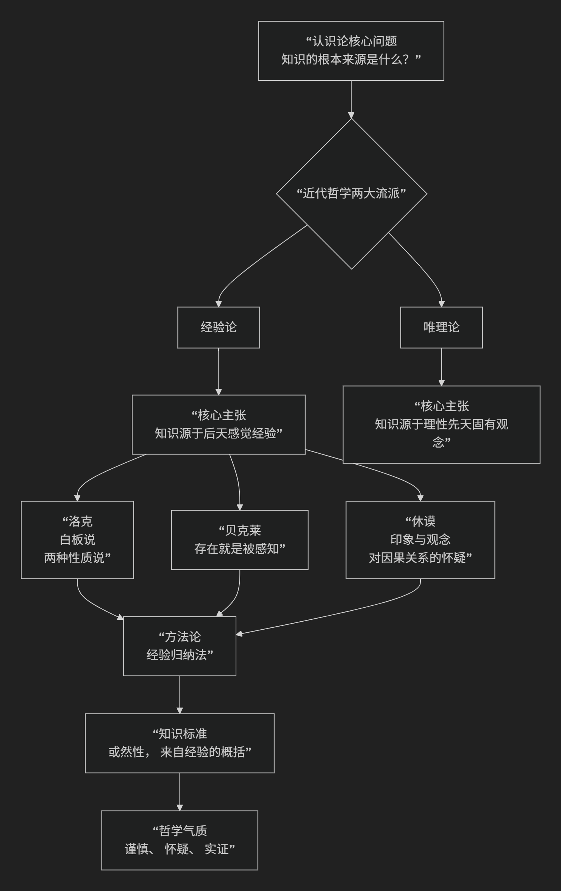

Empiricism
=============

基于经验论（Empiricism）哲学核心思想

---------------------------------

经验论是西方哲学史上与 **唯理论** 相对立的核心认识论流派。它的核心思想可以概括为：**人类的一切知识和观念都最终来源于感觉经验，否定存在任何先于经验的“天赋观念”。**

为了更直观地理解经验论的核心主张及其与唯理论的根本对立，下图清晰地展示了其思想脉络与关键分野：

以下，我们将沿此脉络，深入解析经验论的核心思想、基本原则及其代表人物。

一、核心命题：经验是知识的唯一源泉

经验论者面对的核心问题是：**我们的知识从何而来？** 他们的回答坚定而一致：**源于经验**。

他们打了一个著名的比方：人的心灵就像一块 **“白板”** ，上面没有任何先天标记。所有的知识和观念，都是由后天经验在这块白板上书写而成的。

二、经验论的四个关键原则

1.  **否定天赋观念**

    *   这是经验论与唯理论最根本的分歧。经验论者坚决否认人类心灵中存在任何与生俱来的观念（如数学公理、逻辑法则、上帝观念）。他们认为，即使是最抽象、最复杂的观念，也能在经验中找到其最终根源。

2.  **经验归纳法**

    *   在方法论上，经验论推崇 **观察、实验和归纳**。知识始于对个别事物的感觉经验，通过重复观察，归纳出普遍性的规律或结论。例如，通过多次观察到“太阳从东方升起”，我们归纳出“太阳总是从东方升起”这一结论。

3.  **怀疑理性独断**

    *   经验论者对唯理论者单凭理性推理就能获得关于世界的新知识的能力表示深刻怀疑。他们认为，没有经验基础的纯粹理性思辨是空洞的，可能产生谬误。

4.  **强调知识的或然性**

    *   由于归纳法无法穷尽所有可能情况（我们无法观察所有天鹅来证明“所有天鹅都是白的”），因此经验论认为，我们的大部分知识（尤其是关于自然规律的知识）是 **或然的、可错的**，而非唯理论所追求的“普遍必然的”。

三、主要代表人物及其思想

经验论的传统主要由17-18世纪的英国哲学家所奠定和发展，因此常被称为“英国经验论”。

1. 约翰·洛克 - 经验论的奠基人

*   **核心学说**： **“白板说”**。系统性地批判了“天赋观念论”，提出人的心灵最初就像一张白纸或一块白板。

*   **主要理论**：将经验分为 **感觉** （外部经验）和 **反省** （内部经验）。并提出 **第一性的质** （如大小、形状，是物体固有的）与 **第二性的质** （如颜色、声音，是知觉产生的）的著名区分。

2. 乔治·贝克莱 - 极端经验论与唯心论者

*   **核心命题**： **“存在就是被感知”**。他将经验论原则推向极致：既然我们只能认识自己的观念，那么一个物体的存在，就在于它被心灵所感知。他否认物质实体的独立存在，认为“物是观念的集合”。

*   **影响**：他的思想主观唯心论色彩浓厚，揭示了经验论原则可能导致的激进结论。

3. 大卫·休谟 - 经验论的集大成者与怀疑论者

*   **核心理论**：

    *   **印象与观念**：将知觉分为强烈的“印象”和微弱的“观念”。观念是印象的摹本。

    *   **对因果关系的致命打击**：这是休谟最著名的贡献。他认为，我们所谓的“因果关系”（如A导致B），实际上只是观察到两个事件 **恒常联结** 先后发生，并在心中产生了一种 **习惯性联想**。我们从未在经验中观察到“因果力”本身。这动摇了自然科学知识的必然性基础。

*   **影响**：休谟的怀疑论将经验论推向了顶峰，也暴露了其理论困境，激发了康德后来的哲学革命。

四、经验论的影响与面临的挑战

.. list-table:: 
   :header-rows: 1
   :widths: 30 70
   :align: center

   * - **方面**
     - **内容**
   * - **深远影响**
     - 为 **现代实验科学** 提供了哲学基础，强调观察和实证的重要性。它是 **现代逻辑实证主义、分析哲学和实用主义** 的重要思想源头。其精神也深刻影响了 **政治自由主义** （如洛克）。
   * - **内部挑战（休谟的怀疑论）**
     - 休谟揭示了经验论的原则会导致严峻的怀疑论后果：我们无法证明因果关系的必然性，无法保证归纳推理的有效性，甚至无法确知外部世界和自我的实在性。
   * - **康德的调和与超越**
     - 康德认为休谟把他从"独断论的迷梦"中惊醒。他试图调和经验论与唯理论，提出知识需要两个来源：**感性经验提供材料，先天认知形式（时空、范畴）提供结构**。

五、总结

总而言之，经验论的核心思想在于，它是对 **人类知识之经验基础的彻底坚守和探索**。它是一场将知识从“天赋”的神坛拉回到“人间经验”的哲学运动。

从洛克的“白板”起点，到贝克莱的“感知即存在”，再到休谟对“因果关系”的釜底抽薪，经验论者共同塑造了一种 **谨慎、怀疑和注重实证** 的哲学气质。尽管其理论最终引向了怀疑论的难题，但它对后世科学和哲学的发展产生了不可估量的影响，至今仍是英美哲学传统中最具活力的思想源泉之一。

------------

 .. toctree::
    :maxdepth: 3

    copilot
    grok
    chatgpt
    deepseek
    gemini
    qwen
