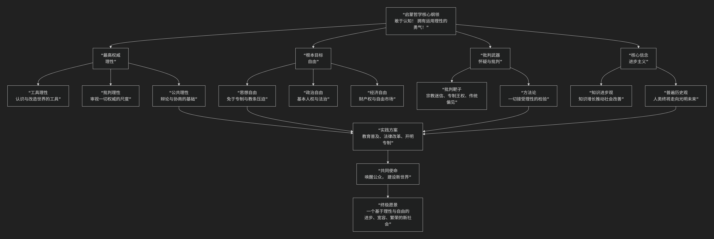

Enlightenment
=============

基于启蒙哲学（The Enlightenment）核心思想

---------------------------------

启蒙哲学是17世纪末至18世纪在欧洲（尤其在法国、英国和德国）兴起的一场宏大的思想革命运动。其核心思想可以概括为：**一场以“理性”为最高权威，以“自由”为根本目标，旨在通过知识进步和思想解放来克服愚昧、专制和迷信，从而推动人类社会不断走向光明、进步与幸福的 intellectual revolution（思想革命）。**

启蒙哲学并非一个统一的学派，而是一场由众多思想家共同推动的、具有共同精神气质的思想运动。其核心纲领与内在结构，可以通过下图清晰地展现：

以下，我们将沿此逻辑脉络，深入解析启蒙哲学的核心要义。

一、最高权威：理性

“理性”是启蒙运动的旗帜和基石。它不仅是认知工具，更是评判一切的最高法庭。

*   **核心口号**：康德在《什么是启蒙运动？》中开宗明义：**“要敢于认知！拥有运用你自己理性的勇气！”** 这呼吁人们从自我招致的“不成熟状态”中挣脱出来。

*   **内涵**：

    1.  **工具理性**：一种基于经验和逻辑的、认识自然和人类社会运行规律的能力。

    2.  **批判理性**：一种不盲从任何权威（宗教、传统、专制），对一切现有观念和制度进行审视、质疑和批判的能力。

    3.  **公共理性**：理性是普遍的，为所有人共有。通过 **公开的辩论和自由的交流**，真理越辩越明。

二、根本目标：自由

启蒙哲士们追求多种维度的自由，旨在将人从各种束缚中解放出来。

*   **思想自由与宗教宽容**：反对思想禁锢和宗教迫害，主张人人有权利按照自己的理性思考，并选择自己的信仰。伏尔泰的名言：“我不同意你的观点，但誓死捍卫你说话的权利”是这种精神的典范。

*   **政治自由**：批判君主专制和封建特权，追求 **法治、平等和基本人权**。洛克提出生命、自由、财产是 **不可剥夺的自然权利**；卢梭提出 **“社会契约论”** 和 **“主权在民”** 思想，认为政府的权力来源于人民的同意。

*   **经济自由**：重农学派和亚当·斯密倡导 **自由市场**，反对重商主义的国家干预，认为个人追求自身利益在“看不见的手”引导下能促进公共福利。

三、核心方法：怀疑与批判

启蒙哲士们运用理性作为武器，对旧世界的根基进行了无情的批判。

*   **批判的靶子**：

    *   **宗教迷信与教条**：将批判矛头直指天主教的权威和迷信，倡导 **自然神论** （上帝创造世界后便不再干预，世界依自然律运行）甚至 **无神论**。

    *   **专制王权**：抨击“君权神授”，论证权力的世俗来源和限制。

    *   **传统偏见**：挑战一切未经理性检验的传统习俗和社会制度。

*   **方法论**：笛卡尔的 **普遍怀疑** 精神被继承和发扬，要求一切知识和社会制度都必须站在理性的法庭上为自己辩护。

四、坚定信念：进步主义

启蒙哲学对未来抱有一种前所未有的乐观主义信念。

*   **知识进步观**：相信 **知识的积累和科学的进步** 能够解决人类面临的问题，改善生活条件，推动社会不断向前发展。狄德罗主编的 **《百科全书》** 即是这一信念的集中体现，旨在汇集一切知识，启迪民智。

*   **普遍历史观**：人类历史是一个从蒙昧、迷信走向理性、光明的 **线性进步过程**。尽管道路曲折，但终极目标是向好的。

五、主要代表人物与思想

.. list-table:: 
   :header-rows: 1
   :widths: 30 70
   :align: center

   * - **代表人物**
     - **核心贡献与思想**
   * - **孟德斯鸠（法）**
     - 提出 **"三权分立"** 学说（立法、行政、司法），成为现代宪政主义的基石。
   * - **伏尔泰（法）**
     - 启蒙的旗手，猛烈抨击天主教会的腐败和专制，倡导 **理性、宗教宽容和自由**。
   * - **卢梭（法）**
     - 提出 **"社会契约论"** 和 **"主权在民"**，认为不平等源于私有制，强调"公意"的重要性。
   * - **狄德罗（法）**
     - **《百科全书》** 主编，旨在传播科学知识，挑战传统权威，是启蒙思想的集大成者。
   * - **休谟（英）**
     - 经验论代表，对因果关系和归纳法提出深刻质疑，揭示了理性的局限性。
   * - **康德（德）**
     - 德国古典哲学奠基人，对"启蒙"做了经典定义，探讨理性的范围和界限（"人为自然立法"）。
   * - **洛克（英）**
     - 早期启蒙思想家，系统阐述 **经验论、政府论和宗教宽容**，深刻影响了美国革命。

六、核心要义总结

.. list-table:: 
   :header-rows: 1
   :widths: 25 45 30
   :align: center

   * - **理论维度**
     - **核心命题**
     - **关键概念与贡献**
   * - **理性观**
     - **理性是最高权威，是评判一切、解放人类的根本工具。**
     - **敢于认知、批判理性、公共运用理性**
   * - **自由观**
     - **人应享有思想、政治、经济等多方面的自由，这是不可剥夺的自然权利。**
     - **思想自由、宗教宽容、主权在民、三权分立、自然权利**
   * - **批判观**
     - **运用理性对宗教迷信、专制政治和传统偏见进行无情的批判。**
     - **怀疑精神、批判一切、反迷信、反专制**
   * - **进步观**
     - **知识进步将引领人类社会不断走向光明、幸福和完美的未来。**
     - **进步主义、科学乐观主义、百科全书派**
     
七、历史影响与反思

*   **革命性的影响**：启蒙思想直接为 **美国独立战争** 和 **法国大革命** 提供了理论武器和革命口号（自由、平等、博爱），奠定了现代西方民主、法治和人权观念的基础。

*   **内在张力与反思**：

    *   后世对启蒙的“理性万能”倾向进行了反思，如浪漫主义强调情感，后现代主义批判其“宏大叙事”可能带来的新的压迫。

    *   极端的理性主义是否会导致工具理性的膨胀，使人“异化”？

    *   “进步”观念是否掩盖了发展带来的新问题？

八、总结

总而言之，启蒙哲学的核心思想在于，它是一场 **“理性的黎明”与“人的第二次觉醒”** 。它教导我们，**人类无需匍匐在任何超验的权威脚下，我们自身拥有的理性，足以照亮前行的道路，为自己立法，并创造一个更自由、更公正、更繁荣的世界。**

它的全部工作是对 **人类自身力量** 的一次伟大发现与肯定。尽管其理想在现实中遭遇了各种挑战，但启蒙运动所奠立的理性、自由、进步和宽容的基本价值，至今仍是现代文明大厦最坚实的基石。在这个意义上，我们至今仍然生活在启蒙运动所开启的时代，并继续着它未竟的事业。

------------

 .. toctree::
    :maxdepth: 3

    grok
    copilot
    chatgpt
    deepseek
    gemini
    qwen
