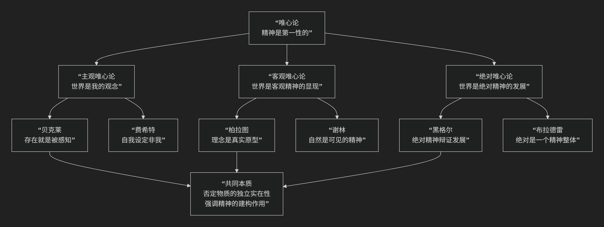

Idealism
===========

基于唯心论（Idealism）哲学核心思想

-------------------------------------

唯心论是哲学中最基本、最富影响力的思潮之一。其核心思想可以概括为：**主张“精神”（或心灵、意识、理念）是世界的本质，物质世界是精神的产物或依存于精神而存在。** 即，**精神是第一性的，物质是第二性的。**

简单来说，唯心论者坚信：**我们感知到的世界，其存在和秩序最终源于某种精神性的本源。**

然而，围绕“这种精神本源是什么”以及“它如何派生或构造世界”等问题，唯心论内部发展出不同的流派，其演变历程与核心观点如下图所示：

以下，我们将沿此脉络，详细解析唯心论的核心思想与代表人物。

一、核心命题与基本立场

所有唯心论形式都共享两个基本承诺：

1.  **本体论承诺**：世界的本质是 **精神性的**。存在的基本构成不是物质粒子，而是心灵、意识、理念或某种宇宙精神。物质世界要么是精神的派生物，要么其存在依赖于被感知或思维。

2.  **认识论承诺**：我们对世界的认识，根本上是 **对精神内容的认识**。我们无法越过我们的观念、感觉或概念去直接把握一个所谓的“纯粹物质世界”。

**唯心论的反面** 是 **唯物论**，后者主张物质是第一性的，意识是物质的产物。

二、主要流派及代表人物

唯心论在哲学史上呈现出丰富多样的形态，主要可分为以下三大类：

1. 主观唯心论

这是最激进的唯心论形式，将世界的存在完全系于个人的主观意识。

*   **核心命题**：**外部世界是个人感觉经验的复合，离开感知者的心灵，物质世界便不存在。** “物是观念的集合”。

*   **代表人物与思想**：

    *   **乔治·贝克莱（英国）**：最著名的代表，提出 **“存在就是被感知”**。他认为，物体的存在就在于其被心灵所感知。所谓的物质实体，不过是稳定地、有规则地出现在我们心灵中的一组感觉观念而已。他并不否认桌子的实在性，而是说桌子的实在性就在于它被看到、被摸到。

    *   **约翰·戈特利布·费希特（德国）**：从“自我”出发，认为“自我”设定自身，并设定“非我”（外部世界），从而为知识奠定基础。外部世界是“自我”为了实现自身道德使命而设定的对立面。

2. 客观唯心论

认为存在一种不依赖于个别心灵的、客观的精神实体或理念世界，物质世界是它的产物或表现。

*   **核心命题**：**存在一个客观的、普遍的精神或理念秩序，自然界和人类历史是这一客观精神的外化或显现。**

*   **代表人物与思想**：

    *   **柏拉图（古希腊）**：客观唯心论的奠基人。提出 **“理念论”** ，认为在我们感知的变化无常的物质世界背后，存在一个永恒、完美、真实的 **“理念世界”** 。个别事物只是理念的 **“摹本”** 。例如，所有的马都分有同一个完美的“马”的理念。

    *   **弗里德里希·谢林（德国）**：主张 **“自然哲学”** ，认为“自然”是 **“可见的精神”** ，而“精神”是 **“不可见的自然”** 。自然界是一个有生命、有目的的创造过程，是宇宙精神从无意识状态向自我意识发展的阶段。

3. 绝对唯心论

这是德国古典哲学的巅峰，将客观精神推演至囊括一切的“绝对”。

*   **核心命题**： **存在一个包罗万象、自我发展的“绝对精神”或“绝对理念”，整个宇宙（自然和人类历史）都是绝对精神通过辩证逻辑自我展开、自我认识的过程。**

*   **代表人物与思想**：

    *   **格奥尔格·威廉·弗里德里希·黑格尔（德国）**：绝对唯心论的集大成者。他认为，“绝对精神”是唯一的、最终的实在。它通过 **“辩证法”** （正题-反题-合题）的逻辑运动，外化为自然界和人类社会发展史，最终在哲学中达到完全的自我认识。历史就是“理性”的展开过程。

---

三、唯心论的意义与面临的挑战

.. list-table:: 
   :header-rows: 1
   :widths: 30 70
   :align: center

   * - **方面**
     - **意义与挑战**
   * - **哲学意义**
     - 深刻揭示了 **意识的能动性** 和 **理性的建构力量**。它强调意义、价值和精神生活在人类世界中的核心地位，对抗了将人视为纯粹机器的机械唯物主义观点。
   * - **知识论意义**
     - 强调了我们的知识永远是被我们的认知形式（如范畴、语言）所中介的，我们无法直接接触"物自体"，这推动了认识论的深化。
   * - **核心挑战**
     - **常识直觉**：最直接的挑战来自常识。大多数人直觉上相信，即使没有人感知，树木、山川依然存在。如何解释这种坚固的常识信念？
   * - **科学挑战**
     - **科学成果**：自然科学（如物理学、进化论）的成功，似乎为物质世界的独立存在和自行演化提供了强有力的证据，这与唯心论的基本主张相悖。

四、总结

总而言之，唯心论的核心思想在于，它是对 **精神、意识和理性之首要性** 的坚决捍卫。它是一股强大的思想洪流，其共同根基是：

**拒绝接受世界是盲目、无意义的物质堆砌，坚持认为实在的本质是精神的，因而世界在根本上是可以被理解的、有目的的，甚至是充满价值的。**

从柏拉图对永恒理念的追寻，到贝克莱对感知的确信，再到黑格尔对绝对理性的宏大叙事，唯心论者始终在探索一条用精神的光芒照亮宇宙的道路。尽管它面临着来自常识和科学的严峻挑战，但它对人性、自由和意义的深刻关怀，使其依然是哲学史上最富魅力、影响最深远的思潮之一。

------------

 .. toctree::
    :maxdepth: 3

    copilot
    grok
    deepseek
    gemini
