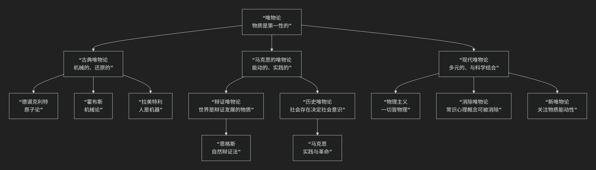

Materialism
============

基于唯物论（Materialism）哲学核心思想

-----------------

唯物论是哲学中最基本、影响最广泛的思潮之一。其核心思想可以概括为：**主张“物质”是世界的本原，意识、精神或心灵是物质高度发展的产物。** 即，**物质是第一性的，意识是第二性的。**

简单来说，唯物论者坚信：**先有物质世界（如大脑），然后才产生了意识（如思想）。没有独立于物质的精神实体。**

然而，围绕“物质如何决定意识”以及“物质世界的图景是怎样的”等问题，唯物论内部发展出不同的流派，其演变历程与核心观点如下图所示：

以下，我们将沿此脉络，详细解析唯物论的核心思想与代表人物。

一、核心命题与基本立场

所有唯物论形式都共享两个基本承诺：

1.  **本体论承诺**：世界的本质是 **物质性的**。存在一个客观的、独立于意识之外的物质世界。所谓的“精神”、“意识”、“灵魂”等现象，都不能脱离物质（尤其是高度组织起来的物质——大脑）而独立存在。

2.  **认识论承诺**：我们对世界的认识，源于 **物质世界作用于我们的感官**。意识是对物质的反映。

**唯物论的反面** 是 **唯心论**，后者主张精神或意识是第一性的，物质是第二性的，是精神的产物或表现。

二、主要流派及代表人物

唯物论在历史上经历了从朴素到科学、从机械到辩证的发展过程。

1. 古典唯物论：机械的与还原的

这一阶段的唯物论带有明显的机械论和还原论色彩。

*   **核心特征**：试图将世界万物（包括生命和意识）还原为 **物质粒子的机械运动**。

*   **代表人物与思想**：

    *   **德谟克利特（古希腊）**：提出 **“原子论”** ，认为万物是由不可分的原子和虚空构成，甚至灵魂也是由精细的原子组成。

    *   **托马斯·霍布斯（英国）**：将唯物论系统化，认为宇宙是无数物体的机械运动，连人也是“一架自动机”，思维是头脑中物质的微小运动。

    *   **朱利安·奥弗雷·拉美特利（法国）**：提出 **“人是机器”** ，认为人的身体和心灵的一切活动都可用物理规律来解释。

2. 马克思的唯物论：能动的与实践的

马克思和恩格斯创立的唯物论是革命性的，它克服了旧唯物论的机械性和直观性。

*   **核心特征**：强调 **实践的能动性** 和 **历史的辩证发展**。

*   **主要形态**：

    *   **辩证唯物论**：认为物质世界是 **普遍联系和永恒发展** 的，其发展的根本规律是 **对立统一、质量互变、否定之否定**。它强调矛盾是事物发展的根本动力。

    *   **历史唯物论** （唯物史观）：将辩证唯物论原理应用于社会历史领域。其核心命题是：**社会存在决定社会意识**。一个社会的物质生产方式（经济基础）决定了其政治、法律、文化等上层建筑。历史发展的动力是生产力和生产关系的矛盾运动。

*   **代表人物**：

    *   **卡尔·马克思 & 弗里德里希·恩格斯**：马克思主义哲学的奠基人。他们强调“哲学家们只是用不同的方式解释世界，而问题在于改变世界”，突出了 **实践** 在认识和改造世界中的决定性作用。

3. 现代唯物论：多元的与科学化的

在现代哲学和科学背景下，唯物论呈现出更多元的形式，并与具体科学紧密结合。

*   **核心特征**：更多地关注心灵哲学、语言哲学和科学哲学中的相关问题，如心身问题、意识的本质等。

*   **主要形态与代表人物**：

    *   **物理主义**：认为所有存在的事物都是物理的，或最终可还原为物理事物。心理状态其实就是大脑的物理状态。

    *   **消除唯物论**：更激进的一种，认为常识心理学中的“信念”、“欲望”等概念如同“燃素”一样，是错误的理论，最终会被成熟的神经科学所“消除”和取代。 **（保罗·费耶阿本德、帕特丽夏·丘奇兰德）**

    *   **新唯物论**：受德勒兹哲学、复杂性科学等影响，强调物质本身的 **能动性、自我组织能力和创造力**，试图超越机械还原论的局限。 **（简·贝内特、凯伦·芭拉德）**

三、唯物论的意义与面临的挑战

.. list-table:: 
   :header-rows: 1
   :widths: 30 70
   :align: center

   * - **方面**
     - **意义与挑战**
   * - **科学意义**
     - 为自然科学（特别是物理学、生物学、神经科学）提供了哲学基础，鼓励从物质世界本身寻找解释，反对超自然原因。
   * - **社会意义**
     - 历史唯物论为分析社会结构、历史变迁和阶级斗争提供了强大的理论工具，具有强烈的批判性和革命性。
   * - **核心挑战**
     - **心身问题**：如何解释纯粹的物质过程如何产生主观的、定性的"意识体验"（感质）？这是唯物论面临的最大难题。
   * - **其他挑战**
     - **自由意志**：在纯粹物质决定论的世界里，人的自由意志和道德责任如何可能？ **数学与抽象对象**：数学对象（如数字、集合）是否是物质性的？

四、总结

总而言之，唯物论的核心思想在于，它是对 **世界物质统一性** 的坚定信念。它是一棵不断生长的思想之树，其共同根基是：

**坚持从物质世界本身出发，用物质的原因来解释世界，拒绝任何形式的神秘主义、唯心主义和超自然主义。**

从德谟克利特的原子，到马克思的实践，再到现代神经科学的神经元，唯物论者始终在探索一条用物质本身的力量来解释宇宙、生命、心灵和社会的道路。尽管它面临着意识等难题的严峻挑战，但它依然是当今哲学和科学领域中一种极具生命力和影响力的世界观。

------------

 .. toctree::
    :maxdepth: 3

    copilot
    grok
    chatgpt
    deepseek
    gemini
    qwen
