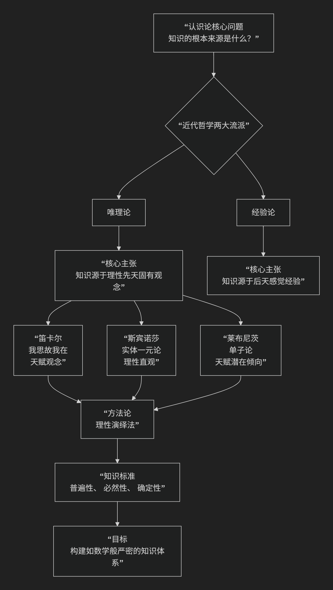

Rationalism
=============

基于唯理论（Rationalism）哲学核心思想

---------------------------------

唯理论是近代西方哲学中与**经验论**相对立的重要认识论流派。它的核心思想可以概括为：**强调理性是人类知识的根本来源和检验标准，认为通过理性推理可以获得普遍必然的真理，而感觉经验是不可靠的。**

为了更直观地理解唯理论的核心主张及其与经验论的根本对立，下图清晰地展示了其思想脉络与关键分野：

以下，我们将沿此脉络，深入解析唯理论的核心思想、主要原则及其代表人物。

一、核心命题：理性是知识的基石

唯理论者面对的核心问题是：**什么是真正可靠的知识？如何获得它？** 他们的回答是：

真正的知识必须具有 **数学一样的普遍必然性和确定性**。而感觉经验（如看、听、触）是模糊、个别和易错的，无法提供这种确定性。因此，知识的可靠来源只能是 **人类与生俱来的理性能力**。

二、唯理论的四个关键原则

1.  **先天观念论**

    *   认为人的心灵中存在着一些 **与生俱来的观念和原则** （如几何公理、逻辑律、上帝观念）。这些观念不是从经验中得来，而是理性固有的，是知识体系的起点。

2.  **理性演绎法**

    *   推崇 **数学（尤其是几何学）的方法** 作为哲学的典范。从清晰、自明的先天原则或定义出发，通过严格的逻辑推理，演绎出整个知识体系。感觉经验在此过程中只起到触发或例证的作用。

3.  **怀疑感官经验**

    *   对感觉的可靠性持深刻的怀疑态度。例如，筷子在水里看起来是弯的，梦境有时和现实一样真实。因此，感觉经验不能作为真理的标准，它至多提供意见，不能提供知识。

4.  **追求普遍必然真理**

    *   目标是获得超越具体时空和个人经验的、放之四海而皆准的真理。例如，“三角形的内角和等于180度”就是一个普遍必然的真理，它不依赖于我们测量了多少个具体的三角形。

三、主要代表人物及其思想

唯理论的辉煌时期是17世纪的欧洲大陆，因此也被称为“大陆唯理论”，其三位巨擎是：

1. 勒内·笛卡尔 - 唯理论奠基人

*   **核心方法**： **普遍怀疑**。为了找到无可置疑的知识起点，他怀疑一切可被怀疑的东西（包括感官、身体），最终发现 **“我在怀疑”** 这一事实本身是无可怀疑的，从而确立了著名的第一原理：**“我思故我在”**。

*   **主要理论**：从“我思”出发，他论证了上帝的存在和物质世界的存在，建立了 **心物二元论**。他认为关于心灵、上帝和物质的某些观念是 **天赋的**。

2. 巴鲁赫·斯宾诺莎 - 极端的一元论者

*   **核心方法**： **几何学演绎**。他的代表作《伦理学》完全采用几何学的写作方式（定义、公理、命题、证明）。

*   **主要理论**：提出 **“实体一元论”** 。认为宇宙间只有一个绝对的、无限的“实体”，他称之为“神”或“自然”。思想和广延（物质）是这同一实体的两种属性，从而解决了笛卡尔的二元论难题。他认为通过 **理性直观** 可以获得最高级的知识。

3. 戈特弗里德·威廉·莱布尼茨 - 理性的乐观主义者

*   **核心理论**： **单子论**。认为构成世界的基本单位是无数精神性的、不可分的实体——“单子”。每个单子都是一个独立的“小宇宙”，没有窗户，其发展由内在的“预定和谐”所决定。

*   **对天赋观念的发展**：他认为观念不是现成存在于心灵中，而是作为 **潜在的倾向或禀赋** 天赋在我们心中，需要经过经验的刺激才变得清晰起来。

四、唯理论的影响与面临的挑战

.. list-table:: 
   :header-rows: 1
   :widths: 30 70
   :align: center

   * - **方面**
     - **内容**
   * - **积极影响**
     - 高扬了人类的理性尊严，为现代科学（尤其是数学和逻辑学）的发展提供了哲学基础。其追求确定性和体系化的思想对后来的德国古典哲学（如康德、黑格尔）产生了巨大影响。
   * - **核心挑战（来自经验论）**
     - **经验论的诘难**：洛克批判"天赋观念论"，认为人心如一块"白板"，所有观念都源于经验。休谟进一步质疑因果律的必然性，认为那只是心理习惯，动摇了唯理论理性基础的可靠性。
   * - **康德的调和**
     - 康德认识到唯理论与经验论各有片面性，试图进行调和。他提出"先天综合判断"如何可能的问题，指出知识既需要感性经验提供材料，也需要先天认知形式（时空、范畴）进行整理。

五、总结

总而言之，唯理论的核心思想在于，它是对 **人类理性能力至高无上的信任和礼赞**。它是一场试图通过理性构建一个严密、确定知识大厦的宏伟哲学尝试。

从笛卡尔的“我思”起点，到斯宾诺莎的几何宇宙，再到莱布尼茨的预定和谐，唯理论者共同描绘了一幅 **理性之光普照世界** 的图景。尽管其“天赋观念”论受到经验论的强力挑战，但它对认识论、逻辑学和科学方法的深刻探索，使其成为哲学史上不可或缺的瑰宝。

------------

 .. toctree::
    :maxdepth: 3

    copilot
    grok
    deepseek
    gemini
    qwen
