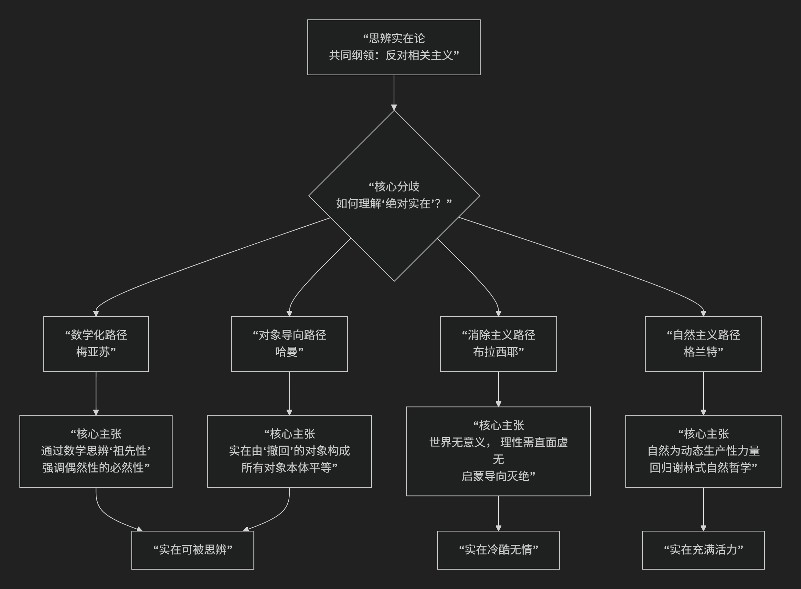

Speculative Realism
===================

基于​​思辨实在论（Speculative Realism）​哲学核心思想

-------------------------------------------------

思辨实在论是21世纪初兴起的一场极具革命性的哲学运动，它并非一个统一的理论，而是对自康德以来主导欧陆哲学的 **“相关主义”** 发起的一场集体反叛。其核心思想可以概括为：**哲学必须能够直接思考独立于人类思维和感知之外的“绝对实在”，并坚决拒绝将“存在”等同于“被人类所认知的存在”。**

为了更直观地理解这场运动的核心诉求、内部分支与根本分歧，下图清晰地勾勒了其思想图谱：

一、共同敌人：相关主义

要理解思辨实在论，必须首先理解其攻击的靶心—— **“相关主义”**。

*   **相关主义**：这是思辨实在论者 :doc:`昆汀·梅亚苏 </chats/outlaw/analyse/foreign/master/today/meillassou/index>` 提出的概念，指一种自康德以来的哲学教条。康德认为，我们无法认识“**物自体**”，我们只能认识被我们的先天认知形式（时间、空间、范畴）所建构的“现象”。因此，**思维与存在、世界与人类总是相互关联的**。我们无法思考一个独立于我们思维的世界。

*   **思辨实在论的指控**：相关主义导致了一种 **顽固的人类中心主义**。哲学变得只关心人类如何“ access ”（接近）世界，而完全放弃了思考世界本身的可能性。这被思辨实在论者视为哲学的怯懦和堕落。

二、核心命题与思想分支

如图表所示，思辨实在论内部为解决“如何思辨绝对实在”这一核心问题，发展出四条主要路径。

1. :doc:`昆汀·梅亚苏 </chats/outlaw/analyse/foreign/master/today/meillassou/index>` - 思辨唯物论

*   **核心著作**：《有限性之后》

*   **核心命题**：**我们必须能够思考“祖先性”**——即在人类甚至生命出现之前就已存在的实在（如宇宙大爆炸、化石）。相关主义在此陷入悖论，因为它要求任何存在都必须与人类思维相关，这显然是荒谬的。

*   **关键概念**：**“偶然性必然性”**。自然律本身是 **偶然的** （它们可以不是现在这样），但它们的存在是 **必然的** （总要有某种自然律）。这为思考一个充满可能性的绝对世界开辟了道路。

*   **方法**：通过数学（尤其是集合论）来思辨绝对实在。

2. :doc:`格拉汉姆·哈曼 </chats/outlaw/analyse/foreign/master/today/harman/index>` - 对象导向本体论

*   **核心命题**：**实在由“对象”构成，所有对象（无论是电子、茶杯、国家还是思想）都是平等的，且永远无法被完全耗尽。**

*   **关键概念**：

    *   **对象的“撤回”**：任何一个实在对象，其真实本质总是隐藏在它与其它对象的关系之后，永远无法被完全触及或理解。

    *   **关系不对称**：对象之间的相互作用（如火燃烧棉花）不是直接的，而是通过各自的“感性属性”进行的，这是一种扭曲的翻译。

*   **影响**：在艺术、建筑等领域影响巨大，因为它赋予了一切非人对象以神秘性和平等地位。

3. :doc:`雷·布拉西耶 </chats/outlaw/analyse/foreign/master/today/brassier/index>` - 消除唯物论

*   **核心命题**：**“虚无主义是真理。”** 世界本质上是无意义、无目的的。人类意识是自然过程的偶然产物，并终将消亡。

*   **态度**：他主张一种冷酷的、科学化的唯物主义，接受宇宙的冷漠和人类最终的消亡。哲学的任务不是寻找意义或安慰，而是 **追随理性的冷酷之光**，即使它导向的是虚无。他的思想深受神经科学和宇宙学的影响。

4. :doc:`伊恩·汉密尔顿·格兰特 </chats/outlaw/analyse/foreign/master/today/grant/index>` - 自然哲学取向

*   **核心思想**：回归德国唯心论（特别是谢林），认为自然不是被动的产物，而是充满创造力和生产力的动态过程。哲学应思考这种“自然的生产性”，反对将自然简化为科学定律下的被动领域。

核心要义总结

.. list-table:: 
   :header-rows: 1
   :widths: 25 45 30
   :align: center

   * - **理论维度**
     - **核心命题**
     - **关键概念与贡献**
   * - **共同纲领**
     - **反对“相关主义”**，主张哲学能够且必须思考独立于人类的 **绝对实在**。
     - **相关主义批判、思辨转向、破除人类中心主义**
   * - **本体论革新**
     - **赋予“非人领域”（物体、物质、宇宙）以本体论核心地位**，探索其自主性与神秘性。
     - **绝对实在、对象导向、扁平本体论、祖先性**
   * - **方法论多元**
     - 运用 **数学、隐喻、科学** 等多种方式，直接思辨实在本身。
     - **数学化本体论、思辨哲学、隐喻性思辨**
   * - **哲学气质**
     - **重拾哲学的野心与勇气**，直面世界的冷漠、偶然与虚无。
     - **哲学野心、理性无畏、虚无的肯定**

影响与意义

思辨实在论的重要性在于：

*   **哲学上的解放**：它打破了康德以来哲学的人类学禁锢，为哲学思考打开了广阔的非人领域，恢复了哲学的野心和思辨勇气。

*   **应对当代挑战**：它为理解 **气候变化** （盖亚理论）、 **人工智能** （非人智能）、 **技术物** （算法、网络）等提供了全新的框架，使我们能够更公正地对待与我们共存并塑造我们的非人力量。

*   **争议**：批评者认为其有些观点过于思辨而缺乏实证基础，或可能陷入一种新的神秘主义。

总而言之，思辨实在论是一场 **哲学的“宇宙学转向”**。它邀请我们放下人类的自恋，谦卑而勇敢地思考一个 **不以我们为中心、甚至没有我们的世界**，并在这个基础上，重新思考我们与万物共存的责任与伦理。它是对哲学想象力的一次极大激发。

------------

 .. toctree::
    :maxdepth: 3

    copilot
    grok
    deepseek
    gemini

-----------

代表人物

[:doc:`Alain Badiou </chats/outlaw/analyse/foreign/master/today/badiou/index>`]
[:doc:`Graham Harman </chats/outlaw/analyse/foreign/master/today/harman/index>`]
[:doc:`Ray Brassier </chats/outlaw/analyse/foreign/master/today/brassier/index>`]
[:doc:`Iain Hamilton Grant </chats/outlaw/analyse/foreign/master/today/grant/index>`]
[:doc:`Quentin Meillassoux </chats/outlaw/analyse/foreign/master/today/meillassou/index>`]

