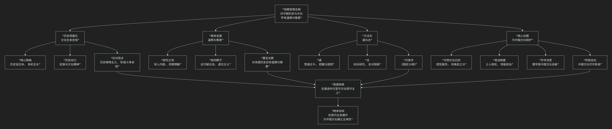

钱宾四
======

钱穆的历史和哲学观

----------------

钱穆是中国现代史学巨擘、国学大师。他的核心思想可以概括为：**一种以“温情与敬意”为根本态度，以“文化生命史观”为哲学基础，旨在从中国历史内部探寻其独特脉络与精神，并坚信中国文化具有内在生命力与独特价值，能够应对现代挑战的宏大思想体系。他毕生反对“历史虚无主义”和“全盘西化论”，致力于为中国文化招魂续命。**

钱穆的思想深邃而自成一体，其核心架构与内在逻辑可以通过下图清晰地展现：

以下，我们将沿此逻辑脉络，深入解析钱穆思想的核心要义。

一、历史观基石：文化生命史观

钱穆将历史视为一个有机的生命体，这是他全部思想的哲学基础。

*   **核心隐喻**：**历史不是一堆僵死的“史料”，而是一个民族“文化生命”的有机生长过程**。如同一个人的生命，有童年、青年、壮年，有其精神、个性与命运。研究历史，就是研究这个民族文化的生命历程。
*   **历史动力**：推动历史发展的根本力量，不是经济或阶级斗争，而是 **民族精神与文化理想**。他尤其强调中国历史内在的“**士人精神**”（知识分子的责任感）和“**人心教化**”的力量。
*   **反对对象**：他强烈批评当时盛行的 **历史唯物主义** 和 **疑古思潮**。认为前者将复杂的历史简化为经济公式，后者则粗暴地割裂了传统，导致中国人失去文化自信。

二、根本态度：对历史的温情与敬意

这是钱穆最著名、也最具标志性的治史态度。

*   **核心主张**：研究本国历史，**“必附随一种对其本国已往历史之温情与敬意”**。这不是盲目自大，而是要求研究者首先 **“深入内部”**，设身处地地理解古人所处的时代和面临的难题，抱有同情之理解，而非居高临下地批判。
*   **目的**：只有持此态度，才能发现中国历史自身的 **内在脉络和独特价值**，而不是简单地用西方理论来裁剪中国历史，从而避免 **“将我们当身种种罪恶与弱点，一切诿卸于古人”**。

三、方法论：通与合

基于上述史观和态度，钱穆形成了独特的研究方法。

*   **通**：强调 **贯通**。研究历史要有通史眼光，上下贯通，把握历史发展的大趋势和整体精神。其代表作《国史大纲》便是通史研究的典范。
*   **合**：强调 **综合**。主张将政治、经济、社会、学术思想等各方面结合起来作整体研究，反对孤立、割裂地看问题。他认为中国文化的精髓就在于其 **整体性与和谐性**。

四、核心论题：为中国文化辩护

在20世纪中国全面批判传统的浪潮中，钱穆独树一帜地为中国历史与文化进行系统辩护。

1.  **中西文化比较：类型差异，非高低之分**

    *   他反对“中国文化落后论”，认为中西文化是 **“不同类型”** 的文明，而非“不同阶段”的文明。

    *   西方文明可称为 **“外倾型”** ，更侧重于向外征服自然、建立规则。

    *   中国文化则是 **“内倾型”** ，更侧重于向内修身养性、追求人伦社会的和谐。二者各有长短，并无绝对的优劣。

2.  **政治制度：士人政权与贤能政治**

    *   他提出，中国传统政治并非“专制黑暗”所能概括，而是一种独特的 **“士人政权”** 。通过科举制度，政权向平民开放，由受过儒家教育的“士”来管理，形成了 **“贤能政治”**。

    *   他认为 **“皇权与相权”** 的制衡、**“科举制度”** 的开放性等，都包含了合理的成分，不能一概否定。

3.  **学术思想：儒学是中国文化的中枢**

    *   他认为儒家思想是中国历史的 **总动脉**，它塑造了中国人的价值观和社会结构。他尤其推崇宋明理学的心性之学，认为其体现了很高的精神境界。

4.  **终极信念：中国文化可开新局**

    *   面对现代化挑战，他坚信中国文化并非现代化的障碍，其内在的 **包容性、适应性** 和 **人文精神**，恰恰可以矫正西方现代性的弊端（如功利主义、个人主义膨胀）。中国现代化的正确道路，应是 **“吸收外来新元素，再开民族文化新运”**，即在本民族文化根基上创造性地吸收西方优点。

四、核心要义总结

.. list-table:: 
   :header-rows: 1
   :widths: 25 45 30
   :align: center

   * - **理论维度**
     - **核心命题**
     - **关键概念与贡献**
   * - **历史哲学**
     - **历史是民族"文化生命"的有机展现，有其内在精神与脉络。**
     - **文化生命史观、民族精神、有机生长**
   * - **治史态度**
     - **对本国历史应怀有"温情与敬意"，以求同情之理解。**
     - **温情与敬意、深入内部、反对虚无主义**
   * - **研究方法**
     - **强调"通"（贯通古今）与"合"（综合研究）的整体史观。**
     - **通史眼光、整体研究、《国史大纲》**
   * - **文化立场**
     - **中国文化是独特的"内倾型"文明，其价值可补西方之弊，并能开创新局。**
     - **中西文化类型说、士人政权、贤能政治、儒学中枢**

五、思想特质与历史影响

*   **文化保守主义**：在激进的革命时代，他坚守民族文化本位，被视为文化保守主义的代表人物。

*   **体系宏大的通儒**：其学贯古今，融汇经、史、子、集，是最后一代传统意义上的“通儒”之一。

*   **争议与批评**：批评者认为他对中国传统政治和文化的辩护有过誉之嫌，有时过于理想化，对专制皇权的阴暗面批判不足。

*   **当代回响**：在当今中国强调文化自信的背景下，钱穆的思想重新受到广泛重视，其对中国文化独特价值的阐发，为思考全球化时代的文明对话提供了重要资源。

六、总结

总而言之，钱穆的核心思想在于，他是一位 **“文化生命的守护者”和“历史灵魂的诠释者”** 。他教导我们，**一个民族若想拥有未来，必先理解并尊重自己的过去。真正的现代化，不是斩断传统的根脉，而是让古老的文化生命在新时代的土壤中焕发新的生机。**

他的全部工作是对 **中国文化自信心** 的一次艰难重建。在民族危亡和历史虚无主义的双重夹击下，他以其渊博的学识和深沉的智慧，为中国历史勾勒出一幅充满内在活力与独特价值的壮丽图景。在这个意义上，钱穆不仅是一位史学家，更是一位为往圣继绝学、为民族立心的思想巨匠。

------------

 .. toctree::
    :maxdepth: 3

    grok
    gemini
    copilot
    chatgpt
    deepseek
    qwen
