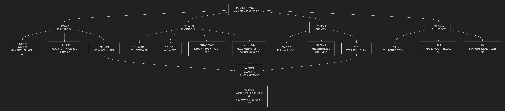

F. R. Ankersmit
====================

基于弗兰克·安克斯密特（F. R. Ankersmit）历史哲学核心思想

---------------------------------

弗兰克·安克斯密特是当代最富原创性和挑战性的历史哲学家之一，他的思想深刻塑造了后现代历史学的面貌。其核心思想可以概括为：**一场从认识论到美学的“语言学转向”，其核心主张是，历史学家的首要产品不是对过去的解释，而是对过去的“表现”；历史的真谛不在于与事实的符合，而在于语言叙事的创造；历史的最终价值，或许不在于提供知识，而在于提供一种疏离又崇高的“历史经验”。**

安克斯密特的思想极具颠覆性，其发展脉络与核心架构可以通过下图清晰地展现：

以下，我们将沿此逻辑脉络，深入解析安克斯密特历史哲学的核心要义。

一、思想基石：叙事实体理论

安克斯密特的学术起点是对分析历史哲学的不满。他反对将历史学的真实性建立在单个陈述（如“路易十四死于1715年”）与事实的符合之上。

*   **核心单位**：历史学的基本单位不是 **单称陈述**，而是 **叙事实体** ——即由大量陈述构成的、作为一个 **有机整体** 的历史叙事（如关于“法国大革命”的整本书或整章）。

*   **核心论点**：**叙事实体的意义是不可还原的**。整体叙事的意义大于其各部分陈述意义的总和。你不能通过验证每一个句子的真假来验证整个叙事的真实性。叙事的价值在于它提供了一个 **独特的、连贯的视角** 来理解过去。

*   **著名比喻**：单称陈述好比地图上 **一个个孤立的地点**，而叙事实体则是将这些点连接起来的 **路径**。路径本身提供了方向和意义，这是孤立的点所不具备的。

二、核心突破：历史表现理论

这是安克斯密特最著名的贡献，他将历史书写类比为艺术表现（尤其是绘画）。

*   **核心隐喻**：历史学家如同 **画家**，过去本身（历史实在）如同 **被画的风景**，而历史著作（文本）就是完成的 **画作**。

*   **描述 vs. 表现**：

    *   **描述**：针对个别事实（如“这张桌子是方的”）。语言是 **透明的**，直接指向对象。

    *   **表现**：针对作为一个整体的、复杂的过去（如“文艺复兴”）。语言是 **不透明的**，它创造了一个 **替代物** （即叙事文本）来“替代”无法直接触及的过去。

*   **表现的三要素**：

    1.  **被表现物**：过去本身（历史实在），它是 **缺失的、无法直接触及的**。

    2.  **表现物**：历史文本（叙事），它是 **在场的、可阅读的**。

    3.  **观者视角**：表现总是从一个 **特定的观点** 出发，它不是中立的镜像。

*   **本体论滑动**：历史学中，指称发生了滑动——语言不再直接指向过去本身，而是指向历史学家创造的 **叙事实体**。我们通过这个文本来“观看”过去。

*   **结论**：因此，历史著作的好坏，不能简单地用“真/假”来判断，而更应用 **恰当、深刻、富有启发性** 等审美和解释学标准来衡量。不同的历史表现，如同从不同角度画同一座山的不同画作，它们可能同样有效，但提供了不同的“真相”。

三、晚期转向：崇高历史经验

晚年，安克斯密特的思想发生了“美学转向”之后的“经验转向”，从关注语言表现转向关注语言之前的、直接的 **历史经验**。

*   **核心关切**：在语言和叙事 **之前**，我们与过去是否有更直接、更震撼的遭遇？

*   **崇高历史经验**：他借用伯克和康德的“崇高”概念，指一种 **失去自我与对象边界的、令人震撼的体验**。当面对一件历史遗迹（如奥斯维辛集中营的废墟）时，我们可能会产生一种无法用语言完全表达的、直接的、痛苦的共鸣。这种经验 **瓦解了主客体之间的现代二元对立**。

*   **目标**：安克斯密特希望通过“崇高历史经验”的概念，恢复历史研究中被语言哲学所遮蔽的 **直接性和情感强度**，将历史学从“意义”的追求拉回到对“实在”的创伤性体验。

四、哲学立场：美学的优先性

安克斯密特始终坚持，历史学在本质上更接近于艺术而非科学。

*   **理由**：因为历史学处理的是 **整体的、复杂的、无法直接观察的对象** （ 如“冷战”）。它必须通过 **叙事结构、隐喻、修辞** 来赋予过去以形式和意义，这与小说家或画家的创作行为并无本质区别。

*   **挑战**：这直接挑战了传统历史学追求的“客观性”理想。他认为，历史学的价值不在于提供关于过去的“唯一正确”版本，而在于提供 **多元的、相互竞争的视角和解释**，从而丰富我们对人性的理解。

五、核心要义总结

.. list-table:: 
   :header-rows: 1
   :widths: 25 45 30
   :align: center

   * - **理论维度**
     - **核心命题**
     - **关键概念与贡献**
   * - **叙事理论**
     - **历史学的基本单位是"叙事实体"，其整体意义不可还原为单称陈述。**
     - **叙事实体、整体论、路径比喻**
   * - **表现理论**
     - **历史著作是对过去的"表现"，如同画作是对风景的表现，具有建构性和视角性。**
     - **历史表现、描述/表现区分、替代理论、本体论滑动**
   * - **经验理论**
     - **在语言之外，存在一种直接的"崇高历史经验"，能瓦解主客二分。**
     - **崇高历史经验、创伤性在场、主客体融合**
   * - **学科定位**
     - **历史学本质上是审美的和解释的，更近于艺术而非科学。**
     - **美学优先性、多元视角、解释的丰富性**

六、思想特质与影响

*   **颠覆性**：安克斯米特动摇了历史学基于“事实相符”的传统真理观，将历史哲学的关注点从“认识论”转向了“语言哲学”和“美学”。

*   **争议性**：批评者认为他的理论过于强调语言和叙事，可能导致历史相对主义，使历史写作失去客观标准，沦为“怎么都行”的文学创作。

*   **深远影响**：他与海登·怀特共同引领了历史哲学的“叙事主义转向”，深刻影响了文学理论、文化研究和美学等领域。

七、总结

总而言之，安克斯密特的核心思想在于，他是一位 **“历史的美学鉴赏家”和“语言的炼金术士”** 。他教导我们，**历史并非埋藏在地下等待发掘的化石，而是历史学家用语言的彩釉在现在的画布上精心烧制的一件瓷器。我们无法直接触摸过去，但可以通过欣赏这些风格各异的瓷器，来感受历史的质感、温度和深度。**

他的全部工作是对 **历史书写本性** 的一次极其深刻的揭示。在后现代语境下，他让我们意识到，历史研究最迷人的地方，或许不在于它所能提供的确定答案，而在于它所激发的无尽解释和体验的可能。在这个意义上，安克斯密特不仅是历史哲学家，更是一位思想的诗人。

------------

 .. toctree::
    :maxdepth: 3

    grok
    copilot
    chatgpt
    deepseek
    gemini
    qwen
