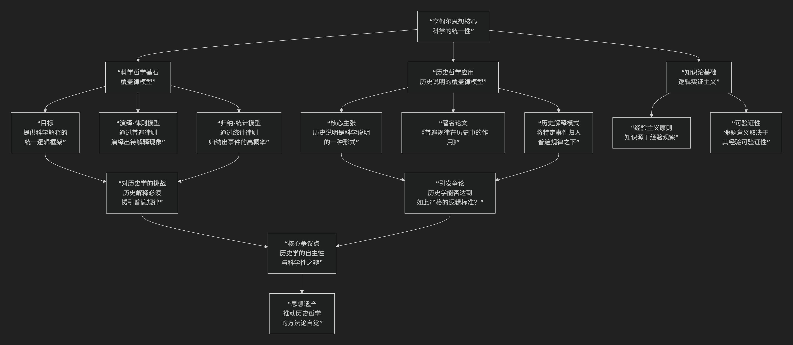

Carl G. Hempel
====================

基于卡尔·亨佩尔（Carl G. Hempel）历史哲学核心思想

---------------------------------

卡尔·亨佩尔是一位极具影响力的逻辑实证主义哲学家，他的核心思想可以概括为：**致力于将科学研究的严谨逻辑和方法确立为所有经验知识（包括历史学）的黄金标准。他最为人熟知的是提出了科学说明的“覆盖律模型”，并由此引发了关于历史学本质的激烈论战。**

亨佩尔的思想核心在于对科学统一性的追求，其核心主张与引发的争议可以通过下图清晰地展现：

以下，我们将沿此逻辑脉络，深入解析亨佩尔思想的核心要义。

一、科学哲学核心：覆盖律模型

亨佩尔认为，科学说明的本质不在于满足我们的好奇心，而在于 **表明事件的发生是在特定条件下可以被预期（或概然预期）的**。这种“可预期性”由“覆盖律模型”来保证。

该模型主要有两种形式：

1.  **演绎-律则模型**：

    *   **目标**：对个别事件提供 **确定的** 解释。

    *   **结构**：解释必须包含两部分：

        *   **普遍规律**：一个覆盖性的自然律（如“所有金属受热膨胀”）。

        *   **初始条件**：描述特定情况的陈述（如“这是一根铜棒，并且它被加热了”）。

    *   **逻辑**：从“普遍规律”和“初始条件”这两个前提中，可以 **逻辑地演绎出** 需要解释的事件（如“因此，这根铜棒膨胀了”）。被解释项是解释项的 **逻辑必然结果**。

2.  **归纳-统计模型**：

    *   **目标**：对那些不具有严格确定性、只有统计规律性的现象提供 **概率性的** 解释。

    *   **结构**：与DN模型类似，但普遍规律被替换为 **统计规律** （如“吸烟者患肺癌的概率显著高于非吸烟者”）。

    *   **逻辑**：从前提中不能演绎出确定结论，但可以归纳性地推出事件具有 **很高的发生概率**。

二、历史哲学应用：历史解释的逻辑

亨佩尔将其科学哲学观点直接应用于历史学，这构成了他最具争议也最著名的贡献。

*   **核心主张**：在1942年的著名论文《普遍规律在历史中的作用》中，亨佩尔提出，**历史说明与自然科学说明在逻辑结构上是同构的**。一个令人满意的历史解释，也必须（至少是隐含地）援引 **普遍规律**。

*   **著名例证**：如何解释“为什么美国1930年代的早期农业项目失败了”？

    *   一个充分的解释需要表明，在给定的条件下（初始条件：如政治体制、经济环境等），根据某些普遍规律（如关于群体行为、经济压力下社会反应的规律），这个失败是 **可以预期的**。

    *   亨佩尔认为，历史学家通常只陈述了初始条件（“因为当时政治腐败，资金不足……”），而将所依据的普遍规律视为不言自明或过于琐碎而省略了。但一个解释要成立，这些规律在 **逻辑上必须是存在的**。

*   **对“移情理解”的批判**：他坚决反对柯林武德等人的“重演论”，即历史学家通过“设身处地”理解历史人物思想就能完成解释。亨佩尔认为，这种“移情理解”充其量只是一种 **提出假说的心理学启发法**，其结论的有效性仍需由经验证据和覆盖律模型来检验。

三、哲学基础：逻辑实证主义

亨佩尔的整个思想大厦建立在逻辑实证主义的基石上。

*   **经验主义**：所有有意义的经验知识，其最终源泉都是 **感官经验**。

*   **可验证性原则**：一个命题如果不能在经验上被证实或证伪，那么它就是 **无认知意义的** （形而上学命题、伦理命题等被归为此类）。

*   **科学统一**：所有经验科学（从物理学到历史学、社会学）在方法论上是统一的，它们都遵循相同的逻辑标准来建立和验证知识。

四、核心要义总结

.. list-table:: 
   :header-rows: 1
   :widths: 25 45 30
   :align: center

   * - **理论维度**
     - **核心命题**
     - **关键概念与贡献**
   * - **科学哲学**
     - **科学说明必须符合"覆盖律模型"，表明事件是可（或大概率可）预期的。**
     - **覆盖律模型、演绎-律则模型、归纳-统计模型、可预期性**
   * - **历史哲学**
     - **历史说明在逻辑上依赖于普遍规律，与自然科学说明同构。**
     - **普遍规律的作用、历史解释的逻辑、对移情理解的批判**
   * - **哲学立场**
     - **坚持逻辑实证主义，主张所有经验科学的方法论统一性。**
     - **逻辑实证主义、经验主义、可验证性原则、科学统一**

五、思想遗产与争议

亨佩尔模型的影响巨大而深远，但主要不是因为它被广泛接受，而是因为它 **树立了一个清晰而严苛的靶子**，迫使历史哲学家们必须认真思考并回应“历史解释究竟是什么？”这个元问题。

*   **主要争议与批评**：

    1.  **规律难以寻觅**：历史中几乎找不到像自然科学那样精确、无例外的普遍规律。历史解释所依赖的往往是 **常识性的、或然性的概括** （如“长期受压的群体会反抗”），这些概括往往充满例外，不够“普遍”。

    2.  **历史学的独特性被抹杀**：批评者（如威廉·德雷）认为，亨佩尔模型无法捕捉历史解释的本质——即通过揭示行动者的 **理由、意图和目的** 来使历史行动变得 **可理解**，而非将其归为自然事件。

    3.  **过于理想化**：该模型是一个逻辑“理想型”，而实际的历史写作很少（即使有）以这种严格形式呈现。

六、总结

总而言之，卡尔·亨佩尔是一位 **“科学标准的坚定捍卫者”和“逻辑清晰性的不懈追求者”** 。他以其极致的清晰和逻辑力量，为历史哲学提出了一个根本性的挑战：**如果历史学声称提供的是理性的、客观的知识而不仅仅是故事，那么它的逻辑标准究竟是什么？**

尽管他的覆盖律模型在历史学领域被认为 **过于严苛且不切实际**，但他工作的巨大价值在于 **极大地提升了历史哲学讨论的方法论自觉和逻辑严谨性**。在他之后，任何试图为历史学知识进行辩护的人，都无法再回避对其逻辑结构的深刻反思。在这个意义上，亨佩尔不仅是科学哲学家，更是整个20世纪分析的历史哲学讨论的 **奠基者和催化剂**。

------------

 .. toctree::
    :maxdepth: 3

    grok
    copilot
    chatgpt
    deepseek
    gemini
    qwen
