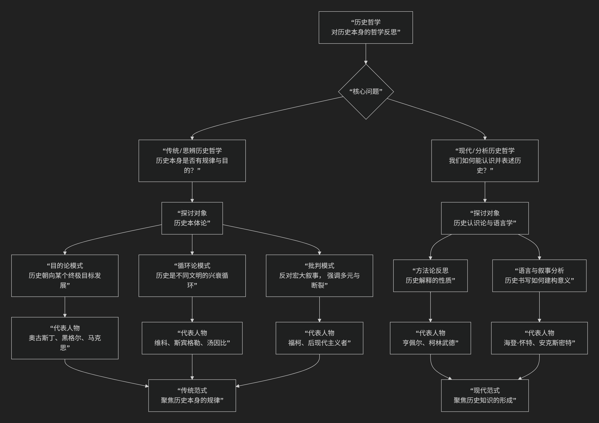
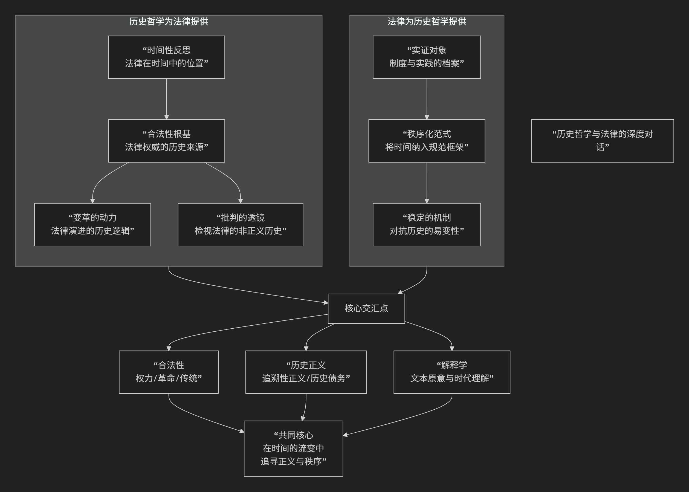

历史哲思
===========

历史哲学是对历史本身进行哲学反思的学科，它不研究具体的历史事件，而是追问：**历史作为一个整体，是否有其意义、模式或规律？我们如何能够认识历史？历史知识的性质是什么？**

其发展主要分为两大范式：**传统的历史哲学（思辨的历史哲学）** 和 **现代的历史哲学（分析的历史哲学）**。它们所关注的核心问题与演变脉络，可以通过下图清晰地展现：

以下，我们将沿此脉络，深入解析历史哲学的各流派及其核心思想。

一、传统历史哲学（思辨的历史哲学）

这种范式盛行于古代至19世纪，旨在 **探寻历史整体进程的模式、动力和终极目的**，试图构建一个宏大的历史叙事框架。它关注的是 **“历史本身是什么”**。

主要流派与代表人物：

**1. 神学史观（目的论）**

*   **核心思想**：历史是 **神意** 的实现过程，具有明确的开端、过程和终点。

*   **代表人物**：

    *  :doc:`圣·奥古斯丁 </chats/outlaw/analyse/foreign/master/middle/augustine/index>` ：在《上帝之城》中提出，人类历史是“上帝之城”与“世俗之城”之间斗争的过程，最终将迎来“上帝之城”的永恒胜利。历史具有 **线性、有目的** 的特征。

**2. 唯心史观（理性目的论）**

*   **核心思想**：历史是 **理性** 或“世界精神”自我实现的过程，自由意识的进展是历史的最终目的。

*   **代表人物**：

    *  :doc:`G.W.F. 黑格尔 </chats/outlaw/analyse/foreign/master/recent/hegel/index>` ：提出 **“理性统治世界历史”** 。历史是“世界精神”通过“理性的机巧”（如历史人物的热情）逐步实现自身自由的过程，每一个历史阶段都是世界精神发展的必要环节。他提出了“正-反-合”的辩证发展模式。

**3. 唯物史观（经济决定论）**

*   **核心思想**：历史发展的根本动力是 **物质生产方式** 的变革，阶级斗争是推动历史前进的直接动力。

*   **代表人物**：

    *  :doc:`卡尔·马克思 </chats/outlaw/analyse/foreign/master/recent/marx/index>` ：将黑格尔的唯心辩证法“倒转”过来，认为不是意识决定存在，而是 **社会存在决定社会意识**。生产力与生产关系的矛盾运动推动社会形态从原始社会、奴隶社会、封建社会、资本主义社会向共产主义社会演进。这同样是一种宏大的、有规律的历史目的论。

**4. 历史循环论**

*   **核心思想**：历史 **没有终极目的**，而是在 **周期性循环** 中运行，如同有机体一样，每个文明都会经历生长、繁荣、衰败和死亡的过程。

*   **代表人物**：

    *   :doc:`维科 </chats/outlaw/history/philos/vico/index>` ：认为历史是“神的时代”、“英雄的时代”、“人的时代”三个阶段的循环。

    *   :doc:`斯宾格勒 </chats/outlaw/history/philos/spengler/index>` ：《西方的没落》中认为，各种文化是封闭的有机体，会经历春、夏、秋、冬的周期，西方文化正走向衰亡。

    *   :doc:`汤因比 </chats/outlaw/history/philos/toynbee/index>`：《历史研究》提出“挑战-应战”模式，文明的兴衰取决于其对环境挑战的创造性回应能力。

二、现代历史哲学（分析或批判的历史哲学）

兴起于20世纪，其关注点发生了 **“认识论转向”** 。它不再追问历史本身是什么，而是追问：**“我们如何认识历史？”、“历史知识的性质是什么？”、“历史叙述如何建构？”**。它更关注历史学作为一门学科的方法论和语言基础。

主要流派与代表人物：

**1. 覆盖律模型**

*   **核心思想**：历史解释与自然科学解释在逻辑上同构，即要将待解释的历史事件归入一个 **普遍规律** 之下。

*   **代表人物**：

    *   :doc:`卡尔·亨佩尔 </chats/outlaw/history/philos/hempel/index>`：认为合理解释一个历史事件，必须引用 **普遍规律** 和 **初始条件**。这一过于僵化的模型遭到了许多历史学家的反对。

**2. 唯心主义史学（移情理解）**

*   **核心思想**：历史学不同于自然科学，其核心方法是 **重演历史行动者的思想**。

*   **代表人物**：

    *   :doc:`柯林武德 </chats/outlaw/history/philos/colinwod/index>`：提出著名论断 **“一切历史都是思想史”** 。历史学家的任务是在自己心中“重演”过去行动者的思想，理解其行为背后的理由。历史是“过去的思想在史学家心灵中的重演”。

**3. 历史叙事主义**

*   **核心思想**：这是当代历史哲学的主流。它认为历史学家通过 **叙事结构** （情节化、论证、意识形态蕴含）来赋予过去事件以意义，历史著作更像是一种 **文学创作**。

*   **代表人物**：

    *   :doc:`海登·怀特 </chats/outlaw/history/philos/white/index>`：在《元史学》中指出，历史学家通过选择不同的 **情节化模式** （如悲剧、喜剧、浪漫剧、讽刺剧）来建构历史故事，这本质上是 **诗性的、语言的** 行为。

    *   :doc:`安克斯密特 </chats/outlaw/history/philos/ankersmit/index>`：提出“叙事实体”概念，强调历史叙述的整体性，以及历史叙述与过去实在之间的“替代”关系。

**4. 后现代主义史学**

*   **核心思想**：彻底解构“宏大叙事”，强调历史的 **断裂性、碎片化和多元性**，关注被主流历史叙述所压抑的声音（如女性、少数族裔）。

*   **代表人物**：

    *   :doc:`米歇尔·福柯 </chats/outlaw/analyse/foreign/master/modern/foucault/index>`：通过 **知识考古学** 和 **系谱学**，揭示历史并非连续的进步，而是由不同“知识型”决定的 **话语实践** 的断裂序列，与权力纠缠在一起。

三、核心要义总结

.. list-table:: 
   :header-rows: 1
   :widths: 20 20 20 20 20
   :align: center

   * - **范式**
     - **核心问题**
     - **主要流派**
     - **关键概念**
     - **代表人物**
   * - **思辨历史哲学**
     - **历史本身是什么？（规律、目的）**
     - 神学史观、唯心史观、唯物史观、循环论
     - 神意、理性、辩证法、生产方式、阶级斗争、文明周期
     - 奥古斯丁、黑格尔、马克思、斯宾格勒
   * - **分析历史哲学**
     - **我们如何认识历史？（方法、叙述）**
     - 覆盖律模型、移情理解、叙事主义、后现代主义
     - 普遍规律、思想重演、情节化、叙事实体、宏大叙事、权力/知识
     - 亨佩尔、柯林武德、海登·怀特、福柯

四、总结

总而言之，历史哲学的演变是从 **“建构历史的宏大意义”** 走向 **“反思历史知识如何可能”** 的历程。传统哲学家试图为历史找到一个“剧本”，而现代哲学家则转而研究“剧本”是如何被撰写、被阅读的，并质疑是否真的存在一个唯一的、客观的“剧本”。

这一转变使得历史哲学从形而上的思辨，转变为更严谨、更具批判性的学科，深刻影响了我们对历史真实性、客观性及其意义的理解。

---------------------------------

 .. toctree::
    :maxdepth: 1

    jaspers/index

 .. toctree::
    :maxdepth: 1

    spengler/index

 .. toctree::
    :maxdepth: 1

    toynbee/index

 .. toctree::
    :maxdepth: 1

    vico/index

 .. toctree::
    :maxdepth: 1

    ankersmit/index

 .. toctree::
    :maxdepth: 1

    colinwod/index

 .. toctree::
    :maxdepth: 1

    hempel/index

 .. toctree::
    :maxdepth: 1

    white/index

-------------------------

历史哲学与法律的关系远比表面看起来的密切，它们共同围绕着 **时间、权威、变化与秩序** 等核心议题展开。二者的对话，本质上是 **“时间中的正义”** 与 **“正义的秩序化时间”** 之间的深刻互动。

其复杂而动态的关联，可以通过下图清晰地展现：

以下，我们将沿此逻辑脉络，深入解析历史哲学与法律之间的深刻关联。

一、历史哲学如何塑造法律？

历史哲学为理解法律提供了关于时间、变化和意义的宏观框架，是法律“何以如此”的深层注脚。

.. list-table:: 
   :header-rows: 1
   :widths: 30 35 35
   :align: center

   * - **历史哲学流派**
     - **对法律的根本性影响**
     - **具体表现**
   * - **目的论历史哲学** （如 :doc:`黑格尔 </chats/outlaw/analyse/foreign/master/recent/hegel/index>`、:doc:`马克思 </chats/outlaw/analyse/foreign/master/recent/marx/index>`）
     - 法律是 **实现某种历史终极目标的工具**。
     - **进步性立法**：法律需推动社会向既定目标（如自由实现、无阶级社会）演进。法律本身的正当性也由其是否促进这一历史进程来判断。
   * - **循环论历史哲学** （如 :doc:`斯宾格勒 </chats/outlaw/history/philos/spengler/index>` 、:doc:`汤因比 </chats/outlaw/history/philos/toynbee/index>`）
     - 法律是 **特定文明生命周期中的有机组成部分**，随文明兴衰而演变。
     - **法律移植的审慎**：强调法律需符合本土文明的"体质"，反对机械照搬。关注法律与文明整体精神的关联。
   * - **批判性历史哲学** （如 :doc:`后现代主义 </chats/outlaw/analyse/foreign/schools/today/postm/index>`、:doc:`福柯 </chats/outlaw/analyse/foreign/master/modern/foucault/index>`）
     - 法律是 **权力话语的构成部分**，其历史是权力争夺和排斥的历史。
     - **去神秘化**：批判法律中立表象，揭示其如何参与塑造并维护压迫性结构（如种族主义、父权制）。关注被主流法律史边缘化的叙事。
   * - **历史主义** （如 :doc:`萨维尼 </chats/outlaw/analyse/foreign/branch/legal/savigny/index>`）
     - 法律是 **民族精神** 在历史中缓慢、有机的产物，是"民族精神的沉淀"。
     - **反对立法万能**：强调习惯法的重要性，认为法典应是民族法惯例的自觉表达，而非理性凭空创造。这是对自然法普适性的批判。

二、法律如何回应历史哲学？

法律并非被动接受历史哲学的影响，它通过自身的实践和逻辑，为历史哲学提供了具体的实证领域并构成了一种独特的“秩序化时间”的模式。

.. list-table:: 
   :header-rows: 1
   :widths: 40 60
   :align: center

   * - **法律领域/概念**
     - **对历史哲学的回应与体现**
   * - **宪法**
     - **一国政治生活的"历史性总契约"**。它凝结了特定的历史时刻（如革命、建国）的根本抉择，并为未来的政治变迁设定了框架，本身就是一种"奠基性历史事件"的法律化。
   * - **先例与遵循先例** （普通法系核心）
     - **将历史经验制度化、权威化**。过去法官的判决（历史）对当前案件具有约束力，体现了历史智慧在司法中的延续和积累，是一种"在历史中司法"的哲学。
   * - **法律解释**
     - **处理"时间距离"的艺术**。解释者（法官）如何对待立法原意（历史意图）？是追求"原旨主义"还是强调"活的宪法"？这直接反映了对历史与当下关系的哲学立场。
   * - **追溯力问题**
     - **法律在时间中的效力边界**。"法不溯及既往"原则体现了对稳定性和信赖利益的保护，是法律对抗历史流变性的"锚"。但某些情况下（如追究反人类罪）的溯及力，则体现了"超越实证法的更高正义"的历史哲学观念。
   * - **权利的历史生成**
     - **权利并非先天给定，而是在历史斗争中形成**。如财产权、选举权的发展史，本身就是一部微观的历史哲学，展示了权利观念如何随社会变迁而演进。

三、核心交汇点：合法性、正义与解释

1.  **合法性的根基**

    *   **问题**：法律的权威从何而来？

    *   **历史哲学的回答**：

        *   **革命叙事**：合法性源于一个 **奠基性的历史事件** （如美国独立战争、法国大革命）。新法律秩序通过与旧时代的决裂而获得正当性。

        *   **传统叙事**：合法性源于 **历史延续性**。法律权威因其源远流长、世代相袭而被认可（如英国普通法）。

        *   **进步叙事**：合法性源于法律推动 **社会进步** 的能力。

2.  **历史正义**

    *   **问题**：如何对待历史上的不公正？

    *   **法律实践**：**追溯性正义**，如战后审判（纽伦堡、东京）、真相与和解委员会、历史遗产归还、历史错误纠正与赔偿等。这涉及如何用今天的法律和正义观去评判历史行为，以及国家如何承担历史责任。

3.  **历史解释学**

    *   **问题**：如何理解过去的法律文本？

    *   **核心争议**：是探寻制定者 **历史上的原意**，还是承认文本在 **新的历史语境** 下具有新的含义？这本质上是“历史原意”与“当代理解”之间的张力。

四、总结

总而言之，历史哲学与法律的关系是 **双向建构、深度互嵌** 的。

*   **历史哲学是法律的“时间镜”**：它为法律提供了关于自身在时间长河中的位置、意义和变革方向的深层理解。没有历史视角的法律是肤浅的。

*   **法律是历史哲学的“稳定器”**：它将流动不居的历史时间纳入相对稳定的规范框架，通过规则和程序将历史经验制度化，从而创造出现世的可预期性和秩序。没有法律形式的历史哲学是空泛的。

理解二者的关系，不仅能让我们更深刻地把握法律的本质——它既是 **历史的产物**，也是 **塑造历史的能动力量** ——也能让我们在面对法律变革与历史正义等复杂问题时，拥有更富洞见的分析框架。