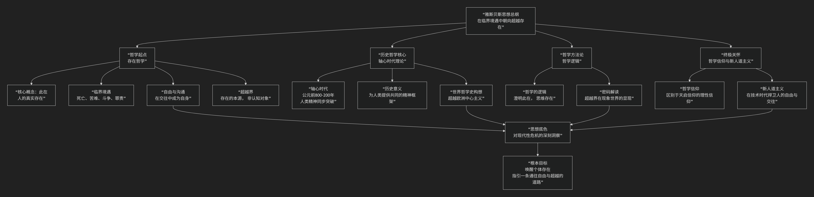

Karl Jaspers
====================

基于卡尔·雅斯贝斯（Karl Jaspers）历史哲学核心思想

---------------------------------

卡尔·雅斯贝斯是一位极具深度的德国哲学家和精神病学家，他的思想难以被简单归类。其核心可概括为：**一位从精神病学走向哲学、以“存在哲学”为基础、以“世界哲学”为视野、以“轴心时代”理论为历史框架，致力于在技术理性与价值崩溃的现代性危机中，为个体探寻自由与超越可能性的思想大师。**

雅斯贝斯的思想体系宏大且充满人文关怀，其核心架构与内在探索可以通过下图清晰地展现：

以下，我们将沿此探索路径，深入解析雅斯贝斯思想的核心要义。

一、哲学起点：存在哲学

雅斯贝斯是“存在哲学”的代表人物之一。他关注的是在传统形而上学和宗教信仰崩塌后，个体如何能获得真实、本真的存在。

*   **此在**：指人的真实存在，它不是抽象的“理性动物”，而是 **处于具体情境中、面向未来、具有可能性的自由存在**。成为“自身”，是此在的核心任务。

*   **临界境遇**：这是雅斯贝斯哲学的关键概念。指那些 **无法改变、无法逃避、无法被理性知识所掌控** 的根本性人生处境，如 **死亡、苦难、斗争、罪责**。正是在这些“边缘”处，一切世俗的支撑物（如金钱、权力、知识）都失效了，个体被抛回自身，被迫面对其存在的赤裸真相，并有机会 **触及“超越界”**。

*   **自由与交往**：人只有在 **自由的交往** 中才能成为自身。真正的交往不是说服或征服，而是“爱的斗争”，是彼此作为自由个体坦诚相待，共同探寻真理。

*   **超越界**：指存在的本源或上帝。它 **无法被对象化认知**，不能通过理性证明，但可以在临界境遇中，通过“哲学信仰”被“触及”。它是此在的依托和意义的最终指向。

二、历史哲学核心：轴心时代理论

这是雅斯贝斯最富影响力的思想，为理解世界历史提供了一个全新的框架。

*   **核心发现**：在公元前800年至公元前200年之间，在中国、印度、伊朗、巴勒斯坦和希腊，**几乎同步地出现了人类精神的根本性突破**，彼此之间并无直接交流。孔子、老子、佛陀、《奥义书》作者、琐罗亚斯德、以赛亚、荷马、柏拉图等伟大精神导师几乎同时登场。

*   **历史意义**：

    1.  **人类共同的精神基础**：轴心时代为至今的人类提供了思考的基本范畴和宗教的可能性，奠定了人类精神的基础。

    2.  **历史的统一性**：它证明了人类历史具有内在的统一性，不同文明可以在这个共同的基础上进行对话。

    3.  **对欧洲中心论的超越**：雅斯贝斯以此打破了“历史是线性进步、以西方为顶点的”目的论史观，倡导一种 **真正的“世界哲学”视角**。

*   **目标**：在科技时代，人类需要一场 **“新的轴心时代”** ，即通过哲学思考，在全新的层面上实现全人类的精神统一。

三、哲学方法论：哲学逻辑与密码解读

雅斯贝斯认为，哲学无法提供像科学那样的确定性知识，而是一种 **“哲学的逻辑”**。

*   **哲学的逻辑**：哲学的任务不是建构体系，而是进行 **“存在澄明”** 。即通过思维，照亮人的存在境况，引导人朝向超越界。它是一种 **方法**，而非一套 **教条**。

*   **密码解读**：既然“超越界”本身不可知，我们如何感知它？雅斯贝斯认为，超越界会在此在世界中显现自身，这些显现就是 **“密码”** 。历史事件、艺术品、自然乃至哲学思想本身，都可能是超越界的密码。哲学家的任务就是 **解读这些密码**，但这解读永远不是最终的确知，而是开放的、个人的。

四、终极关怀：哲学信仰与新人道主义

面对现代社会的技术统治和虚无主义危机，雅斯贝斯提出了他的解决方案。

*   **哲学信仰**：区别于天启宗教的信仰，也区别于独断的科学主义。它是一种 **在理性极限处，由理性自身推动产生的、对超越界的开放态度和信赖**。它是一种在不确定性中坚持寻求真理的勇气。

*   **新人道主义**：在技术时代，人面临被“物化”的危险。新人道主义旨在 **捍卫人的自由、尊严和交往的可能性**。它要求我们将技术视为工具，而非目的本身，并始终将人作为一切价值的中心。

五、核心要义总结

.. list-table:: 
   :header-rows: 1
   :widths: 25 45 30
   :align: center

   * - **理论维度**
     - **核心命题**
     - **关键概念与贡献**
   * - **存在哲学**
     - **人通过"临界境遇"体验真实存在，并在自由交往中朝向"超越界"。**
     - **此在、临界境遇、自由与交往、超越界**
   * - **历史哲学**
     - **"轴心时代"奠定了人类共同的精神基础，历史的意义在于朝向"新的轴心时代"。**
     - **轴心时代、世界哲学、历史的统一性、新人道主义**
   * - **哲学方法**
     - **哲学是"存在的澄明"，通过"解读密码"来触及不可言说的超越界。**
     - **哲学逻辑、存在澄明、密码解读**
   * - **现代性批判**
     - **以"哲学信仰"和"新人道主义"对抗技术统治与虚无主义。**
     - **哲学信仰、新人道主义、技术时代的危机**

六、思想特质与当代意义

*   **开放性**：雅斯贝斯拒绝封闭的哲学体系，始终保持向超越界、向他者、向未来的开放。

*   **对话性**：他坚信哲学的本质是沟通，其“世界哲学”的构想是不同文明间对话的重要理论基础。

*   **现实关怀**：他的思想直面20世纪的极权主义、技术异化和信仰危机，为现代人提供了深刻的精神资源。

七、总结

总而言之，卡尔·雅斯贝斯的核心思想在于，他是一位 **“临界境遇的指路人”和“世界哲学的倡导者”** 。他教导我们，**人生的真理并非藏在安逸的平原上，而是矗立在那些无法逾越的悬崖边缘——死亡、苦难与罪责。唯有勇敢地站在这些“临界境遇”之中，进行真诚的交往与不懈的哲学思索，个体才能触及自身的自由与超越性，人类文明才能在对话中寻找到共同的精神家园。**

他的全部工作是对 **现代人生存处境** 的一次深邃勘测。在虚无主义弥漫的时代，他试图为无根的人类重新找到一条通往超越的路径。在这个意义上，他不仅是一位哲学家，更是一位充满悲悯与希望的精神导师。

------------

 .. toctree::
    :maxdepth: 3

    grok
    copilot
    chatgpt
    deepseek
    gemini
    qwen
