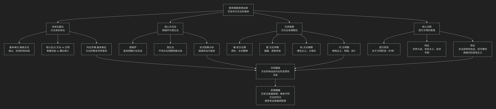

Oswald Spengler
====================

基于奥斯瓦尔德·斯宾格勒（Oswald Spengler）历史哲学核心思想

---------------------------------

奥斯瓦尔德·斯宾格勒是一位思想极具冲击力和悲观色彩的历史哲学家。其核心思想可以概括为：**一种彻底反对欧洲中心论的“文明形态学”，主张历史是若干高级文化有机体的生、长、盛、衰的循环过程，并据此预言西方文明正不可逆转地走向衰亡。**

斯宾格勒的理论体系宏大而严密，其核心架构与内在逻辑可以通过下图清晰地展现：

以下，我们将沿此逻辑脉络，深入解析斯宾格勒思想的核心要义。

一、本体论基石：文化有机体论

斯宾格勒彻底颠覆了传统的线性历史观（如“古代-中世纪-现代”的划分），提出了一个革命性的本体论框架。

*   **基本单位：高级文化**：历史的主体不是民族或国家，而是 **高级文化**。他识别出八种这样的文化：埃及、巴比伦、印度、中国、古典（希腊罗马）、阿拉伯、墨西哥和西方（浮士德文化）。

*   **文化作为有机体**：每种高级文化都是一个 **独立的、封闭的、有生命的有机体**，像植物一样，有固定的生命周期（约1000年），经历春、夏、秋、冬四个阶段，最终必然死亡。文化之间 **不可通约**，一种文化的人无法真正理解另一种文化的内在精神。

*   **核心区分：文化 vs. 文明**：这是斯宾格勒思想的关键。

    *   **文化**：是文化的 **春天和夏天**，是 **内在的、宗教的、富有创造力的** 青春期。特点是艺术、哲学、形而上学的繁荣。

    *   **文明**：是文化的 **秋天和冬天**，是 **外在的、世俗的、僵化的** 衰亡期。特点是世界都市、唯物主义、帝国主义、技术专制和大众文化的兴起。**文明是文化不可避免的终结**。

*   **基本象征**：每种文化的“灵魂”都有一个独特的 **“基本象征”** ，它表达了该文化对世界和空间的基本直觉，并渗透到其所有表现形式中。

    *   **古典文化（阿波罗文化）**：基本象征是 **“有限的、可触知的个体躯体”** 。重视当下、可见的界限（如希腊神庙、雕塑）。

    *   **西方文化（浮士德文化）**：基本象征是 **“纯粹、无限的空间”** 。追求无限、深度和超越（如哥特式教堂、交响乐、微积分、远洋航行）。

二、核心方法论：观相学与类比法

斯宾格勒反对科学式的因果分析，提倡一种直觉和类比的方法。

*   **观相学**：历史学家应像相面师一样， **直觉地把握** 历史现象的整体“面相”和形态，理解其内在的必然性，而非寻找机械的因果关系。

*   **类比法**：通过比较不同文化在 **相同生命周期阶段** 所出现的“同时代”现象，来理解历史的宿命。例如，他认为苏格拉底时期的雅典、佛陀时期的印度、孔子时期的中国是“同时代的”，因为它们都处于文化的“春秋时期”。

三、历史图景：文化生命周期与西方命运

斯宾格勒用他的理论为西方文明下了诊断书。

*   **西方文化的位置**：他断言，西方文化已于19世纪进入 **文明阶段（冬季）**。拿破仑代表了伟大的政治创造力的终结，其后的时代是机械的、物质主义的解体期。

*   **文明期的特征**：

    *   **民主的胜利与金钱的统治**：政治被金钱和媒体操纵。

    *   **世界都市的崛起**：巨大的城市（如他所处的柏林、纽约）吞噬了乡村，人类变成“智力发达、务实的原始人”。

    *   **帝国主义与战争**：民族国家被“凯撒式”的人物和帝国取代，战争成为常态。

    *   **艺术的没落**：伟大的艺术让位于娱乐和感官刺激。

*   **预言与态度**：斯宾格勒是 **决定论** 和 **悲观主义** 者。他认为衰亡是 **不可逆转的宿命**。但他倡导一种 **“英雄式的悲观主义”** ：明知结局已定，仍要在自己的命运岗位上恪尽职守，表现出坚韧和勇气，而不是感伤和逃避。

四、核心要义总结

.. list-table:: 
   :header-rows: 1
   :widths: 25 45 30
   :align: center

   * - **理论维度**
     - **核心命题**
     - **关键概念与贡献**
   * - **历史本体论**
     - **历史是若干独立的高级文化有机体生灭循环的过程。**
     - **高级文化、文化有机体论、文化 vs. 文明**
   * - **历史方法论**
     - **理解历史需用"观相学"直觉和"类比法"把握文化形态。**
     - **观相学、类比法、同时代、反因果论**
   * - **文化形态学**
     - **每种文化有其独特的"基本象征"和约千年的生命周期。**
     - **基本象征、生命周期（春/夏/秋/冬）、文化灵魂**
   * - **现代性诊断**
     - **西方已进入"文明"阶段，其衰亡是不可避免的历史宿命。**
     - **宿命论、英雄式悲观主义、世界都市、凯撒主义**

五、思想特质与影响

*   **革命性**：彻底打破了以西方为顶点的线性进步史观，是 **文化相对主义** 的早期重要代表。

*   **宏大叙事**：其理论体系气势恢宏，极具解释力，尤其在解释文明兴衰方面。

*   **深远影响与争议**：

    *   深刻影响了汤因比、索罗金等后世历史哲学家。

    *   其 **决定论** 和 **宿命论** 色彩受到批评，被认为忽视了人的能动性。

    *   其 **证据选择** 常被指为服务于理论，存在牵强附会之处。

    *   其思想中的文化封闭论和对强权的认可，被一些学者视为为后来的极权主义提供了思想资源。

六、总结

总而言之，斯宾格勒的核心思想在于，他是一位 **“文明命运的诊断者”和“历史星相的预言家”** 。他教导我们，**文明如同生命，有朝气蓬勃的青春，也必有老态龙钟的暮年。历史的真理不是直线进步的乐观主义，而是循环往复的有机节律。**

他的全部工作是对 **西方现代性** 的一次极其严厉的审判。在西方文明如日中天的20世纪初，他敲响了警钟，预言了它的黄昏。尽管其结论充满悲观，但他迫使人们以千年为尺度来思考文明的命运，这种宏大的视野和深刻的洞察力，使其著作《西方的没落》成为一部不朽的、充满争议的思想丰碑。在这个意义上，他不仅是一位历史学家，更是一位思想的先知。

------------

 .. toctree::
    :maxdepth: 3

    grok
    copilot
    chatgpt
    deepseek
    gemini
    qwen
