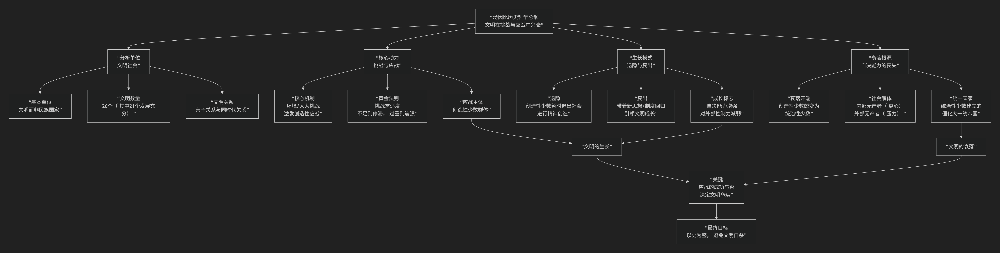

Arnold J. Toynbee
====================

基于阿诺德·约瑟夫·汤因比（Arnold J. Toynbee）的宏观历史哲学核心思想

---------------------------------

阿诺德·约瑟夫·汤因比是20世纪最具野心和宏大的历史哲学家之一。他的核心思想可以概括为：**一种以“文明”为基本单位、通过比较研究探寻其“兴衰规律”的历史哲学体系。他反对历史的“宿命论”，主张文明的生长源于对“挑战”的成功“应战”，其衰落则源于“自决能力”的丧失，最终目标是希望通过理解历史来为当代西方文明的困境寻找出路。**

汤因比的思想体系庞大而精密，其核心分析框架与内在逻辑可以通过下图清晰地展现：

以下，我们将沿此逻辑脉络，深入解析汤因比历史哲学的核心要义。

一、分析单位：文明社会

汤因比彻底颠覆了以民族国家为单元的历史研究传统。

*   **基本单位**：历史研究的基本单位不是民族国家，而是 **“文明社会”**。文明是一个 **能自成一体的、包含政治、经济、文化要素的宏观社会**。

*   **文明谱系**：在其巨著《历史研究》中，他识别出 **26个文明** （其中21个得到充分发展），包括西方文明、东正教文明、伊斯兰文明、印度文明、中华文明等。

*   **文明关系**：文明之间存在 **“亲子关系”**  （如希腊文明是西方文明的“母文明”）和 **“同时代关系”** ，它们之间可以进行有意义的比较。

二、核心动力：挑战与应战

这是汤因比理论中最著名、最核心的模型，解释了文明的起源、生长和停滞。

*   **核心机制**：文明的产生和发展不是由种族或环境决定，而是源于对一系列 **挑战** 的成功 **应战**。挑战可能来自自然环境（如艰苦的地理条件）或人为环境（如外敌入侵、内部压力）。

*   **“挑战与应战”法则**：挑战必须 **适度**。挑战过弱，无法激发文明潜能；挑战过强，则可能直接摧毁文明。 **“适度的挑战”** 最能激发创造性的应战。

*   **应战主体**：成功的应战通常由社会中的 **“创造性少数群体”** 领导。他们通过自身的创造力，带领整个社会找到应对挑战的新方法（新技术、新制度、新思想）。

三、生长模式：退隐与复出

文明如何实现持续成长？汤因比提出了一个动态心理模型。

*   **退隐与复出**：文明的成长不是直线前进的，而是通过 **“退隐与复出”** 的节奏实现的。

    1.  **退隐**：创造性少数暂时从社会中“退隐”出来，进行精神上的思考和创造。

    2.  **复出**：之后，他们带着新的思想、制度或信仰“复出”，引导整个文明进入一个新的、更高级的发展阶段。

    *   **著名例证**：但丁创作《神曲》、圣本笃创立修道会制度，都是“退隐与复出”的典范。

*   **成长的标志**：文明的真正成长体现在 **“自决能力”** 的增强，即对外部物质环境的控制力相对减弱，而对自身精神世界的掌控力不断增强。

四、衰落根源：自决能力的丧失

汤因比坚决反对斯宾格勒的“生物宿命论”（文明注定会死亡）。他认为，**文明的衰落并非必然，而是自杀所致**。

*   **衰落的开端**：当 **创造性少数群体** 不再能通过模范引领，而是依靠 **武力（暴力）** 来维持权威时，他们就蜕变为 **“统治性少数群体”**。这标志着文明“自决能力”的开始丧失。

*   **社会解体**：随之而来的是社会分裂：

    *   **内部无产者**：社会内部被压迫的群体，他们离心离德，往往创造出 **高级宗教** 作为精神寄托。

    *   **外部无产者**：文明边界外的“蛮族”，不断冲击文明体。

*   **统一国家**：统治性少数为了维持统治，会建立 **大一统的帝国（统一国家）**。这看似是文明的巅峰，实则是僵化的开始，是为文明敲响的“丧钟”。

*   **衰落的本质**：衰落不是源于外部打击，而是源于 **内在精神的失败**，即创造性应对能力的丧失。

五、最终归宿：统一教会与高级宗教

在文明解体的废墟上，什么会诞生？汤因比给出了一个充满宗教关怀的答案。

*   **高级宗教的角色**：在旧文明解体的痛苦中，由“内部无产者”创造的 **高级宗教** （如基督教、佛教）应运而生。它们为个体生命提供了新的意义，并成为新文明的“蛹体”。

*   **文明与宗教的关系**：汤因比晚期思想更加突出宗教的地位，认为 **宗教是文明生灭的最终目的和意义所在**。文明的循环，或许是为了让高级宗教得以产生和传播。

六、核心要义总结

.. list-table:: 
   :header-rows: 1
   :widths: 25 45 30
   :align: center

   * - **理论维度**
     - **核心命题**
     - **关键概念与贡献**
   * - **历史本体论**
     - **历史的基本单位是"文明社会"，其发展过程是可比较的。**
     - **文明社会（26个）、可比性、亲子关系**
   * - **发展动力**
     - **文明的兴衰取决于其对"挑战"能否做出成功的"创造性应战"。**
     - **挑战与应战、适度挑战、创造性少数**
   * - **生长模式**
     - **文明通过"退隐与复出"的节奏实现精神层面的成长。**
     - **退隐与复出、自决能力、精神成长**
   * - **衰落机制**
     - **衰落的根源是创造性少数蜕变为统治性少数，导致"自决能力"丧失。**
     - **自决能力丧失、统治性少数、内部无产者、统一国家**
   * - **历史意义**
     - **高级宗教在文明解体过程中产生，为个体提供意义，并可能孕育新文明。**
     - **高级宗教、统一教会、文明的意义**

七、思想特质与影响

*   **宏大的比较史学**：汤因比是“比较文明学”的奠基人，其研究尺度前无古人。

*   **反对决定论**：他强调人类拥有 **自由意志**，文明的命运并非预先注定，关键取决于自身的应战选择。这为人类留下了希望的空间。

*   **现实关怀**：其研究最终指向对西方现代文明的诊断。他认为西方文明正面临技术垄断、战争、阶级冲突等严峻挑战，能否成功应战，取决于其自身的智慧和努力。

*   **争议与批评**：

    *   **史料处理**：为服务于宏大理论，其对具体史实的选取和解释常被指责有 **削足适履** 之嫌。

    *   **神学色彩**：其晚年思想中浓厚的宗教色彩，被一些学者认为偏离了学术研究的轨道。

八、总结

总而言之，汤因比的核心思想在于，他是一位 **“文明的医师”和“历史的预言家”** 。他教导我们，**文明并非永生，也非必死。它们的命运如同一场永不停歇的“考试”，每一次“挑战”都是一道考题，而“应战”则是我们提交的答卷。文明的成绩，不靠天命，而靠自身的创造力、勇气和智慧。**

他的全部工作是对 **人类集体命运** 的一次史诗般的长篇叙事。在冷战阴云密布的时代，他试图从漫长的文明兴衰史中为人类寻找避免自我毁灭的智慧。尽管其理论存在争议，但他所提供的“挑战-应战”模型，至今仍是我们分析宏观历史动态和文明命运的极具启发性的强大工具。在这个意义上，他不仅是历史学家，更是一位试图为人类把脉的伟大思想家。

------------

 .. toctree::
    :maxdepth: 3

    grok
    copilot
    chatgpt
    deepseek
    gemini
    qwen
