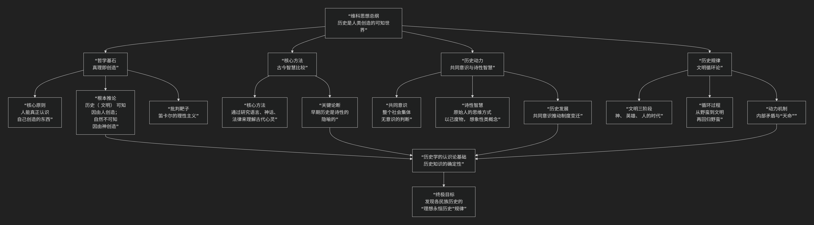

Giambattista Vico
====================

基于詹巴蒂斯塔·维科（Giambattista Vico）历史哲学核心思想

---------------------------------

詹巴蒂斯塔·维科是18世纪初的意大利哲学家，常被誉为**历史哲学和社会科学的先驱**。他的思想极具原创性和革命性，其核心可概括为：**一套以“真理即创造”为哲学基石，以“共同意识”为社会基础，以“历史循环论”为发展模式的宏大思想体系。他首次系统地论证了人类历史是一个有规律可循的、由人类自身创造的过程，因此人可以理解历史，正如上帝可以理解自然一样。**

维科的思想体系深刻而复杂，其核心架构与内在逻辑可以通过下图清晰地展现：

以下，我们将沿此逻辑脉络，深入解析维科思想的核心要义。

一、哲学基石：真理即创造

这是维科全部思想的拱顶石，是其认识论上的革命性贡献。

*   **核心原则**：**“真理即创造”**。意思是，**认识者只有制造了某个东西，才能真正确切地理解它**。因为制造者清楚地知道其构成原因、材料和过程。

*   **根本推论**：

    *   **自然世界**是 **上帝创造** 的，因此只有上帝才能完全理解自然界的奥秘。人类对自然的研究（自然科学）只能达到或然性，而非绝对的真理。

    *   **历史世界**（民族、法律、语言、制度等）是 **人类自己创造** 的，因此人类能够真正地、从内部理解历史。**历史知识比自然科学知识更具确定性**。

*   **意义**：这一原则为历史学和人文科学奠定了坚实的认识论基础，使其获得了不亚于甚至高于自然科学的尊严。

二、核心方法：古今智慧比较与“新科学”

维科在《新科学》中提出了一套研究历史的全新方法论。

*   **批判“笛卡尔式的傲慢”**：他反对笛卡尔主义的普遍理性观，认为不能以现代文明人的理性思维去揣度古人。原始人的思维与现代人截然不同。

*   **研究途径**：要理解一个民族的早期历史，必须研究其 **语言、神话、法典和习俗**，因为这些是人类早期心灵最真实的记录。

*   **古今智慧比较**：通过比较不同民族（彼此隔绝）的神话、寓言和制度，可以发现其背后共通的思维模式和发展阶段，从而揭示历史的普遍规律。

三、历史动力：共同意识与诗性智慧

维科深入探讨了历史创造的主体和方式。

*   **共同意识**：历史不是由少数英雄或天才创造的，而是由整个民族的 **“共同意识”** 所塑造。这是一种 **集体性的、未经反思的判断**，是一个民族关于何者有益、何者必要的共识，它是法律和制度的真正根源。

*   **诗性智慧**：原始人类或早期人类的思维方式不是理性的，而是 **“诗性的”** 。他们不是抽象思考，而是凭借 **旺盛的感觉力和生动的想象力** 来认识世界。其特点是：

    *   **以己度物**：将自然万物视为与自己一样有生命、有情感的存在（即“万物有灵论”）。

    *   **想象性类概念**：无法形成抽象的“勇敢”概念，而是创造一个具体的英雄形象（如阿喀琉斯）来代表勇敢。

    *   **诗性逻辑**：用隐喻、转喻等诗性方式来表达和思考。

四、历史规律：文明循环论

这是维科最著名的历史发展模型，他认为所有民族（除非夭折）都会经历一个循环过程。

*   **文明三阶段**：

    1.  **神的时代**：原始时代。人类对自然充满恐惧，认为由神统治。社会由祭司主导，通行占卜，家庭是最基本单位。

    2.  **英雄时代**：贵族时代。社会分裂为贵族（强者）和平民（弱者）。贵族凭借力量建立城邦和国家，法律是贵族的特权（如罗马的《十二铜表法》），统治形式是贵族制。

    3.  **人的时代**：理性平等时代。平民崛起，争取到平等权利，法律建立在理性的平等基础上，政体可能是民主制或君主制。理性思维取代诗性智慧。

*   **循环过程**：

    *   **上升阶段**：从神的时代经英雄时代到人的时代，文明日趋精致、理性，但也逐渐走向奢靡、怀疑主义和个人主义，社会纽带松弛。

    *   **衰退与回归**：在“人的时代”末期，社会陷入“反思的野蛮”，比原始的“感官的野蛮”更糟，最终因内部腐败或外部冲击而崩溃，文明解体。

    *   **再开始**：崩溃之后，社会将回归到一种新的原始质朴状态，循环重新开始。维科称此过程为 **“复归历程”**。

*   **动力：“天命”**：维科认为，这一循环并非简单的机械运动，而是由 **“天命”** 所引导。天意利用人类自身的情欲和目的（如自私、求生欲、荣誉感）来实现其更高的普遍目的（如社会秩序、正义），这是一种“理性的狡计”。

五、核心要义总结

.. list-table:: 
   :header-rows: 1
   :widths: 25 45 30
   :align: center

   * - **理论维度**
     - **核心命题**
     - **关键概念与贡献**
   * - **认识论**
     - **"真理即创造"：人能真正认识自己创造的历史世界，历史知识比自然科学更具确定性。**
     - **真理即创造、历史可知性、反笛卡尔主义**
   * - **方法论**
     - **通过研究语言、神话、法律等"文物"来理解古代社会的"共同意识"和"诗性智慧"。**
     - **新科学、古今智慧比较、语文学方法、诗性智慧**
   * - **社会哲学**
     - **历史由整个民族的"共同意识"所创造，制度源于集体实践。**
     - **共同意识、民族创建、制度起源**
   * - **历史规律**
     - **所有文明都经历"神-英雄-人"三阶段循环，并在达到顶峰后"复归"。**
     - **文明三阶段、循环论、复归历程、天命**

六、思想特质与历史影响

*   **开创性**：维科是系统阐述历史发展规律的第一人，为历史哲学奠定了基础。

*   **深邃的洞察**：他对原始思维“诗性智慧”的分析，预示了后来的人类学和神话学。

*   **被忽视与再发现**：维科在世时默默无闻，其思想在19世纪才被重新发现，并对赫尔德、黑格尔、马克思、柯林伍德等思想家产生了深远影响。

*   **现代意义**：他的“共同意识”概念有助于我们理解民族性和文化认同的形成；其循环论也为思考西方现代性危机提供了古老的智慧。

七、总结

总而言之，维科的核心思想在于，他是一位 **“历史理性的先知”和“人文科学的奠基人”** 。他教导我们，**人类社会的历史并非神意预设的剧本，也非杂乱无章的偶然事件堆砌，而是人类自身在“共同意识”的驱动下，用激情和行动书写的一部有章可循的“创造史诗”。我们能够理解这部史诗，因为我们是它的作者。**

他的全部工作是对 **人类自由与历史必然性** 关系的一次伟大探索。在启蒙运动高扬理性万能的时代，他独具慧眼地看到了原始“诗性智慧”的创造力量，并为历史学争取了不亚于自然科学的尊严。在这个意义上，维科不仅是一位思想先驱，更是一位跨越时空的智者，其思想至今仍能照亮我们对文明兴衰的思考。

------------

 .. toctree::
    :maxdepth: 3

    grok
    copilot
    chatgpt
    deepseek
    gemini
    qwen
