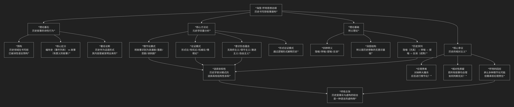

Hayden White
====================

基于海登·怀特（Hayden White）历史哲学核心思想

---------------------------------

海登·怀特是20世纪下半叶最具革命性和争议性的历史哲学家之一。他的核心思想可以概括为：**一场针对历史学本质的“语言学转向”地震。其核心论点是，历史著作的本质不是科学报告，而是语言建构的叙事作品；历史学家的首要工作不是“发现”故事，而是“创造”故事；历史的“真理”更多地取决于其文学形式的说服力，而非与过去“事实”的机械对应。**

怀特的思想极具颠覆性，其核心架构与论证逻辑可以通过下图清晰地展现：

以下，我们将沿此逻辑脉络，深入解析海登·怀特的核心要义。

一、理论基石：历史叙事的诗性行为

怀特思想的起点，是对历史书写行为本身的反思维度。

*   **预构**：历史学家面对的不是纯粹、中性的“事实”，而是一片混沌的“历史领域”。在开始专业研究之前，历史学家已经通过 **诗性语言** （如比喻、修辞） **预构** 了这个领域，为其赋予了潜在的叙事形式。 **历史书写首先是一种语言行为**。

*   **编年史 vs. 故事**：怀特做了关键区分：

    *   **编年史**：按时间顺序排列的事件列表（如“1939年，德国入侵波兰”）。

    *   **故事**：将编年史中的事件组织成一个 **有开头、中间和结尾的、有意义的叙事**，并赋予其道德或认知意义。

*   **核心论断**：历史学家的核心工作就是将“编年史”转化为“故事”。这个转化过程不是中性的描述，而是一种 **建构**。他著名的论断是：**“历史作为一种话语形式，其内容既是被发现的，也是被发明的。”**

二、核心方法论：元史学与四重深层结构

在代表作《元史学：十九世纪欧洲的历史想象》中，怀特提出了一个精密的分析模型，用以揭示历史文本的深层结构。他认为，历史学家的写作风格取决于其在四个层面上的 **前理性选择**，这些选择间存在“选择亲和性”。

.. list-table:: 海登·怀特在《元史学》中提出的历史文本四重分析模式
   :header-rows: 1
   :widths: 25 30 45
   :align: center

   * - **分析层面**
     - **核心问题**
     - **四种可选模式（及简要说明）**
   * - **情节化模式**
     - **如何将故事塑造成一种可理解的类型？**
     - **浪漫剧** （英雄战胜邪恶）、**喜剧** （和谐与和解）、**悲剧** （冲突与宿命）、**讽刺剧** （荒谬与幻灭）
   * - **论证模式**
     - **用什么逻辑来解释历史事件因果关系？**
     - **形式论** （追踪独特事件）、**有机论** （整合入整体）、**机械论** （普遍因果律）、**情境论** （在具体语境中定位）
   * - **意识形态蕴含**
     - **故事背后隐含何种政治/社会立场？**
     - **无政府主义** （激进变革）、**保守主义** （维护现状）、**激进主义** （批判现状以理想化未来）、**自由主义** （渐进改革）
   * - **形式论证模式**
     - **通过何种修辞形式达成解释效果？**
     - 与论证模式相对应，是其在语言形式上的体现。

*   **选择亲和性**：历史学家在这些层面上的选择并非任意组合，而是存在内在的亲和性。例如，选择 **悲剧** 情节化的史学家，很可能也倾向于**机械论** 的论证和**激进主义** 的意识形态立场。

三、理论基础：转义理论

怀特认为，上述所有选择的深层基础是 **转义**，即基本的比喻性语言模式。它是历史想象的无意识基础。

*   **四种主转义**：

    1.  **隐喻** （基于相似性）：通过“是”来识别现象（如“人生是旅途”）。

    2.  **转喻** （基于邻近性）：用部分代表整体或用原因代表结果（如“白宫发表声明”）。

    3.  **提喻** （基于部分与整体）：用部分代表整体的本质（如“他是一切善良的化身”）。

    4.  **反讽** （基于对立性）：字面意义与实际意义相反，表达怀疑和反思。

*   **历史意识的序列**：怀特认为，历史意识的演化也遵循这个序列：从 **隐喻** （诗性的认同）开始，经历 **转喻** 和 **提喻** （分析的还原与整合），最终达到 **反讽** （对知识本身可能性的怀疑）。

四、核心争议：历史的相对主义与“现代事件”的困境

怀特的理论引发了巨大争议，尤其围绕历史真实和伦理的边界。

*   **相对主义指控**：如果历史只是“讲故事”，且情节选择是美学的，那么如何判断一个纳粹大屠杀叙事是“悲剧”还是“讽刺剧”？这是否意味着所有叙事在认识论上是平等的？这是否会导致 **道德虚无主义**？

*   **怀特的回应**：他后期区分了“历史事实”和“对事实的解释”。他承认纳粹大屠杀等“现代事件”确实发生了，这是不可否认的事实。但对于 **如何叙述、如何赋予其意义**，不存在唯一正确的公式。将大屠杀表述为“悲剧”还是“恐怖的荒谬”，取决于史学家的伦理和审美选择。他强调，史学家 **必须为其叙事选择承担伦理和政治责任**。

五、核心要义总结

.. list-table:: 
   :header-rows: 1
   :widths: 25 45 30
   :align: center

   * - **理论维度**
     - **核心命题**
     - **关键概念与贡献**
   * - **历史书写本质**
     - **历史叙事是语言建构的产物，具有无法避免的诗学性质。**
     - **诗性行为、预构、编年史 vs. 故事、发明与发现**
   * - **文本分析模型**
     - **历史文本由情节化、论证、意识形态、形式论证四重模式共同建构。**
     - **元史学、情节化模式、论证模式、意识形态蕴含、选择亲和性**
   * - **认识论基础**
     - **转义是历史想象的无意识深层结构，决定了历史表述的可能形式。**
     - **转义理论（隐喻/转喻/提喻/反讽）、历史意识序列**
   * - **伦理与真实**
     - **历史学家需为叙事形式的选择承担伦理责任，尤其在面对创伤性历史时。**
     - **伦理转向、叙事主义、相对主义争议、现代事件**

六、思想特质与影响

*   **颠覆性**：将历史学从“科学”或“客观研究”的神坛拉下，将其与文学、修辞学紧密联系。

*   **解放性**：为历史书写打开了无限的可能性，鼓励了叙事创新和多视角历史。

*   **深远影响**：深刻影响了新历史主义、文化研究、后殖民史学等领域，促使所有历史写作者反思自身语言的建构性。

*   **争议持续**：关于历史真实、客观性及其伦理界限的争论，至今仍是历史哲学的核心议题。

七、总结

总而言之，海登·怀特的核心思想在于，他是一位 **“历史语言的解剖师”和“叙事权力的揭示者”** 。他教导我们，**历史阅读不仅需要考证史实，更需要解读其叙事形式本身。一个历史文本的真正力量，不仅在于它讲述了什么‘事实’，更在于它如何讲述——它选择了何种情节、运用了何种比喻、隐藏了何种意识形态。**

他的全部工作是对 **历史学自我认知** 的一次彻底刷新。在后现代语境下，他迫使历史学家承认自身工作的修辞和建构维度，将历史学从对“客观性”的天真追求中唤醒，推向一个更复杂、更自觉、也更具伦理挑战的领域。在这个意义上，怀特不仅是历史哲学家，更是整个现代人文科学自我反思的一面关键镜子。

------------

 .. toctree::
    :maxdepth: 3

    grok
    copilot
    chatgpt
    deepseek
    gemini
    qwen
