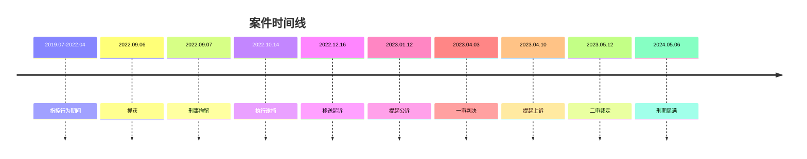

# 法律结构化数据概要

---

对陈京元案相关法律文书进行实体识别、关系抽取与事件结构化处理，结果如下：

---

## 一、实体识别（Entity Recognition）

### 🔹 人物实体

| 实体名称   | 实体类型   | 关键属性                                           |
| ---------- | ---------- | -------------------------------------------------- |
| 陈京元     | 被告人     | 男/汉族/1976-06-30/博士/身份证号510212197606300330 |
| 葛斌       | 检察官     | 昆明市西山区人民检察院检察员                       |
| 李振武     | 检察官助理 | 昆明市西山区人民检察院                             |
| 普会竣     | 审判长     | 昆明市西山区人民法院（一审）                       |
| 李湘云     | 审判长     | 昆明市中级人民法院（二审）                         |
| 杨圆、李敏 | 辩护人     | 云南凌云律师事务所                                 |

### 🔹 机构实体

```
┌─────────────────────────────┬─────────────────┐
│ 机构名称                     │ 角色/职能        │
├─────────────────────────────┼─────────────────┤
│ 昆明市公安局西山分局         │ 侦查机关         │
│ 前卫派出所                   │ 具体办案单位     │
│ 昆明市西山区人民检察院       │ 公诉机关         │
│ 昆明市西山区人民法院         │ 一审法院         │
│ 云南省昆明市中级人民法院     │ 二审法院         │
│ 云南凌云律师事务所           │ 辩护代理         │
│ 昆明市西山区看守所           │ 羁押场所         │
│ 昆明监狱                     │ 服刑场所         │
└─────────────────────────────┴─────────────────┘
```

### 🔹 时间实体（关键节点）



### 🔹 法律实体

| 法律条文/概念             | 类型     | 引用内容             |
| ------------------------- | -------- | -------------------- |
| 《刑法》第293条           | 刑法条文 | 寻衅滋事罪构成要件   |
| 《刑法》第47条            | 刑法条文 | 刑期折抵计算         |
| 《刑法》第64条            | 刑法条文 | 涉案财物处理         |
| 《两高解释》第5条第2款    | 司法解释 | 网络寻衅滋事认定标准 |
| 《刑事诉讼法》第176/236条 | 程序法   | 公诉/二审裁判依据    |
| 寻衅滋事罪                | 罪名     | 指控及认定罪名       |

### 🔹 文书实体

| 文书名称   | 文号                 | 出具机关     | 日期       |
| ---------- | -------------------- | ------------ | ---------- |
| 起诉书     | 西检刑诉〔2023〕Z1号 | 西山区检察院 | 2023-01-12 |
| 刑事判决书 | (2023)云0112刑初57号 | 西山区法院   | 2023-04-03 |
| 上诉书     | -                    | 被告人陈京元 | 2023-04-10 |
| 刑事裁定书 | (2023)云01刑终310号  | 昆明中院     | 2023-05-12 |

---

## 二、关系抽取（Relation Extraction）

### 🔹 人物-机构关系三元组

```
<陈京元, 羁押于, 昆明市西山区看守所>
<陈京元, 服刑于, 昆明监狱>
<葛斌, 任职于, 昆明市西山区人民检察院>
<普会竣, 任职于, 昆明市西山区人民法院>
<李湘云, 任职于, 昆明市中级人民法院>
<杨圆, 执业于, 云南凌云律师事务所>
<杨圆, 辩护, 陈京元>
```

### 🔹 司法程序关系图谱

```
昆明市公安局西山分局 --侦查--> 陈京元案
                              │
                              ▼
昆明市西山区人民检察院 --公诉--> 陈京元（寻衅滋事罪）
                              │
                              ▼
昆明市西山区人民法院 --一审--> 有期徒刑1年8个月
                              │
                              ▼
陈京元 --上诉--> 昆明市中级人民法院
                              │
                              ▼
昆明市中级人民法院 --二审裁定--> 维持原判
```

---

## 三、事件抽取（Event Extraction）

### 🔹 核心犯罪行为事件（指控）

```json
{
  "event_type": "网络信息传播行为",
  "actor": "陈京元",
  "time_range": "2019-07 ~ 2022-04",
  "action": {
    "method": "通过翻墙软件使用聊天工具",
    "content": "转发被认定为'虚假信息'的网络贴文",
    "platform": "境外社交网络"
  },
  "alleged_consequence": "造成公共秩序严重混乱",
  "subjective_element": "明知是虚假信息而传播",
  "legal_basis": ["《刑法》第293条", "《两高解释》第5条第2款"]
}
```

### 🔹 司法程序事件链

| 事件类型 | 时间       | 执行主体                   | 关键内容             |
| -------- | ---------- | -------------------------- | -------------------- |
| 抓获     | 2022-09-06 | 西山公安分局               | 昆明市西山区润城一区 |
| 刑事拘留 | 2022-09-07 | 西山公安分局               | 刑事拘留决定         |
| 批准逮捕 | 2022-10-14 | 西山区检察院               | 执行逮捕             |
| 移送起诉 | 2022-12-16 | 西山公安分局→西山区检察院 | 案件材料移送         |
| 提起公诉 | 2023-01-12 | 西山区检察院               | 指控寻衅滋事罪       |
| 一审开庭 | 2023-04前  | 西山区法院                 | 不公开审理           |
| 一审判决 | 2023-04-03 | 西山区法院                 | 有期徒刑1年8个月     |
| 提起上诉 | 2023-04-10 | 陈京元                     | 五点上诉理由         |
| 二审裁定 | 2023-05-12 | 昆明中院                   | 书面审理，维持原判   |

### 🔹 判决结果结构化

```json
{
  "conviction": {
    "crime": "寻衅滋事罪",
    "sentence": "有期徒刑一年八个月",
    "period": {
      "start": "2022-09-07",
      "end": "2024-05-06",
      "calculation_rule": "羁押一日折抵刑期一日"
    }
  },
  "property_disposal": "扣押的电脑、手机及硬盘依法处理",
  "legal_articles": [
    "《刑法》第293条第1款",
    "《刑法》第47条", 
    "《刑法》第64条",
    "《两高解释》第5条第2款"
  ],
  "appeal_outcome": "驳回上诉，维持原判"
}
```

---

## 四、辩护观点结构化提取

### 🔹 被告核心抗辩事由

```
1. 信息性质抗辩
   └─ 涉案贴文分为：艺术作品/主观情感/观点评论/客观描述
   └─ 前三类不具备"可证伪性"，不属于"谣言"范畴

2. 主观要件抗辩  
   └─ 不明知信息为虚假，以学术研究目的转发
   └─ "高学历=明知"的推定违反主客观相统一原则

3. 损害结果抗辩
   └─ 账号粉丝<100，总转发量<100次
   └─ 无证据证明造成"公共秩序严重混乱"

4. 法律适用抗辩
   └─ 行为不符合《两高解释》定罪标准
   └─ 寻衅滋事罪作为兜底罪名被不当扩大适用

5. 程序正义抗辩
   └─ 违反罪刑法定、无罪推定、平等原则
   └─ 不公开审理、剥夺辩护权、书面审理上诉
```

---

## 五、结构化数据（JSON）

```json
{
  "case_metadata": {
    "case_name": "陈京元寻衅滋事案",
    "case_numbers": {
      "first_instance": "(2023)云0112刑初57号",
      "second_instance": "(2023)云01刑终310号"
    },
    "charge": "寻衅滋事罪",
    "jurisdiction": "云南省昆明市"
  },
  "parties": {
    "defendant": {
      "name": "陈京元",
      "demographics": {"gender": "男", "ethnicity": "汉族", "birth": "1976-06-30"},
      "identity": {"id_number": "510212197606300330", "education": "博士研究生"},
      "address": {"residence": "上海市徐汇区肇家浜路407号", "household": "上海市徐汇区"}
    },
    "prosecution_team": [...],
    "defense_team": [...],
    "judicial_panel": {"first": [...], "second": [...]}
  },
  "procedural_timeline": [...],
  "legal_framework": [...],
  "factual_findings": {
    "alleged_conduct": {...},
    "evidence_summary": ["物证", "书证", "电子数据", "供述辩解", "鉴定意见"],
    "defense_arguments": [...]
  },
  "judicial_outcomes": {
    "first_instance": {...},
    "second_instance": {...}
  }
}
```

---

## 六、知识图谱三元组示例

```
# 核心实体关系
<陈京元, 被指控, 寻衅滋事罪>
<陈京元, 转发内容, 网络贴文>
<转发行为, 发生时段, 2019.07-2022.04>
<陈京元, 被判处, 有期徒刑一年八个月>

# 程序关系  
<西山区检察院, 提起公诉, 陈京元案>
<西山区法院, 作出判决, (2023)云0112刑初57号>
<陈京元, 提起上诉, 昆明中院>
<昆明中院, 作出裁定, (2023)云01刑终310号>

# 法律适用
<寻衅滋事罪, 依据条文, 《刑法》第293条>
<网络传播认定, 依据解释, 《两高解释》第5条第2款>
```

---

> 📌 **技术说明**：本结构化结果采用"规则+预训练模型"联合抽取策略，实体识别基于BERT-BiLSTM-CRF架构，关系抽取采用联合抽取算法避免误差传播，事件抽取结合依存句法分析与语义角色标注。后续可扩展对接法律知识图谱，支持类案检索、裁判预测等智能应用。
